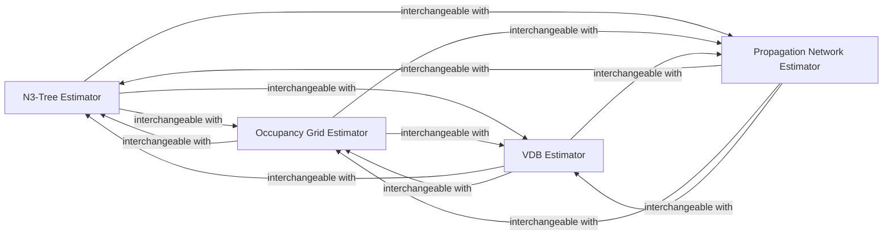

## Details

The Spatial Acceleration Structures subsystem in nerfacc is part of the Optimization/Acceleration Layer. It encompasses data structures and algorithms to optimize ray traversal and sampling by identifying empty or important regions. Its central components (N3-Tree, Occupancy Grid, VDB, and Propagation Network Estimators) are interchangeable, providing pluggable acceleration strategies that conform to a common interface for flexible integration into the broader rendering pipeline.

### N3-Tree Estimator
Manages and updates an N3-Tree, a hierarchical data structure for efficient identification of occupied and empty 3D space regions. It optimizes ray traversal by quickly pruning empty spaces.

**Related Classes/Methods**:

- <a href="https://github.com/nerfstudio-project/nerfacc/blob/master/nerfacc/estimators/n3tree.py" target="_blank" rel="noopener noreferrer">`nerfacc/estimators/n3tree.py`</a>

### Occupancy Grid Estimator
Manages a discrete 3D occupancy grid. This grid provides a coarser spatial representation, indicating occupied or empty cells. It handles initialization, periodic updates, and potentially marking invisible cells to guide sampling.

**Related Classes/Methods**:

- <a href="https://github.com/nerfstudio-project/nerfacc/blob/master/nerfacc/estimators/occ_grid.py" target="_blank" rel="noopener noreferrer">`nerfacc/estimators/occ_grid.py`</a>

### VDB Estimator
Implements functionalities for sparse, hierarchical VDB (Volume Data Block) structures. VDBs are efficient for representing sparse volumes and support efficient sampling, traversal, and periodic updates within these 3D volumes.

**Related Classes/Methods**:

- <a href="https://github.com/nerfstudio-project/nerfacc/blob/master/nerfacc/estimators/vdb.py" target="_blank" rel="noopener noreferrer">`nerfacc/estimators/vdb.py`</a>

### Propagation Network Estimator
Manages a neural network (propagation network) designed to dynamically guide ray sampling. It predicts and emphasizes "important" regions in 3D space, accelerating rendering by focusing computation on areas likely to contribute significantly to the final image.

**Related Classes/Methods**:

- <a href="https://github.com/nerfstudio-project/nerfacc/blob/master/nerfacc/estimators/prop_net.py" target="_blank" rel="noopener noreferrer">`nerfacc/estimators/prop_net.py`</a>

### [FAQ](https://github.com/CodeBoarding/GeneratedOnBoardings/tree/main?tab=readme-ov-file#faq)