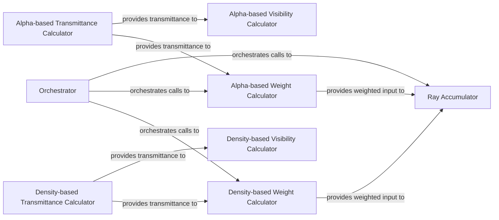

## Details

The Volumetric Ray Marching & Rendering subsystem is primarily encapsulated within the `nerfacc.volrend` package. It leverages core utilities from `nerfacc.scan` for efficient computations. It operates as a pipeline where the `Orchestrator` initiates the process, typically by calling a transmittance calculator (either density-based or alpha-based) first. The output of the transmittance calculation then feeds into the respective weight calculators. Finally, the weighted contributions from both density and alpha paths are passed to the `Ray Accumulator` to produce the final rendered output. The visibility calculators are parallel computations that also depend on transmittance, providing additional insights into the scene. This modular design allows for interchangeability of weight and transmittance calculation methods, aligning with the project's bias towards a performance-oriented, pluggable library.

### Orchestrator
Serves as the primary entry point, coordinating the entire volumetric rendering pipeline. It orchestrates the sequence of operations, including weight calculation, transmittance, and accumulation, ensuring a coherent data flow for rendering.

**Related Classes/Methods**:

- <a href="https://github.com/nerfstudio-project/nerfacc/blob/master/nerfacc/volrend.py#L15-L164" target="_blank" rel="noopener noreferrer">`nerfacc.volrend.rendering`:15-164</a>

### Density-based Weight Calculator
Computes the rendering weights for samples along a ray based on their density values, which determine their contribution to the final pixel color. This is a core part of the volumetric rendering equation.

**Related Classes/Methods**:

- <a href="https://github.com/nerfstudio-project/nerfacc/blob/master/nerfacc/volrend.py#L326-L376" target="_blank" rel="noopener noreferrer">`nerfacc.volrend.render_weight_from_density`:326-376</a>

### Alpha-based Weight Calculator
Computes rendering weights for samples along a ray based on their alpha (opacity) values. This provides an alternative or complementary method to density-based weighting.

**Related Classes/Methods**:

- <a href="https://github.com/nerfstudio-project/nerfacc/blob/master/nerfacc/volrend.py#L281-L323" target="_blank" rel="noopener noreferrer">`nerfacc.volrend.render_weight_from_alpha`:281-323</a>

### Ray Accumulator
Aggregates the computed color and density values, along with their respective weights, along individual rays to produce the final output (e.g., pixel color, accumulated depth). This implements the final integration step of the volumetric rendering equation.

**Related Classes/Methods**:

- <a href="https://github.com/nerfstudio-project/nerfacc/blob/master/nerfacc/volrend.py#L497-L561" target="_blank" rel="noopener noreferrer">`nerfacc.volrend.accumulate_along_rays`:497-561</a>

### Alpha-based Transmittance Calculator
Calculates how much light passes through a medium up to a certain point along a ray, based on alpha values. This is a fundamental component for correct light attenuation and is often a prerequisite for weight calculations.

**Related Classes/Methods**:

- <a href="https://github.com/nerfstudio-project/nerfacc/blob/master/nerfacc/volrend.py#L167-L216" target="_blank" rel="noopener noreferrer">`nerfacc.volrend.render_transmittance_from_alpha`:167-216</a>
- <a href="https://github.com/nerfstudio-project/nerfacc/blob/master/nerfacc/scan.py#L214-L282" target="_blank" rel="noopener noreferrer">`nerfacc.scan.exclusive_prod`:214-282</a>

### Density-based Transmittance Calculator
Calculates how much light passes through a medium up to a certain point along a ray, based on density values. Similar to its alpha-based counterpart, it's crucial for light attenuation.

**Related Classes/Methods**:

- <a href="https://github.com/nerfstudio-project/nerfacc/blob/master/nerfacc/volrend.py#L219-L278" target="_blank" rel="noopener noreferrer">`nerfacc.volrend.render_transmittance_from_density`:219-278</a>
- <a href="https://github.com/nerfstudio-project/nerfacc/blob/master/nerfacc/scan.py#L80-L145" target="_blank" rel="noopener noreferrer">`nerfacc.scan.exclusive_sum`:80-145</a>

### Alpha-based Visibility Calculator
Determines the visibility of points along a ray using alpha values, often derived from transmittance. This is important for understanding which parts of the scene contribute to the final image.

**Related Classes/Methods**:

- <a href="https://github.com/nerfstudio-project/nerfacc/blob/master/nerfacc/volrend.py#L379-L432" target="_blank" rel="noopener noreferrer">`nerfacc.volrend.render_visibility_from_alpha`:379-432</a>

### Density-based Visibility Calculator
Determines the visibility of points along a ray using density values, often derived from transmittance.

**Related Classes/Methods**:

- <a href="https://github.com/nerfstudio-project/nerfacc/blob/master/nerfacc/volrend.py#L435-L494" target="_blank" rel="noopener noreferrer">`nerfacc.volrend.render_visibility_from_density`:435-494</a>

### [FAQ](https://github.com/CodeBoarding/GeneratedOnBoardings/tree/main?tab=readme-ov-file#faq)