```mermaid
graph LR
    Data_Input_Preprocessing["Data Input & Preprocessing"]
    Neural_Scene_Representation["Neural Scene Representation"]
    Spatial_Acceleration_Structures["Spatial Acceleration Structures"]
    Volumetric_Ray_Marching_Rendering["Volumetric Ray Marching & Rendering"]
    Core_Computational_Utilities["Core Computational Utilities"]
    Data_Input_Preprocessing -- "Provides Training/Inference Data" --> Neural_Scene_Representation
    Data_Input_Preprocessing -- "Supplies Ray Data" --> Volumetric_Ray_Marching_Rendering
    Neural_Scene_Representation -- "Outputs Scene Properties (RGB, Density)" --> Volumetric_Ray_Marching_Rendering
    Spatial_Acceleration_Structures -- "Optimizes Ray Sampling/Traversal" --> Volumetric_Ray_Marching_Rendering
    Volumetric_Ray_Marching_Rendering -- "Provides Density/Opacity Feedback" --> Spatial_Acceleration_Structures
    Core_Computational_Utilities -- "Provides Low-Level Computations" --> Data_Input_Preprocessing
    Core_Computational_Utilities -- "Provides Low-Level Computations" --> Neural_Scene_Representation
    Core_Computational_Utilities -- "Provides Low-Level Computations" --> Spatial_Acceleration_Structures
    Core_Computational_Utilities -- "Provides Low-Level Computations" --> Volumetric_Ray_Marching_Rendering
    click Data_Input_Preprocessing href "https://github.com/CodeBoarding/GeneratedOnBoardings/blob/main/nerfacc/Data_Input_Preprocessing.md" "Details"
    click Neural_Scene_Representation href "https://github.com/CodeBoarding/GeneratedOnBoardings/blob/main/nerfacc/Neural_Scene_Representation.md" "Details"
    click Spatial_Acceleration_Structures href "https://github.com/CodeBoarding/GeneratedOnBoardings/blob/main/nerfacc/Spatial_Acceleration_Structures.md" "Details"
    click Volumetric_Ray_Marching_Rendering href "https://github.com/CodeBoarding/GeneratedOnBoardings/blob/main/nerfacc/Volumetric_Ray_Marching_Rendering.md" "Details"
    click Core_Computational_Utilities href "https://github.com/CodeBoarding/GeneratedOnBoardings/blob/main/nerfacc/Core_Computational_Utilities.md" "Details"
```

## Details

The `nerfacc` project is structured around a modular design for efficient Neural Radiance Field (NeRF) implementations. The `Data Input & Preprocessing` component handles the ingestion and preparation of diverse datasets, feeding processed information to both the `Neural Scene Representation` for model training and the `Volumetric Ray Marching & Rendering` for rendering. The `Neural Scene Representation` component, encompassing various neural network architectures, learns the 3D scene properties (color and density). These learned properties are then consumed by the `Volumetric Ray Marching & Rendering` component, which is the core rendering engine responsible for synthesizing 2D images from 3D scene data. To optimize this rendering process, `Spatial Acceleration Structures` are employed, providing efficient ray traversal and sampling by identifying relevant regions in 3D space, and receiving density/opacity feedback from the rendering process for adaptive sampling. Underlying all these components, `Core Computational Utilities` provide essential low-level operations and helper functions, ensuring efficient data manipulation and mathematical computations across the entire pipeline. This architecture facilitates a clear data flow from raw data to rendered images, with specialized components handling distinct aspects of the NeRF pipeline.

### Data Input & Preprocessing [[Expand]](./Data_Input_Preprocessing.md)
Manages the loading, augmentation, and preparation of diverse NeRF datasets, including images, camera poses, and scene metadata, for consumption by the training and rendering pipelines.

**Related Classes/Methods**:

- <a href="https://github.com/nerfstudio-project/nerfacc/blob/master/examples/datasets/nerf_synthetic.py" target="_blank" rel="noopener noreferrer">`examples.datasets.nerf_synthetic`</a>
- <a href="https://github.com/nerfstudio-project/nerfacc/blob/master/examples/datasets/dnerf_synthetic.py" target="_blank" rel="noopener noreferrer">`examples.datasets.dnerf_synthetic`</a>
- <a href="https://github.com/nerfstudio-project/nerfacc/blob/master/examples/datasets/nerf_360_v2.py" target="_blank" rel="noopener noreferrer">`examples.datasets.nerf_360_v2`</a>

### Neural Scene Representation [[Expand]](./Neural_Scene_Representation.md)
Implements various neural network architectures (e.g., MLPs, Instant-NGP) that represent the 3D scene by mapping 3D coordinates and viewing directions to volumetric properties like color (RGB) and density.

**Related Classes/Methods**:

- <a href="https://github.com/nerfstudio-project/nerfacc/blob/master/examples/radiance_fields/ngp.py" target="_blank" rel="noopener noreferrer">`examples.radiance_fields.ngp`</a>
- <a href="https://github.com/nerfstudio-project/nerfacc/blob/master/examples/radiance_fields/mlp.py" target="_blank" rel="noopener noreferrer">`examples.radiance_fields.mlp`</a>

### Spatial Acceleration Structures [[Expand]](./Spatial_Acceleration_Structures.md)
Provides optimized data structures and algorithms (e.g., N3-Trees, Occupancy Grids, VDBs, Propagation Networks) to accelerate ray traversal and sampling by identifying empty or important regions in 3D space.

**Related Classes/Methods**:

- <a href="https://github.com/nerfstudio-project/nerfacc/blob/master/nerfacc/estimators/n3tree.py" target="_blank" rel="noopener noreferrer">`nerfacc.estimators.n3tree`</a>
- <a href="https://github.com/nerfstudio-project/nerfacc/blob/master/nerfacc/estimators/occ_grid.py" target="_blank" rel="noopener noreferrer">`nerfacc.estimators.occ_grid`</a>
- <a href="https://github.com/nerfstudio-project/nerfacc/blob/master/nerfacc/estimators/vdb.py" target="_blank" rel="noopener noreferrer">`nerfacc.estimators.vdb`</a>
- <a href="https://github.com/nerfstudio-project/nerfacc/blob/master/nerfacc/estimators/prop_net.py" target="_blank" rel="noopener noreferrer">`nerfacc.estimators.prop_net`</a>

### Volumetric Ray Marching & Rendering [[Expand]](./Volumetric_Ray_Marching_Rendering.md)
The core engine responsible for integrating color and density values along rays to produce the final 2D rendered image, implementing the volumetric rendering equation with efficient ray-scene intersections, sampling, and accumulation.

**Related Classes/Methods**:

- <a href="https://github.com/nerfstudio-project/nerfacc/blob/master/nerfacc/volrend.py" target="_blank" rel="noopener noreferrer">`nerfacc.volrend`</a>

### Core Computational Utilities [[Expand]](./Core_Computational_Utilities.md)
Offers fundamental helper functions and low-level operations, including camera transformations, grid manipulations, and efficient array computations, serving as a foundational layer for other components.

**Related Classes/Methods**:

- <a href="https://github.com/nerfstudio-project/nerfacc/blob/master/nerfacc/cameras.py" target="_blank" rel="noopener noreferrer">`nerfacc.cameras`</a>
- <a href="https://github.com/nerfstudio-project/nerfacc/blob/master/nerfacc/grid.py" target="_blank" rel="noopener noreferrer">`nerfacc.grid`</a>
- <a href="https://github.com/nerfstudio-project/nerfacc/blob/master/nerfacc/scan.py" target="_blank" rel="noopener noreferrer">`nerfacc.scan`</a>

### [FAQ](https://github.com/CodeBoarding/GeneratedOnBoardings/tree/main?tab=readme-ov-file#faq)