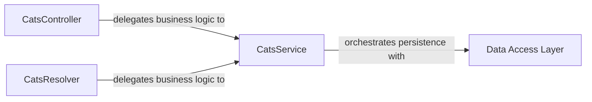

## Details

The cats subsystem in this NestJS application is structured around a clear separation of concerns. The CatsController and CatsResolver act as the primary entry points, handling HTTP and GraphQL requests respectively, and delegating all business logic to the CatsService. The CatsService centralizes the core business operations for managing cat data and orchestrates interactions with the Data Access Layer to persist and retrieve information. This design ensures that presentation logic is decoupled from business rules and data persistence, promoting maintainability and scalability. The Data Access Layer itself is an abstraction, with its implementation details (e.g., specific ORM or ODM usage) being managed within the CatsService or related modules, providing a clean interface for data operations.

### CatsController
Acts as the HTTP API endpoint, receiving incoming HTTP requests, extracting data, and delegating business operations to the CatsService. It handles HTTP-specific concerns like request parsing and response formatting.

**Related Classes/Methods**:

- <a href="https://github.com/nestjs/nest/blob/master/integration/inspector/src/cats/cats.controller.ts#L8-L30" target="_blank" rel="noopener noreferrer">`CatsController`:8-30</a>

### CatsResolver
Serves as the GraphQL API endpoint, receiving GraphQL queries and mutations, extracting arguments, and delegating the execution of business logic to the CatsService. It handles GraphQL-specific concerns like schema resolution.

**Related Classes/Methods**:

- <a href="https://github.com/nestjs/nest/blob/master/sample/12-graphql-schema-first/src/cats/cats.resolver.ts#L11-L40" target="_blank" rel="noopener noreferrer">`CatsResolver`:11-40</a>

### CatsService
Encapsulates the core business logic for managing "cats," including CRUD operations and specific business rules. It acts as an intermediary between the presentation layer (controllers/resolvers) and the data persistence layer.

**Related Classes/Methods**: _None_

### Data Access Layer
Provides the mechanism for interacting with the database (e.g., Mongoose, TypeORM) to perform CRUD operations on cat data. It abstracts the underlying database technology from the business logic.

**Related Classes/Methods**: _None_

### [FAQ](https://github.com/CodeBoarding/GeneratedOnBoardings/tree/main?tab=readme-ov-file#faq)