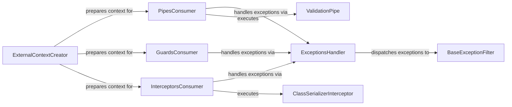

## Details

The core of this NestJS subsystem revolves around the structured application of cross-cutting concerns: Pipes for data transformation/validation, Guards for authorization, and Interceptors for request/response manipulation. The ExternalContextCreator acts as the initial orchestrator, preparing the execution environment for PipesConsumer, GuardsConsumer, and InterceptorsConsumer. These "consumer" components then sequentially execute their respective logic, with concrete implementations like ValidationPipe and ClassSerializerInterceptor demonstrating specific use cases. All exceptions encountered during this flow are centrally managed by ExceptionsHandler, which dispatches them to BaseExceptionFilter for consistent error handling and response generation. This architecture ensures a clear separation of concerns and a robust error management strategy within the application's request lifecycle.

### ExternalContextCreator
Orchestrates the creation of execution contexts for Pipes, Guards, and Interceptors. It gathers necessary metadata to prepare the environment for their execution, acting as the initial setup point for applying these concerns.

**Related Classes/Methods**:

- <a href="https://github.com/nestjs/nest/blob/master/packages/core/helpers/external-context-creator.ts#L77-L86" target="_blank" rel="noopener noreferrer">`ExternalContextCreator`:77-86</a>

### PipesConsumer
Responsible for executing the chain of registered Pipes. It applies data transformation and validation logic to method arguments based on the context provided by ExternalContextCreator.

**Related Classes/Methods**:

- <a href="https://github.com/nestjs/nest/blob/master/packages/websockets/context/ws-context-creator.ts" target="_blank" rel="noopener noreferrer">`PipesConsumer`</a>

### GuardsConsumer
Executes the chain of registered Guards. It determines if a request is authorized to proceed by evaluating access control logic, acting as a gatekeeper in the request lifecycle.

**Related Classes/Methods**:

- <a href="https://github.com/nestjs/nest/blob/master/packages/websockets/context/ws-context-creator.ts" target="_blank" rel="noopener noreferrer">`GuardsConsumer`</a>

### InterceptorsConsumer
Manages the execution of registered Interceptors. It intercepts incoming requests and outgoing responses, allowing for additional logic such as logging, caching, or response transformation.

**Related Classes/Methods**:

- <a href="https://github.com/nestjs/nest/blob/master/packages/websockets/context/ws-context-creator.ts" target="_blank" rel="noopener noreferrer">`InterceptorsConsumer`</a>

### ExceptionsHandler
The central component for managing exceptions. It dispatches caught exceptions to appropriate Exception Filters for processing, ensuring consistent error responses.

**Related Classes/Methods**:

- <a href="https://github.com/nestjs/nest/blob/master/packages/websockets/exceptions/ws-exceptions-handler.ts#L12-L40" target="_blank" rel="noopener noreferrer">`ExceptionsHandler`:12-40</a>

### BaseExceptionFilter
Provides a foundational implementation for handling exceptions. Concrete exception filters extend this class to define specific error handling logic and response formatting, promoting reusability and standardization.

**Related Classes/Methods**:

- <a href="https://github.com/nestjs/nest/blob/master/packages/core/exceptions/base-exception-filter.ts#L17-L88" target="_blank" rel="noopener noreferrer">`BaseExceptionFilter`:17-88</a>

### ValidationPipe
A concrete implementation of a Pipe, specifically designed for validating incoming data against defined schemas (e.g., DTOs). It exemplifies how a cross-cutting concern like validation is applied.

**Related Classes/Methods**:

- <a href="https://github.com/nestjs/nest/blob/master/packages/common/pipes/parse-array.pipe.ts" target="_blank" rel="noopener noreferrer">`ValidationPipe`</a>

### ClassSerializerInterceptor
A concrete implementation of an Interceptor, used for serializing outgoing data, often transforming class instances into plain objects based on serialization rules. It demonstrates response transformation as a cross-cutting concern.

**Related Classes/Methods**:

- <a href="https://github.com/nestjs/nest/blob/master/packages/common/serializer/class-serializer.interceptor.ts#L35-L113" target="_blank" rel="noopener noreferrer">`ClassSerializerInterceptor`:35-113</a>

### [FAQ](https://github.com/CodeBoarding/GeneratedOnBoardings/tree/main?tab=readme-ov-file#faq)