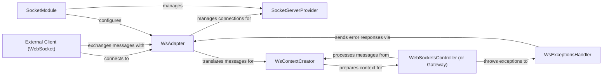

## Details

The nest WebSocket subsystem provides a robust framework for real-time communication. At its core, the SocketModule orchestrates the entire WebSocket infrastructure, managing the SocketServerProvider which handles the underlying server instance, and the WsAdapter which abstracts the specific WebSocket implementation. External Clients connect through this adapter, exchanging raw messages. The WsAdapter then translates these messages for the WsContextCreator, which prepares the execution context for the WebSocketsController (or Gateway). The WebSocketsController processes application-specific logic, and any errors are gracefully managed by the WsExceptionsHandler, which sends appropriate responses back to the client via the WsAdapter. This layered architecture ensures clear separation of concerns and efficient handling of WebSocket interactions.

### External Client (WebSocket) [[Expand]](./External_Client_WebSocket_.md)
Represents external applications (e.g., web browsers, mobile apps) that establish and interact with the nest application via WebSocket connections. It initiates connections, exchanges messages, and manages its connection lifecycle.

**Related Classes/Methods**: _None_

### SocketModule
The core nest module responsible for configuring and orchestrating WebSocket functionalities. It manages the lifecycle of the WebSocket server and integrates various WebSocket-related components.

**Related Classes/Methods**: _None_

### SocketServerProvider
Manages and provides the underlying WebSocket server instance (e.g., using ws or socket.io). It ensures the server is properly initialized and available for handling client connections.

**Related Classes/Methods**: _None_

### WsAdapter
An abstraction layer that bridges nest's WebSocket functionalities with a specific underlying WebSocket server implementation. It handles low-level communication, translating raw WebSocket messages into a format consumable by nest and vice-versa.

**Related Classes/Methods**: _None_

### WebSocketsController (or Gateway)
The application-level entry point for handling incoming WebSocket messages. It receives messages from the WsAdapter (via WsContextCreator) and dispatches them to specific handler methods based on defined message patterns.

**Related Classes/Methods**: _None_

### WsContextCreator
Responsible for preparing the execution context for incoming WebSocket messages. This includes tasks such as parsing arguments, validating data, and transforming messages before they are processed by the WebSocketsController.

**Related Classes/Methods**: _None_

### WsExceptionsHandler
Centralizes the handling of exceptions that occur during WebSocket interactions, message processing, or within gateway methods. It ensures errors are caught and appropriate responses are sent back to the client.

**Related Classes/Methods**: _None_

### [FAQ](https://github.com/CodeBoarding/GeneratedOnBoardings/tree/main?tab=readme-ov-file#faq)