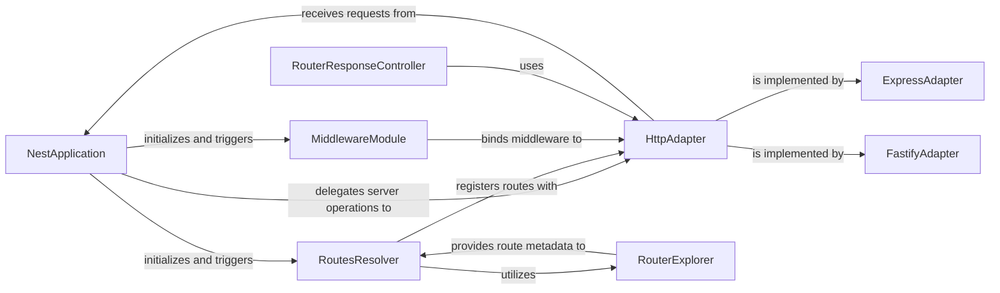

## Details

The Nest.js HTTP subsystem is orchestrated by the NestApplication, which serves as the central entry point for handling incoming requests. It delegates core server operations to the HttpAdapter, an abstraction layer that allows seamless integration with various underlying HTTP frameworks like ExpressAdapter or FastifyAdapter. The RoutesResolver is responsible for discovering and registering routes, leveraging the RouterExplorer to extract route metadata from controllers. Concurrently, the MiddlewareModule manages the application of global and route-specific middleware. Finally, the RouterResponseController handles the outgoing responses, ensuring proper formatting and delivery to the client. This modular design promotes flexibility and maintainability, allowing developers to choose their preferred HTTP framework while maintaining a consistent application structure.

### NestApplication
Orchestrates the entire HTTP layer, manages the application's lifecycle, integrates core modules, applies global configurations, and delegates server operations to the HttpAdapter. It acts as the main entry point for the Nest.js application's HTTP handling.

**Related Classes/Methods**:

- <a href="https://github.com/nestjs/nest/blob/master/packages/common/interfaces/nest-application.interface.ts#L20-L165" target="_blank" rel="noopener noreferrer">`NestApplication`:20-165</a>

### HttpAdapter
Defines the contract for interacting with underlying HTTP frameworks (e.g., Express, Fastify). It provides an abstraction layer, allowing NestApplication and other components to interact with the HTTP server without knowing the specific framework implementation details.

**Related Classes/Methods**:

- <a href="https://github.com/nestjs/nest/blob/master/packages/platform-fastify/interfaces/nest-fastify-application.interface.ts" target="_blank" rel="noopener noreferrer">`HttpAdapter`</a>

### ExpressAdapter
A concrete implementation of HttpAdapter for the Express.js framework. It handles low-level routing, middleware application, and request/response manipulation specific to Express.js, translating Nest.js's abstract operations into Express.js specific calls.

**Related Classes/Methods**:

- <a href="https://github.com/nestjs/nest/blob/master/packages/platform-express/adapters/express-adapter.ts#L51-L518" target="_blank" rel="noopener noreferrer">`ExpressAdapter`:51-518</a>

### FastifyAdapter
A concrete implementation of HttpAdapter for the Fastify framework. Similar to ExpressAdapter, it manages low-level routing, middleware, and request/response handling tailored for the Fastify framework, providing high performance.

**Related Classes/Methods**:

- <a href="https://github.com/nestjs/nest/blob/master/packages/platform-fastify/adapters/fastify-adapter.ts#L122-L869" target="_blank" rel="noopener noreferrer">`FastifyAdapter`:122-869</a>

### RoutesResolver
Discovers and registers routes from controllers with the HttpAdapter. It is responsible for mapping incoming HTTP requests to the appropriate controller methods and setting up global error and not-found handlers.

**Related Classes/Methods**:

- <a href="https://github.com/nestjs/nest/blob/master/packages/core/nest-application.ts" target="_blank" rel="noopener noreferrer">`RoutesResolver`</a>

### MiddlewareModule
Manages the registration and application of global, module-specific, and route-specific middleware. It ensures that middleware functions are executed in the correct order during the request-response cycle.

**Related Classes/Methods**:

- <a href="https://github.com/nestjs/nest/blob/master/packages/core/nest-application.ts" target="_blank" rel="noopener noreferrer">`MiddlewareModule`</a>

### RouterExplorer
Scans controllers to extract route metadata (paths, HTTP methods, decorators). This metadata is then used by RoutesResolver to correctly register routes with the underlying HttpAdapter.

**Related Classes/Methods**:

- <a href="https://github.com/nestjs/nest/blob/master/packages/core/router/routes-resolver.ts" target="_blank" rel="noopener noreferrer">`RouterExplorer`</a>

### RouterResponseController
Handles the final stage of the HTTP request lifecycle, sending responses back to the client. This includes setting HTTP status codes, headers, and rendering views or sending JSON data.

**Related Classes/Methods**:

- <a href="https://github.com/nestjs/nest/blob/master/packages/core/router/router-response-controller.ts#L28-L169" target="_blank" rel="noopener noreferrer">`RouterResponseController`:28-169</a>

### [FAQ](https://github.com/CodeBoarding/GeneratedOnBoardings/tree/main?tab=readme-ov-file#faq)