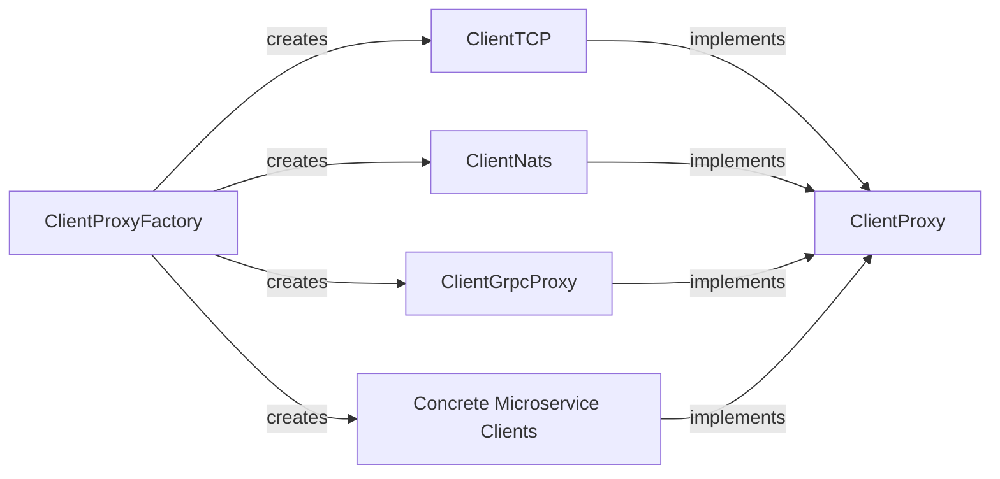

## Details

The microservices client architecture is built upon a flexible and extensible design centered around the `ClientProxy` abstraction. This abstract component defines the universal contract for interacting with remote microservices, enabling a consistent API regardless of the underlying transport protocol. The `ClientProxyFactory` serves as the primary entry point for client instantiation, dynamically selecting and configuring specific client implementations such as `ClientTCP`, `ClientNats`, `ClientGrpcProxy`, and other `Concrete Microservice Clients` (e.g., `ClientRedis`, `ClientKafka`, `ClientMqtt`, `ClientRMQ`). This factory pattern centralizes client creation logic and promotes loose coupling between the application and the specific communication protocols. Each concrete client handles the intricate details of its respective protocol, ensuring efficient and reliable message exchange. This modular approach allows for easy integration of new communication methods and simplifies the overall management of microservice interactions.

### ClientProxy
This is the foundational abstract component that defines the contract for all microservice clients. It provides a unified interface for sending messages (`send`) and dispatching events (`emit`) to remote microservices, abstracting away the complexities of specific transport protocols. It also manages the lifecycle of connections and the observation of responses.

**Related Classes/Methods**:

- <a href="https://github.com/nestjs/nest/blob/master/packages/microservices/client/client-proxy.ts#L38-L233" target="_blank" rel="noopener noreferrer">`ClientProxy`:38-233</a>

### ClientProxyFactory
This component is responsible for creating and configuring instances of concrete `ClientProxy` implementations. It centralizes the logic for instantiating the correct client based on the application's configuration (e.g., TCP, NATS, Redis, gRPC). It also integrates with the application's lifecycle hooks to ensure proper client shutdown.

**Related Classes/Methods**:

- <a href="https://github.com/nestjs/nest/blob/master/packages/microservices/client/client-proxy-factory.ts#L32-L82" target="_blank" rel="noopener noreferrer">`ClientProxyFactory`:32-82</a>

### ClientTCP
A concrete implementation of `ClientProxy` that manages TCP socket connections for sending and receiving data. It handles the low-level details of TCP communication, including connection establishment, data serialization/deserialization, and error handling.

**Related Classes/Methods**:

- <a href="https://github.com/nestjs/nest/blob/master/packages/microservices/client/client-tcp.ts#L16-L206" target="_blank" rel="noopener noreferrer">`ClientTCP`:16-206</a>

### ClientNats
A concrete implementation of `ClientProxy` that handles communication via the NATS messaging system. It integrates with the NATS client library to publish messages and subscribe to responses, leveraging NATS's high-performance messaging capabilities.

**Related Classes/Methods**:

- <a href="https://github.com/nestjs/nest/blob/master/packages/microservices/client/client-nats.ts#L29-L277" target="_blank" rel="noopener noreferrer">`ClientNats`:29-277</a>

### ClientGrpcProxy
A concrete implementation of `ClientProxy` that facilitates communication with gRPC services. It includes logic for loading `.proto` definitions, generating client stubs, and managing gRPC channels for efficient remote procedure calls.

**Related Classes/Methods**:

- <a href="https://github.com/nestjs/nest/blob/master/packages/microservices/client/client-grpc.ts#L31-L402" target="_blank" rel="noopener noreferrer">`ClientGrpcProxy`:31-402</a>

### Concrete Microservice Clients
This conceptual component represents all other specific transport client implementations (e.g., `ClientRedis`, `ClientKafka`, `ClientMqtt`, `ClientRMQ`). Each of these classes extends `ClientProxy` and provides the necessary logic to interact with their respective messaging systems or protocols.

**Related Classes/Methods**:

- <a href="https://github.com/nestjs/nest/blob/master/packages/microservices/client/client-redis.ts#L24-L306" target="_blank" rel="noopener noreferrer">`ClientRedis`:24-306</a>
- <a href="https://github.com/nestjs/nest/blob/master/packages/microservices/helpers/kafka-reply-partition-assigner.ts" target="_blank" rel="noopener noreferrer">`ClientKafka`</a>
- <a href="https://github.com/nestjs/nest/blob/master/packages/microservices/client/client-mqtt.ts#L28-L328" target="_blank" rel="noopener noreferrer">`ClientMqtt`:28-328</a>
- <a href="https://github.com/nestjs/nest/blob/master/packages/microservices/client/client-rmq.ts#L55-L492" target="_blank" rel="noopener noreferrer">`ClientRMQ`:55-492</a>

### [FAQ](https://github.com/CodeBoarding/GeneratedOnBoardings/tree/main?tab=readme-ov-file#faq)