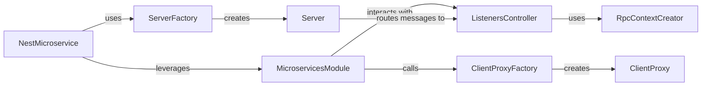

## Details

The NestJS Microservices subsystem provides a robust framework for building distributed applications. At its core, the NestMicroservice acts as the application's entry point, orchestrating the setup and lifecycle of microservices. It relies on ServerFactory to provision protocol-specific Server instances for handling incoming requests and ClientProxyFactory to create ClientProxy instances for outgoing communication. The MicroservicesModule seamlessly integrates these capabilities into the NestJS module system, managing the registration of message handlers and client proxies. The ListenersController plays a crucial role in discovering and routing incoming messages to the correct handlers, while the RpcContextCreator ensures that these handlers execute within a properly configured RPC context, applying necessary pipes, guards, and interceptors. This modular design promotes clear separation of concerns and extensibility for various transport protocols.

### NestMicroservice
Acts as the primary application bootstrap and orchestrator for microservice applications. It manages the lifecycle of the microservice, from creation and listening for incoming messages to graceful shutdown.

**Related Classes/Methods**:

- <a href="https://github.com/nestjs/nest/blob/master/packages/microservices/nest-microservice.ts#L35-L357" target="_blank" rel="noopener noreferrer">`NestMicroservice`:35-357</a>

### ServerFactory
A factory component responsible for creating concrete server instances based on the specified transport protocol (e.g., TCP, Redis, NATS, Kafka, MQTT, gRPC). It abstracts the complexity of instantiating different server types.

**Related Classes/Methods**:

- <a href="https://github.com/nestjs/nest/blob/master/packages/microservices/server/server-factory.ts#L20-L43" target="_blank" rel="noopener noreferrer">`ServerFactory`:20-43</a>

### ClientProxyFactory
A factory component responsible for creating concrete client proxy instances for various transport protocols. These client proxies are used by other parts of the application to send messages and emit events to microservice servers.

**Related Classes/Methods**:

- <a href="https://github.com/nestjs/nest/blob/master/packages/microservices/client/client-proxy-factory.ts#L32-L82" target="_blank" rel="noopener noreferrer">`ClientProxyFactory`:32-82</a>

### Server
Defines the common interface and abstract logic for all microservice servers. Concrete implementations (e.g., TcpServer, RedisServer) extend this class to handle protocol-specific server logic, including listening for messages, adding message handlers, and dispatching them. It also manages the serialization and deserialization of messages.

**Related Classes/Methods**:

- <a href="https://github.com/nestjs/nest/blob/master/integration/repl/e2e/repl.spec.ts" target="_blank" rel="noopener noreferrer">`Server`</a>

### ClientProxy
Provides the abstract interface for sending messages (send) and emitting events (emit) to microservice servers. Concrete implementations handle the specifics of communication over different transport protocols, abstracting the underlying network details. It also handles serialization and deserialization of outgoing and incoming data.

**Related Classes/Methods**:

- <a href="https://github.com/nestjs/nest/blob/master/packages/microservices/client/client-proxy.ts#L38-L233" target="_blank" rel="noopener noreferrer">`ClientProxy`:38-233</a>

### MicroservicesModule
Integrates microservice capabilities into the Nest application's module system. It registers client proxies and message pattern handlers, making microservice features available within the application context. It uses ListenersController to bind listeners and clients.

**Related Classes/Methods**:

- <a href="https://github.com/nestjs/nest/blob/master/packages/microservices/microservices-module.ts#L23-L121" target="_blank" rel="noopener noreferrer">`MicroservicesModule`:23-121</a>

### ListenersController
Manages the discovery and registration of message pattern handlers (methods decorated with @MessagePattern()) and assigns client proxies to properties. It acts as a dispatcher or router for incoming microservice messages, directing them to the correct handler and creating request-scoped handlers.

**Related Classes/Methods**:

- <a href="https://github.com/nestjs/nest/blob/master/packages/microservices/microservices-module.ts" target="_blank" rel="noopener noreferrer">`ListenersController`</a>

### RpcContextCreator
Creates the execution context for RPC (Remote Procedure Call) handlers. This involves applying pipes, guards, and resolving parameters, ensuring that the handler executes within the correct environment. It uses PipesContextCreator, GuardsContextCreator, and InterceptorsContextCreator.

**Related Classes/Methods**:

- <a href="https://github.com/nestjs/nest/blob/master/packages/microservices/context/rpc-context-creator.ts#L41-L283" target="_blank" rel="noopener noreferrer">`RpcContextCreator`:41-283</a>

### [FAQ](https://github.com/CodeBoarding/GeneratedOnBoardings/tree/main?tab=readme-ov-file#faq)