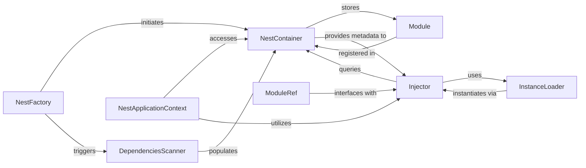

## Details

The `NestJS Core (Bootstrapping & DI)` subsystem forms the bedrock of any NestJS application, handling the initial setup, component discovery, and the intricate dependency injection mechanism. It aligns perfectly with the "Web Framework / Backend Application Framework" project type by providing a structured and extensible foundation for building modular applications.

### NestFactory
The primary entry point for bootstrapping a NestJS application. It orchestrates the initial setup, including the creation of the DI container, initiating module scanning, and preparing the application for execution.

**Related Classes/Methods**:

- <a href="https://github.com/nestjs/nest/blob/master/packages/core/nest-factory.ts" target="_blank" rel="noopener noreferrer">`NestFactory`</a>

### DependenciesScanner
Scans the application's modules to build a comprehensive internal module graph. It identifies and registers all providers, controllers, and other injectables with the NestContainer.

**Related Classes/Methods**:

- <a href="https://github.com/nestjs/nest/blob/master/packages/core/scanner.ts" target="_blank" rel="noopener noreferrer">`packages.core.scanner`</a>

### NestContainer
The central registry for all application modules, providers, controllers, and injectables. It maintains the complete module graph, serving as the authoritative source for component metadata and relationships within the DI system.

**Related Classes/Methods**:

- <a href="https://github.com/nestjs/nest/blob/master/packages/core/injector/container.ts" target="_blank" rel="noopener noreferrer">`packages.core.injector.container`</a>

### Injector
The core of the Dependency Injection system. It is responsible for resolving dependencies, instantiating classes, and managing the lifecycle and scope of providers and controllers.

**Related Classes/Methods**:

- <a href="https://github.com/nestjs/nest/blob/master/packages/core/injector/injector.ts" target="_blank" rel="noopener noreferrer">`packages.core.injector.injector`</a>

### InstanceLoader
Works in conjunction with the Injector to create prototypes and instances of all registered providers, controllers, and injectables after the module graph has been scanned and validated.

**Related Classes/Methods**:

- <a href="https://github.com/nestjs/nest/blob/master/packages/core/injector/instance-loader.ts" target="_blank" rel="noopener noreferrer">`packages.core.injector.instance-loader`</a>

### Module
A fundamental organizational unit in NestJS, encapsulating a cohesive set of providers, controllers, and other modules. It defines a specific, self-contained part of the application's structure and functionality, promoting modularity.

**Related Classes/Methods**:

- <a href="https://github.com/nestjs/nest/blob/master/packages/core/injector/module.ts" target="_blank" rel="noopener noreferrer">`packages.core.injector.module`</a>

### NestApplicationContext
Provides a foundational API for interacting with the NestJS module system and the Dependency Injection container. It allows programmatic access to registered modules and providers and manages application lifecycle hooks.

**Related Classes/Methods**:

- <a href="https://github.com/nestjs/nest/blob/master/packages/common/interfaces/nest-application-context.interface.ts#L28-L158" target="_blank" rel="noopener noreferrer">`NestApplicationContext`:28-158</a>

### ModuleRef
Offers a programmatic interface to the Dependency Injection container, enabling dynamic resolution of instances and introspection of the module graph at runtime. This is crucial for advanced scenarios like dynamic module loading, testing, or custom factories.

**Related Classes/Methods**:

- <a href="https://github.com/nestjs/nest/blob/master/packages/core/injector/module-ref.ts" target="_blank" rel="noopener noreferrer">`packages.core.injector.module-ref`</a>

### [FAQ](https://github.com/CodeBoarding/GeneratedOnBoardings/tree/main?tab=readme-ov-file#faq)