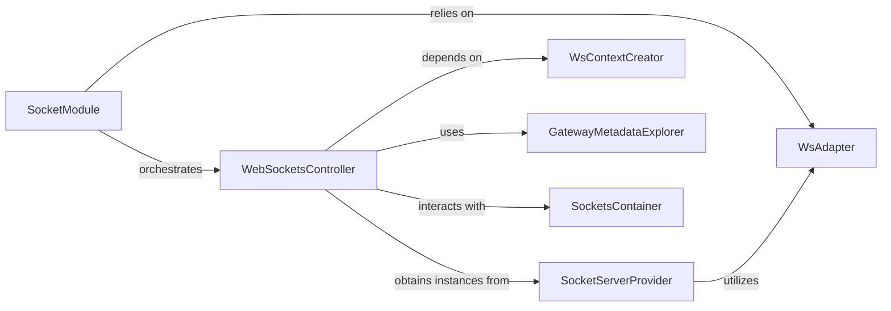

## Details

The WebSockets subsystem in NestJS is orchestrated by the `SocketModule`, which initializes the necessary components for WebSocket communication. It leverages the `WsAdapter` (an interface for `WebSocketAdapter`) to provide an abstraction over different underlying WebSocket server implementations. The `WebSocketsController` manages the lifecycle of WebSocket gateway connections, utilizing the `SocketServerProvider` to obtain server instances and the `GatewayMetadataExplorer` to discover message handlers. The `WsContextCreator` is crucial for preparing the execution context of incoming WebSocket messages, while the `SocketsContainer` keeps track of active WebSocket connections. This design promotes modularity and extensibility, allowing for flexible integration with various WebSocket libraries.

**Critical Interaction Pathways:**
1.  **Initialization Flow:** `SocketModule` -> `WsAdapter` (initializes platform-specific WebSocket server)
2.  **Gateway Management:** `SocketModule` -> `WebSocketsController` (orchestrates gateway connections)
3.  **Server Provisioning:** `WebSocketsController` -> `SocketServerProvider` (obtains WebSocket server instances)
4.  **Message Handling Setup:** `WebSocketsController` -> `GatewayMetadataExplorer` (discovers message patterns) -> `WsContextCreator` (prepares message execution context)
5.  **Connection Tracking:** `WebSocketsController` -> `SocketsContainer` (manages active WebSocket connections)

### SocketModule
Acts as the primary orchestrator and entry point for the WebSockets layer. It is responsible for initializing WebSocket adapters, connecting registered gateways, and setting up the core context creators for event processing. This aligns with the "Module" pattern, encapsulating WebSocket-specific logic.

**Related Classes/Methods**:

- <a href="https://github.com/nestjs/nest/blob/master/packages/websockets/socket-module.ts" target="_blank" rel="noopener noreferrer">`/home/ivan/StartUp/CodeBoarding/repos/nest/packages/websockets/socket-module.ts:SocketModule`</a>

### WebSocketsController
Manages the lifecycle of individual WebSocket gateway connections and event subscriptions. It handles the assignment of server instances to gateways and subscribes to server events such as connection, disconnection, and incoming messages. This component functions as a "Controller" or "Handler" for WebSocket events.

**Related Classes/Methods**:

- <a href="https://github.com/nestjs/nest/blob/master/packages/websockets/web-sockets-controller.ts" target="_blank" rel="noopener noreferrer">`/home/ivan/StartUp/CodeBoarding/repos/nest/packages/websockets/web-sockets-controller.ts:WebSocketsController`</a>

### WsAdapter
Defines the abstract interface for platform-specific WebSocket server implementations. It provides a crucial abstraction layer, allowing the framework to support different underlying WebSocket libraries (e.g., ws, socket.io) without changing core logic. This is a clear "Adapter" pattern.

**Related Classes/Methods**:

- <a href="https://github.com/nestjs/nest/blob/master/packages/common/interfaces/websockets/web-socket-adapter.interface.ts" target="_blank" rel="noopener noreferrer">`packages/common/interfaces/websockets/web-socket-adapter.interface.ts:WebSocketAdapter`</a>

### SocketServerProvider
Manages the creation and retrieval of WebSocket server instances. It abstracts the details of the underlying WebSocket library and handles different namespaces, acting as a "Provider" or "Factory" for server instances.

**Related Classes/Methods**:

- <a href="https://github.com/nestjs/nest/blob/master/packages/websockets/socket-server-provider.ts" target="_blank" rel="noopener noreferrer">`/home/ivan/StartUp/CodeBoarding/repos/nest/packages/websockets/socket-server-provider.ts:SocketServerProvider`</a>

### WsContextCreator
Creates the execution context for WebSocket messages. This includes reflecting callback patterns, retrieving metadata, and enabling the application of pipes and guards, forming a key part of the message processing pipeline.

**Related Classes/Methods**:

- <a href="https://github.com/nestjs/nest/blob/master/packages/websockets/context/ws-context-creator.ts" target="_blank" rel="noopener noreferrer">`/home/ivan/StartUp/CodeBoarding/repos/nest/packages/websockets/context/ws-context-creator.ts:WsContextCreator`</a>

### GatewayMetadataExplorer
Discovers and processes metadata from WebSocket gateway classes and their methods. It identifies message patterns and event handlers, essential for routing incoming WebSocket messages to the correct application logic.

**Related Classes/Methods**:

- <a href="https://github.com/nestjs/nest/blob/master/packages/websockets/gateway-metadata-explorer.ts" target="_blank" rel="noopener noreferrer">`/home/ivan/StartUp/CodeBoarding/repos/nest/packages/websockets/gateway-metadata-explorer.ts:GatewayMetadataExplorer`</a>

### SocketsContainer
Manages individual WebSocket socket instances, likely tracking active connections.

**Related Classes/Methods**:

- <a href="https://github.com/nestjs/nest/blob/master/packages/websockets/sockets-container.ts" target="_blank" rel="noopener noreferrer">`/home/ivan/StartUp/CodeBoarding/repos/nest/packages/websockets/sockets-container.ts:SocketsContainer`</a>

### [FAQ](https://github.com/CodeBoarding/GeneratedOnBoardings/tree/main?tab=readme-ov-file#faq)