```mermaid
graph LR
    NestJS_Core_Bootstrapping_DI_["NestJS Core (Bootstrapping & DI)"]
    HTTP_Application_Layer["HTTP Application Layer"]
    Microservices_Layer["Microservices Layer"]
    WebSockets_Layer["WebSockets Layer"]
    Application_Logic_Data_Access["Application Logic & Data Access"]
    Cross_Cutting_Concerns["Cross-Cutting Concerns"]
    External_Client["External Client"]
    Internal_Microservice_Client["Internal Microservice Client"]
    External_Client_WebSocket_["External Client (WebSocket)"]
    External_Client -- "HTTP Request" --> HTTP_Application_Layer
    HTTP_Application_Layer -- "Routes Request" --> Cross_Cutting_Concerns
    Cross_Cutting_Concerns -- "Processed Request" --> Application_Logic_Data_Access
    Application_Logic_Data_Access -- "Response" --> HTTP_Application_Layer
    Internal_Microservice_Client -- "Sends Message" --> Microservices_Layer
    Microservices_Layer -- "Dispatches Message" --> Application_Logic_Data_Access
    Application_Logic_Data_Access -- "Sends Response" --> Microservices_Layer
    External_Client_WebSocket_ -- "WebSocket Connection/Events" --> WebSockets_Layer
    WebSockets_Layer -- "Dispatches Event" --> Application_Logic_Data_Access
    NestJS_Core_Bootstrapping_DI_ -- "Initializes & Injects" --> HTTP_Application_Layer
    NestJS_Core_Bootstrapping_DI_ -- "Initializes & Injects" --> Microservices_Layer
    NestJS_Core_Bootstrapping_DI_ -- "Initializes & Injects" --> WebSockets_Layer
    NestJS_Core_Bootstrapping_DI_ -- "Initializes & Injects" --> Application_Logic_Data_Access
    NestJS_Core_Bootstrapping_DI_ -- "Initializes & Injects" --> Cross_Cutting_Concerns
    click NestJS_Core_Bootstrapping_DI_ href "https://github.com/CodeBoarding/GeneratedOnBoardings/blob/main/nest/NestJS_Core_Bootstrapping_DI_.md" "Details"
    click HTTP_Application_Layer href "https://github.com/CodeBoarding/GeneratedOnBoardings/blob/main/nest/HTTP_Application_Layer.md" "Details"
    click Microservices_Layer href "https://github.com/CodeBoarding/GeneratedOnBoardings/blob/main/nest/Microservices_Layer.md" "Details"
    click WebSockets_Layer href "https://github.com/CodeBoarding/GeneratedOnBoardings/blob/main/nest/WebSockets_Layer.md" "Details"
    click Application_Logic_Data_Access href "https://github.com/CodeBoarding/GeneratedOnBoardings/blob/main/nest/Application_Logic_Data_Access.md" "Details"
    click Cross_Cutting_Concerns href "https://github.com/CodeBoarding/GeneratedOnBoardings/blob/main/nest/Cross_Cutting_Concerns.md" "Details"
    click Internal_Microservice_Client href "https://github.com/CodeBoarding/GeneratedOnBoardings/blob/main/nest/Internal_Microservice_Client.md" "Details"
    click External_Client_WebSocket_ href "https://github.com/CodeBoarding/GeneratedOnBoardings/blob/main/nest/External_Client_WebSocket_.md" "Details"
```

## Details

The NestJS framework provides a robust, modular architecture designed for building scalable server-side applications. At its core, the NestJS Core handles bootstrapping and dependency injection, forming the backbone for all other components. Incoming requests, whether HTTP, Microservice, or WebSocket, are first processed by their respective Application Layers (HTTP, Microservices, WebSockets). These layers are responsible for protocol adaptation, routing, and initial request handling. Before reaching the core Application Logic & Data Access, requests pass through Cross-Cutting Concerns such as Pipes for validation, Guards for authorization, and Interceptors for request/response transformation and error handling. The Application Logic & Data Access component encapsulates the business rules and interacts with data persistence. Finally, responses are returned through the same layers back to the External Clients or Internal Microservice Clients.

### NestJS Core (Bootstrapping & DI) [[Expand]](./NestJS_Core_Bootstrapping_DI_.md)
The foundational layer responsible for application bootstrapping, module scanning, and managing the robust Dependency Injection system that underpins all other components.

**Related Classes/Methods**:

- <a href="https://github.com/nestjs/nest/blob/master/packages/core/nest-factory.ts" target="_blank" rel="noopener noreferrer">`NestFactory`</a>
- <a href="https://github.com/nestjs/nest/blob/master/packages/common/interfaces/nest-application-context.interface.ts#L28-L158" target="_blank" rel="noopener noreferrer">`NestApplicationContext`:28-158</a>
- <a href="https://github.com/nestjs/nest/blob/master/packages/microservices/microservices-module.ts#L53-L57" target="_blank" rel="noopener noreferrer">`Injector`:53-57</a>
- <a href="https://github.com/nestjs/nest/blob/master/integration/discovery/src/webhooks.explorer.ts" target="_blank" rel="noopener noreferrer">`Scanner`</a>

### HTTP Application Layer [[Expand]](./HTTP_Application_Layer.md)
Handles all aspects of incoming HTTP requests, including adapting to underlying HTTP frameworks (Express/Fastify), applying middleware, and routing requests to the appropriate controllers.

**Related Classes/Methods**:

- <a href="https://github.com/nestjs/nest/blob/master/packages/common/interfaces/nest-application.interface.ts#L20-L165" target="_blank" rel="noopener noreferrer">`NestApplication`:20-165</a>
- <a href="https://github.com/nestjs/nest/blob/master/packages/core/nest-application.ts" target="_blank" rel="noopener noreferrer">`RoutesResolver`</a>
- <a href="https://github.com/nestjs/nest/blob/master/packages/core/nest-application.ts" target="_blank" rel="noopener noreferrer">`MiddlewareModule`</a>
- <a href="https://github.com/nestjs/nest/blob/master/packages/platform-fastify/adapters/fastify-adapter.ts#L122-L869" target="_blank" rel="noopener noreferrer">`FastifyAdapter`:122-869</a>
- <a href="https://github.com/nestjs/nest/blob/master/packages/platform-express/adapters/express-adapter.ts#L51-L518" target="_blank" rel="noopener noreferrer">`ExpressAdapter`:51-518</a>

### Microservices Layer [[Expand]](./Microservices_Layer.md)
Provides capabilities for inter-service communication, enabling the creation of both microservice servers (listeners) and clients (emitters) across various transport protocols (e.g., TCP, Redis, Kafka).

**Related Classes/Methods**:

- <a href="https://github.com/nestjs/nest/blob/master/packages/microservices/nest-microservice.ts#L35-L357" target="_blank" rel="noopener noreferrer">`NestMicroservice`:35-357</a>
- <a href="https://github.com/nestjs/nest/blob/master/packages/microservices/server/server-factory.ts#L20-L43" target="_blank" rel="noopener noreferrer">`ServerFactory`:20-43</a>
- <a href="https://github.com/nestjs/nest/blob/master/packages/microservices/client/client-proxy-factory.ts#L32-L82" target="_blank" rel="noopener noreferrer">`ClientProxyFactory`:32-82</a>

### WebSockets Layer [[Expand]](./WebSockets_Layer.md)
Manages real-time, bidirectional communication through WebSocket gateways, integrating with different WebSocket libraries and handling event subscriptions.

**Related Classes/Methods**:

- <a href="https://github.com/nestjs/nest/blob/master/packages/websockets/socket-module.ts#L27-L150" target="_blank" rel="noopener noreferrer">`SocketModule`:27-150</a>
- <a href="https://github.com/nestjs/nest/blob/master/packages/websockets/socket-module.ts" target="_blank" rel="noopener noreferrer">`WebSocketsController`</a>

### Application Logic & Data Access [[Expand]](./Application_Logic_Data_Access.md)
Encapsulates the core business logic, handling specific request processing (Controllers), implementing business rules (Services), and managing interactions with data storage (Data Access Components).

**Related Classes/Methods**:

- <a href="https://github.com/nestjs/nest/blob/master/integration/inspector/src/cats/cats.controller.ts#L8-L30" target="_blank" rel="noopener noreferrer">`CatsController`:8-30</a>
- <a href="https://github.com/nestjs/nest/blob/master/integration/graphql-schema-first/src/cats/cats.resolvers.ts" target="_blank" rel="noopener noreferrer">`CatsService`</a>

### Cross-Cutting Concerns [[Expand]](./Cross_Cutting_Concerns.md)
A set of components (Pipes, Guards, Interceptors, Exception Filters) that apply common, reusable logic across different parts of the application, such as validation, authorization, and error handling.

**Related Classes/Methods**:

- <a href="https://github.com/nestjs/nest/blob/master/packages/common/pipes/parse-array.pipe.ts" target="_blank" rel="noopener noreferrer">`ValidationPipe`</a>
- <a href="https://github.com/nestjs/nest/blob/master/packages/websockets/context/ws-context-creator.ts" target="_blank" rel="noopener noreferrer">`GuardsConsumer`</a>
- <a href="https://github.com/nestjs/nest/blob/master/packages/websockets/context/ws-context-creator.ts" target="_blank" rel="noopener noreferrer">`InterceptorsConsumer`</a>
- <a href="https://github.com/nestjs/nest/blob/master/packages/websockets/exceptions/ws-exceptions-handler.ts#L12-L40" target="_blank" rel="noopener noreferrer">`ExceptionsHandler`:12-40</a>

### External Client
Represents external entities (e.g., web browsers, mobile applications) that interact with the NestJS application primarily via HTTP.

**Related Classes/Methods**: _None_

### Internal Microservice Client [[Expand]](./Internal_Microservice_Client.md)
Represents other microservices within a distributed system that communicate with this NestJS application using microservice transport protocols.

**Related Classes/Methods**: _None_

### External Client (WebSocket) [[Expand]](./External_Client_WebSocket_.md)
Represents external clients (e.g., web browsers with real-time features) that establish and interact over WebSocket connections.

**Related Classes/Methods**: _None_

### [FAQ](https://github.com/CodeBoarding/GeneratedOnBoardings/tree/main?tab=readme-ov-file#faq)