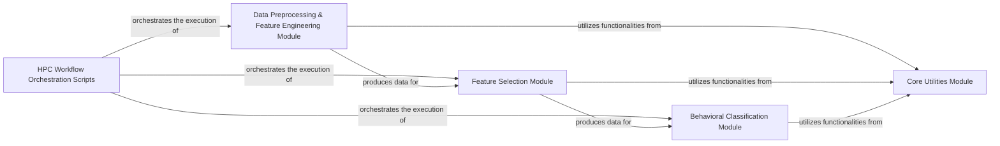

## Details

This project manages the entire execution flow of the `neuro-forestwalk` pipeline within a High-Performance Computing (HPC) environment, handling the submission, scheduling, and monitoring of computational tasks using LSF bsub scripts. It comprises a modular and scalable machine learning pipeline for behavioral phenotyping.

### HPC Workflow Orchestration Scripts
This component comprises the LSF `bsub` scripts that serve as the primary mechanism for orchestrating the entire `neuro-forestwalk` pipeline within a High-Performance Computing (HPC) environment. These scripts define job parameters, dependencies, and resource requirements, managing the submission, scheduling, and monitoring of the computational tasks by invoking the corresponding Python modules.

**Related Classes/Methods**:

- <a href="https://github.com/Roche/neuro-forestwalk/blob/main/Code/classification.py#L1-L1" target="_blank" rel="noopener noreferrer">`Code/classification.bsub` (1:1)</a>
- <a href="https://github.com/Roche/neuro-forestwalk/blob/main/Code/classification_multiclass.py#L1-L1" target="_blank" rel="noopener noreferrer">`Code/classification_multiclass.bsub` (1:1)</a>
- <a href="https://github.com/Roche/neuro-forestwalk/blob/main/Code/feature_extraction.py#L1-L1" target="_blank" rel="noopener noreferrer">`Code/feature_extraction.bsub` (1:1)</a>
- <a href="https://github.com/Roche/neuro-forestwalk/blob/main/Code/feature_selection.py#L1-L1" target="_blank" rel="noopener noreferrer">`Code/feature_selection.bsub` (1:1)</a>
- <a href="https://github.com/Roche/neuro-forestwalk/blob/main/Code/feature_selection_multiclass.py#L1-L1" target="_blank" rel="noopener noreferrer">`Code/feature_selection_multiclass.bsub` (1:1)</a>

### Data Preprocessing & Feature Engineering Module
This module is responsible for transforming raw DeepLabCut (DLC) tracking data into a structured set of features suitable for machine learning. It calculates kinematic variables, spatial relationships, and other behavioral metrics from the animal's pose estimations.

**Related Classes/Methods**:

- <a href="https://github.com/Roche/neuro-forestwalk/blob/main/Code/feature_extraction.py#L1-L1" target="_blank" rel="noopener noreferrer">`Code/feature_extraction.py` (1:1)</a>

### Feature Selection Module
This module identifies and selects the most informative features from the larger set generated by the Data Preprocessing & Feature Engineering Module. This step is crucial for reducing dimensionality, preventing overfitting, and improving model performance and interpretability, often employing statistical methods or machine learning techniques like Random Forest-based feature importance.

**Related Classes/Methods**:

- <a href="https://github.com/Roche/neuro-forestwalk/blob/main/Code/feature_selection.py#L1-L1" target="_blank" rel="noopener noreferrer">`Code/feature_selection.py` (1:1)</a>
- <a href="https://github.com/Roche/neuro-forestwalk/blob/main/Code/feature_selection_multiclass.py#L1-L1" target="_blank" rel="noopener noreferrer">`Code/feature_selection_multiclass.py` (1:1)</a>

### Behavioral Classification Module
This module handles the training and application of machine learning models, specifically Random Forest Classifiers, to classify behavioral phenotypes based on the selected features. It encompasses model training, prediction, and evaluation of the classification performance.

**Related Classes/Methods**:

- <a href="https://github.com/Roche/neuro-forestwalk/blob/main/Code/classification.py#L1-L1" target="_blank" rel="noopener noreferrer">`Code/classification.py` (1:1)</a>
- <a href="https://github.com/Roche/neuro-forestwalk/blob/main/Code/classification_multiclass.py#L1-L1" target="_blank" rel="noopener noreferrer">`Code/classification_multiclass.py` (1:1)</a>

### Core Utilities Module
This module provides a collection of general-purpose helper functions and common utilities used across various parts of the `neuro-forestwalk` system. These functions likely include data loading/saving, data manipulation, mathematical operations, or specific calculations pertinent to behavioral analysis.

**Related Classes/Methods**:

- <a href="https://github.com/Roche/neuro-forestwalk/blob/main/Code/utils/auxiliaryFunctions.py#L1-L1" target="_blank" rel="noopener noreferrer">`Code/utils/auxiliaryFunctions.py` (1:1)</a>
- <a href="https://github.com/Roche/neuro-forestwalk/blob/main/Code/utils/beam_walk.py#L1-L1" target="_blank" rel="noopener noreferrer">`Code/utils/beam_walk.py` (1:1)</a>

### [FAQ](https://github.com/CodeBoarding/GeneratedOnBoardings/tree/main?tab=readme-ov-file#faq)