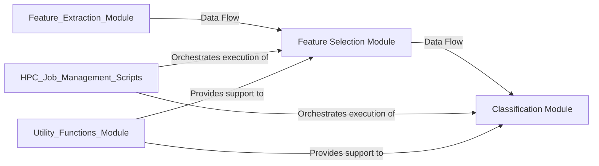

## Details

This component encompasses the core machine learning functionalities of the neuro-forestwalk system. It is responsible for identifying the most discriminative behavioral features, optimizing and training the classification model (specifically Random Forest), performing predictions on new data, and evaluating the overall classification accuracy for behavioral phenotyping. It acts as the central intelligence for transforming processed behavioral data into actionable insights.

### Feature Selection Module
This module identifies and selects the most discriminative and informative features from the larger set generated by the Feature Extraction Module. This step is critical for reducing dimensionality, mitigating overfitting, improving model performance, and enhancing the interpretability of the classification results. It employs statistical methods or machine learning techniques (e.g., Random Forest-based feature importance) to achieve this.

**Related Classes/Methods**:

- <a href="https://github.com/Roche/neuro-forestwalk/blob/main/Code/feature_selection.py#L1-L1" target="_blank" rel="noopener noreferrer">`Code/feature_selection.py` (1:1)</a>
- <a href="https://github.com/Roche/neuro-forestwalk/blob/main/Code/feature_selection_multiclass.py#L1-L1" target="_blank" rel="noopener noreferrer">`Code/feature_selection_multiclass.py` (1:1)</a>

### Classification Module
This module handles the core machine learning tasks of model training, hyperparameter optimization, prediction, and evaluation. Specifically, it trains Random Forest classifiers using the selected features, performs predictions on new data, and assesses the overall classification accuracy for behavioral phenotyping. It supports both binary and multiclass classification scenarios.

**Related Classes/Methods**:

- <a href="https://github.com/Roche/neuro-forestwalk/blob/main/Code/classification.py#L1-L1" target="_blank" rel="noopener noreferrer">`Code/classification.py` (1:1)</a>
- <a href="https://github.com/Roche/neuro-forestwalk/blob/main/Code/classification_multiclass.py#L1-L1" target="_blank" rel="noopener noreferrer">`Code/classification_multiclass.py` (1:1)</a>

### [FAQ](https://github.com/CodeBoarding/GeneratedOnBoardings/tree/main?tab=readme-ov-file#faq)