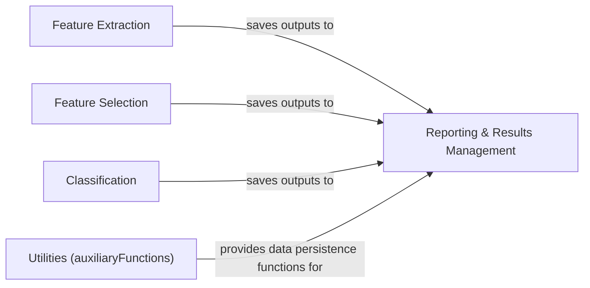

## Details

The `Reporting & Results Management` component is crucial for the `Machine Learning Tool for Behavioral Phenotyping` project, as it ensures the persistence, organization, and accessibility of all analytical outputs. This aligns perfectly with the project's emphasis on reproducibility and batch processing in an HPC environment.

### Reporting & Results Management [[Expand]](./Reporting_Results_Management.md)
This component is responsible for the persistent storage, organization, and accessibility of all intermediate and final outputs generated by the analysis pipeline. This includes raw feature dataframes, lists of selected features, optimized model hyperparameters, classification predictions, and performance metrics. It acts as the central repository for all generated data, ensuring data integrity and facilitating subsequent analysis or visualization.

**Related Classes/Methods**:

- <a href="https://github.com/Roche/neuro-forestwalk/blob/main/Code/utils/auxiliaryFunctions.py" target="_blank" rel="noopener noreferrer">`Code/utils/auxiliaryFunctions.py`</a>
- <a href="https://github.com/Roche/neuro-forestwalk/blob/main/Code/classification.py" target="_blank" rel="noopener noreferrer">`Code/classification.py`</a>
- <a href="https://github.com/Roche/neuro-forestwalk/blob/main/Code/classification_multiclass.py" target="_blank" rel="noopener noreferrer">`Code/classification_multiclass.py`</a>
- <a href="https://github.com/Roche/neuro-forestwalk/blob/main/Code/feature_extraction.py" target="_blank" rel="noopener noreferrer">`Code/feature_extraction.py`</a>
- <a href="https://github.com/Roche/neuro-forestwalk/blob/main/Code/feature_selection.py" target="_blank" rel="noopener noreferrer">`Code/feature_selection.py`</a>
- <a href="https://github.com/Roche/neuro-forestwalk/blob/main/Code/feature_selection_multiclass.py" target="_blank" rel="noopener noreferrer">`Code/feature_selection_multiclass.py`</a>

### Feature Extraction
This component processes raw behavioral data (likely from DeepLabCut tracking) to derive meaningful features. These features are the foundation for subsequent machine learning tasks. It generates intermediate dataframes that need to be stored.

**Related Classes/Methods**:

- <a href="https://github.com/Roche/neuro-forestwalk/blob/main/Code/feature_extraction.py" target="_blank" rel="noopener noreferrer">`Code/feature_extraction.py`</a>
- <a href="https://github.com/Roche/neuro-forestwalk/blob/main/Code/feature_extraction.py" target="_blank" rel="noopener noreferrer">`Code/feature_extraction.bsub`</a>

### Feature Selection
This component takes the extracted features and applies various algorithms to select the most relevant and informative features for the classification task. This step is critical for reducing dimensionality, improving model performance, and enhancing interpretability. The selected features need to be saved for later use.

**Related Classes/Methods**:

- <a href="https://github.com/Roche/neuro-forestwalk/blob/main/Code/feature_selection.py" target="_blank" rel="noopener noreferrer">`Code/feature_selection.py`</a>
- <a href="https://github.com/Roche/neuro-forestwalk/blob/main/Code/feature_selection_multiclass.py" target="_blank" rel="noopener noreferrer">`Code/feature_selection_multiclass.py`</a>
- <a href="https://github.com/Roche/neuro-forestwalk/blob/main/Code/feature_selection.py" target="_blank" rel="noopener noreferrer">`Code/feature_selection.bsub`</a>
- <a href="https://github.com/Roche/neuro-forestwalk/blob/main/Code/feature_selection_multiclass.py" target="_blank" rel="noopener noreferrer">`Code/feature_selection_multiclass.bsub`</a>

### Classification
This component implements the machine learning models (e.g., Random Forest Classifier) to classify behavioral phenotypes based on the selected features. It generates predictions, model hyperparameters, and performance metrics, all of which are critical outputs requiring persistent storage.

**Related Classes/Methods**:

- <a href="https://github.com/Roche/neuro-forestwalk/blob/main/Code/classification.py" target="_blank" rel="noopener noreferrer">`Code/classification.py`</a>
- <a href="https://github.com/Roche/neuro-forestwalk/blob/main/Code/classification_multiclass.py" target="_blank" rel="noopener noreferrer">`Code/classification_multiclass.py`</a>
- <a href="https://github.com/Roche/neuro-forestwalk/blob/main/Code/classification.py" target="_blank" rel="noopener noreferrer">`Code/classification.bsub`</a>
- <a href="https://github.com/Roche/neuro-forestwalk/blob/main/Code/classification_multiclass.py" target="_blank" rel="noopener noreferrer">`Code/classification_multiclass.bsub`</a>

### Utilities (auxiliaryFunctions)
This component provides a collection of general-purpose utility functions, particularly those related to data handling, file I/O, and potentially data serialization/deserialization. It is expected to house the core functions that the other components use to save and load their outputs, making it a direct support component for `Reporting & Results Management`.

**Related Classes/Methods**:

- <a href="https://github.com/Roche/neuro-forestwalk/blob/main/Code/utils/auxiliaryFunctions.py" target="_blank" rel="noopener noreferrer">`Code/utils/auxiliaryFunctions.py`</a>

### [FAQ](https://github.com/CodeBoarding/GeneratedOnBoardings/tree/main?tab=readme-ov-file#faq)