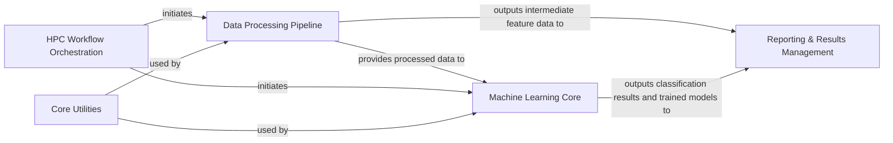

## Details

The `neuro-forestwalk` project is structured as a robust Machine Learning Tool for Behavioral Phenotyping, designed with a clear data pipeline and workflow architecture suitable for High-Performance Computing (HPC) environments. The analysis of its Control Flow Graph (CFG) and source code reveals five central components that manage the flow from raw DeepLabCut (DLC) tracking data to classified behavioral phenotypes.

### Data Processing Pipeline [[Expand]](./Data_Processing_Pipeline.md)
This component is responsible for the initial ingestion of raw DeepLabCut (DLC) tracking data and associated metadata. It then transforms these raw coordinates into a rich set of quantitative behavioral features (e.g., distances, angles, event detections) and aggregates these features from multiple experimental trials into a structured dataset suitable for machine learning.

**Related Classes/Methods**:

- `DLCandTarget`
- `Trial.__init__`
- `Trial`
- `Experiment`
- <a href="https://github.com/Roche/neuro-forestwalk/blob/main/Code/feature_extraction.py" target="_blank" rel="noopener noreferrer">`feature_extraction`</a>

### Machine Learning Core [[Expand]](./Machine_Learning_Core.md)
This component encompasses the core machine learning functionalities. It identifies the most discriminative behavioral features, optimizes the hyperparameters of the classification model (specifically Random Forest), trains the model using the selected features, performs predictions on new data, and evaluates the overall classification accuracy for behavioral phenotyping.

**Related Classes/Methods**:

- <a href="https://github.com/Roche/neuro-forestwalk/blob/main/Code/feature_selection.py" target="_blank" rel="noopener noreferrer">`feature_selection`</a>
- <a href="https://github.com/Roche/neuro-forestwalk/blob/main/Code/feature_selection_multiclass.py" target="_blank" rel="noopener noreferrer">`feature_selection_multiclass`</a>
- <a href="https://github.com/Roche/neuro-forestwalk/blob/main/Code/classification.py" target="_blank" rel="noopener noreferrer">`classification`</a>
- <a href="https://github.com/Roche/neuro-forestwalk/blob/main/Code/classification_multiclass.py" target="_blank" rel="noopener noreferrer">`classification_multiclass`</a>

### HPC Workflow Orchestration [[Expand]](./HPC_Workflow_Orchestration.md)
This component manages the entire execution flow of the `neuro-forestwalk` pipeline within a High-Performance Computing (HPC) environment. It handles the submission, scheduling, and monitoring of computational tasks (data processing, feature engineering, feature selection, and classification) using LSF (Load Sharing Facility) bsub scripts.

**Related Classes/Methods**:

- <a href="https://github.com/Roche/neuro-forestwalk/blob/main/Code/classification.py" target="_blank" rel="noopener noreferrer">`classification.bsub`</a>
- <a href="https://github.com/Roche/neuro-forestwalk/blob/main/Code/feature_extraction.py" target="_blank" rel="noopener noreferrer">`feature_extraction.bsub`</a>
- <a href="https://github.com/Roche/neuro-forestwalk/blob/main/Code/feature_selection.py" target="_blank" rel="noopener noreferrer">`feature_selection.bsub`</a>
- <a href="https://github.com/Roche/neuro-forestwalk/blob/main/Code/feature_extraction.py" target="_blank" rel="noopener noreferrer">`feature_extraction`</a>
- <a href="https://github.com/Roche/neuro-forestwalk/blob/main/Code/feature_selection.py" target="_blank" rel="noopener noreferrer">`feature_selection`</a>
- <a href="https://github.com/Roche/neuro-forestwalk/blob/main/Code/feature_selection_multiclass.py" target="_blank" rel="noopener noreferrer">`feature_selection_multiclass`</a>
- <a href="https://github.com/Roche/neuro-forestwalk/blob/main/Code/classification.py" target="_blank" rel="noopener noreferrer">`classification`</a>
- <a href="https://github.com/Roche/neuro-forestwalk/blob/main/Code/classification_multiclass.py" target="_blank" rel="noopener noreferrer">`classification_multiclass`</a>

### Reporting & Results Management [[Expand]](./Reporting_Results_Management.md)
This component is responsible for the persistent storage, organization, and accessibility of all intermediate and final outputs generated by the analysis pipeline. This includes raw feature dataframes, lists of selected features, optimized model hyperparameters, classification predictions, and performance metrics.

**Related Classes/Methods**:

- <a href="https://github.com/Roche/neuro-forestwalk/blob/main/Code/feature_extraction.py" target="_blank" rel="noopener noreferrer">`feature_extraction`</a>
- <a href="https://github.com/Roche/neuro-forestwalk/blob/main/Code/feature_selection.py" target="_blank" rel="noopener noreferrer">`feature_selection`</a>
- <a href="https://github.com/Roche/neuro-forestwalk/blob/main/Code/classification.py" target="_blank" rel="noopener noreferrer">`classification`</a>
- <a href="https://github.com/Roche/neuro-forestwalk/blob/main/Code/feature_selection_multiclass.py" target="_blank" rel="noopener noreferrer">`feature_selection_multiclass`</a>
- <a href="https://github.com/Roche/neuro-forestwalk/blob/main/Code/classification_multiclass.py" target="_blank" rel="noopener noreferrer">`classification_multiclass`</a>

### Core Utilities
This component provides a collection of general-purpose helper functions and common utilities that support various operations across the project. These utilities include functions for data manipulation, list processing (e.g., `ripristinate_lists`), ranking algorithms (`get_ranks`, `get_final_ranks`), and statistical helpers (`mode_with_none`).

**Related Classes/Methods**:

- `ripristinate_lists`
- `get_ranks`
- `get_final_ranks`
- `mode_with_none`

### [FAQ](https://github.com/CodeBoarding/GeneratedOnBoardings/tree/main?tab=readme-ov-file#faq)