```mermaid
graph LR
    Configuration_Management["Configuration Management"]
    Data_Loading_Preprocessing["Data Loading & Preprocessing"]
    Model_Definition["Model Definition"]
    Experiment_Orchestration["Experiment Orchestration"]
    Interactive_Experimentation_Analysis["Interactive Experimentation & Analysis"]
    Results_Outputs_Storage["Results & Outputs Storage"]
    Configuration_Management -- "provides configuration to" --> Data_Loading_Preprocessing
    Configuration_Management -- "provides configuration to" --> Experiment_Orchestration
    Data_Loading_Preprocessing -- "receives configuration from" --> Configuration_Management
    Data_Loading_Preprocessing -- "provides processed data to" --> Experiment_Orchestration
    Model_Definition -- "is used by" --> Experiment_Orchestration
    Experiment_Orchestration -- "receives configuration from" --> Configuration_Management
    Experiment_Orchestration -- "uses" --> Data_Loading_Preprocessing
    Experiment_Orchestration -- "uses" --> Model_Definition
    Experiment_Orchestration -- "generates" --> Results_Outputs_Storage
    Interactive_Experimentation_Analysis -- "uses" --> Data_Loading_Preprocessing
    Interactive_Experimentation_Analysis -- "can trigger" --> Experiment_Orchestration
    Results_Outputs_Storage -- "is generated by" --> Experiment_Orchestration
    Results_Outputs_Storage -- "is accessed by" --> Interactive_Experimentation_Analysis
    click Configuration_Management href "https://github.com/CodeBoarding/GeneratedOnBoardings/blob/main/neuro-meeglet-paper/Configuration_Management.md" "Details"
```

## Details

This describes the fundamental components and their relationships within a Machine Learning Research/Experimentation Project, highlighting architectural patterns like Modular Design, Configuration-Driven, Data Pipeline/Workflow, Experimentation and Reproducibility.

### Configuration Management [[Expand]](./Configuration_Management.md)
Centralizes and manages all experiment parameters, ensuring reproducibility and easy modification. It loads settings from `config.yml`.

**Related Classes/Methods**:

- <a href="https://github.com/Roche/neuro-meeglet-paper/blob/main/core/config.py#L1-L1" target="_blank" rel="noopener noreferrer">`core.config` (1:1)</a>
- <a href="https://github.com/Roche/neuro-meeglet-paper/blob/main/core/config.py#L1-L1" target="_blank" rel="noopener noreferrer">`config.example` (1:1)</a>

### Data Loading & Preprocessing
Handles the retrieval of raw data and applies necessary transformations (e.g., filtering, epoching, artifact rejection) to prepare it for model consumption.

**Related Classes/Methods**:

- <a href="https://github.com/Roche/neuro-meeglet-paper/blob/main/core/dataloaders.py#L1-L1" target="_blank" rel="noopener noreferrer">`core.dataloaders` (1:1)</a>
- <a href="https://github.com/Roche/neuro-meeglet-paper/blob/main/core/preprocessing.py#L1-L1" target="_blank" rel="noopener noreferrer">`core.preprocessing` (1:1)</a>

### Model Definition
Contains the implementations of various machine learning models and neural network architectures used in the experiments.

**Related Classes/Methods**:

- <a href="https://github.com/Roche/neuro-meeglet-paper/blob/main/core/models.py#L1-L1" target="_blank" rel="noopener noreferrer">`core.models` (1:1)</a>

### Experiment Orchestration
Manages the entire lifecycle of an experiment, from setting up training loops and model evaluation to logging results and saving artifacts. It coordinates interactions between data, models, and configurations.

**Related Classes/Methods**:

- <a href="https://github.com/Roche/neuro-meeglet-paper/blob/main/core/benchmark.py#L1-L1" target="_blank" rel="noopener noreferrer">`core.benchmark` (1:1)</a>
- `scripts.03_run_benchmarks` (1:1)

### Interactive Experimentation & Analysis
Provides a flexible environment (Jupyter notebooks) for ad-hoc data exploration, testing specific processing steps, running quick experiments, and visualizing results.

**Related Classes/Methods**:

- `scripts.00_bidsify_tuab` (1:1)
- `scripts.01_process_tuab` (1:1)
- `scripts.02_process_tdbrain` (1:1)

### Results & Outputs Storage
An abstract component representing the location and management of all experiment outputs, including trained model weights, evaluation metrics, logs, and generated plots.

**Related Classes/Methods**: _None_

### [FAQ](https://github.com/CodeBoarding/GeneratedOnBoardings/tree/main?tab=readme-ov-file#faq)