```mermaid
graph LR
    Configuration_Management["Configuration Management"]
    Data_Preprocessing["Data Preprocessing"]
    Data_Provisioning["Data Provisioning"]
    Model_Definition["Model Definition"]
    Experiment_Orchestration_Benchmarking["Experiment Orchestration/Benchmarking"]
    Interactive_Scripts_Workflows["Interactive Scripts/Workflows"]
    Configuration_Management -- "provides configuration to" --> Data_Provisioning
    Configuration_Management -- "provides configuration to" --> Experiment_Orchestration_Benchmarking
    Data_Preprocessing -- "generates preprocessed data for" --> Data_Provisioning
    Data_Provisioning -- "provides prepared data to" --> Experiment_Orchestration_Benchmarking
    Model_Definition -- "defines models for" --> Experiment_Orchestration_Benchmarking
    Experiment_Orchestration_Benchmarking -- "orchestrates" --> Data_Provisioning
    Experiment_Orchestration_Benchmarking -- "orchestrates" --> Model_Definition
    Interactive_Scripts_Workflows -- "orchestrates" --> Experiment_Orchestration_Benchmarking
    Interactive_Scripts_Workflows -- "utilizes" --> Data_Preprocessing
    click Configuration_Management href "https://github.com/CodeBoarding/GeneratedOnBoardings/blob/main/neuro-meeglet-paper/Configuration_Management.md" "Details"
    click Data_Provisioning href "https://github.com/CodeBoarding/GeneratedOnBoardings/blob/main/neuro-meeglet-paper/Data_Provisioning.md" "Details"
```

## Details

One paragraph explaining the functionality which is represented by this graph. What the main flow is and what is its purpose.

### Configuration Management [[Expand]](./Configuration_Management.md)
This component is responsible for defining and managing all experimental parameters, hyperparameters, and data paths. It acts as the single source of truth for experiment configurations, ensuring reproducibility and easy modification of experimental setups.

**Related Classes/Methods**: _None_

### Data Preprocessing
This component contains functions and classes for cleaning, transforming, and preparing the raw EEG data for model input. This includes filtering, epoching, artifact rejection, and normalization, which are critical steps in EEG signal processing. It generates the derivative files (e.g., epoched `.fif` files, covariance HDF5 files) consumed by the Data Provisioning component.

**Related Classes/Methods**: _None_

### Data Provisioning [[Expand]](./Data_Provisioning.md)
Manages the efficient loading of preprocessed EEG data (raw epochs and covariance matrices) from BIDS-compliant derivatives and prepares it into datasets and batches suitable for training and evaluation of machine learning models. It abstracts the data access layer, providing data iterators to the model training component. It also includes utilities for data scaling and feature manipulation.

**Related Classes/Methods**:

- <a href="https://github.com/Roche/neuro-meeglet-paper/blob/main/core/dataloaders.py#L14-L20" target="_blank" rel="noopener noreferrer">`core.dataloaders.DataScaler` (14:20)</a>
- <a href="https://github.com/Roche/neuro-meeglet-paper/blob/main/core/dataloaders.py#L23-L92" target="_blank" rel="noopener noreferrer">`core.dataloaders.load_raw_data` (23:92)</a>
- <a href="https://github.com/Roche/neuro-meeglet-paper/blob/main/core/dataloaders.py#L95-L163" target="_blank" rel="noopener noreferrer">`core.dataloaders.load_cov_data` (95:163)</a>

### Model Definition
This component defines the machine learning models used in the experiments. These are typically deep learning models (e.g., PyTorch models) or traditional machine learning models tailored for EEG data, including their architecture and forward pass logic.

**Related Classes/Methods**: _None_

### Experiment Orchestration/Benchmarking
This component orchestrates the entire experimental pipeline, from loading data and applying preprocessing to training models, evaluating their performance, and potentially saving results. It manages different experimental setups and comparisons, utilizing configurations, data loaders, and models.

**Related Classes/Methods**: _None_

### Interactive Scripts/Workflows
This component comprises Jupyter notebooks or standalone scripts that serve as high-level entry points for various tasks, including initial data processing (e.g., BIDSification, dataset-specific processing), interactive data exploration, and running complete experimental benchmarks. These scripts orchestrate and utilize the core components.

**Related Classes/Methods**: _None_

### [FAQ](https://github.com/CodeBoarding/GeneratedOnBoardings/tree/main?tab=readme-ov-file#faq)