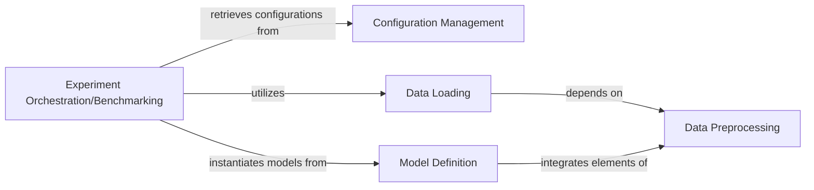

## Details

The Model Definition & Training component is central to the project's machine learning research and experimentation. It provides a robust, flexible, and reproducible framework for conducting machine learning experiments, abstracting away the complexities of model architecture, data handling, and training loops, allowing researchers to focus on defining and comparing different experimental setups for biomarker discovery and computational neuroscience research.

### Configuration Management [[Expand]](./Configuration_Management.md)
Manages and provides access to project-wide configurations, including dataset paths, model parameters, and other experimental settings, ensuring reproducibility and flexible modification of parameters.

**Related Classes/Methods**:

- <a href="https://github.com/Roche/neuro-meeglet-paper/blob/main/core/config.py#L1-L1000" target="_blank" rel="noopener noreferrer">`core.config` (1:1000)</a>

### Data Loading
Responsible for loading various types of data (e.g., raw EEG epochs, precomputed covariance matrices) from specified paths, handling subject filtering, and extracting relevant feature information for model input.

**Related Classes/Methods**:

- <a href="https://github.com/Roche/neuro-meeglet-paper/blob/main/core/dataloaders.py#L23-L92" target="_blank" rel="noopener noreferrer">`core.dataloaders.load_raw_data` (23:92)</a>
- <a href="https://github.com/Roche/neuro-meeglet-paper/blob/main/core/dataloaders.py#L95-L163" target="_blank" rel="noopener noreferrer">`core.dataloaders.load_cov_data` (95:163)</a>

### Data Preprocessing
Contains a suite of functions for transforming raw EEG data, including operations like cropping, resampling, filtering, channel selection, and ICA-based artifact rejection, preparing the data for feature extraction or direct model input.

**Related Classes/Methods**:

- <a href="https://github.com/Roche/neuro-meeglet-paper/blob/main/core/preprocessing.py#L1-L1000" target="_blank" rel="noopener noreferrer">`core.preprocessing` (1:1000)</a>

### Model Definition
Defines and instantiates different machine learning models, including deep learning architectures and traditional models, often wrapping them in skorch or sklearn pipelines for consistent training interfaces.

**Related Classes/Methods**:

- <a href="https://github.com/Roche/neuro-meeglet-paper/blob/main/core/models.py#L49-L124" target="_blank" rel="noopener noreferrer">`core.models.create_raw_model` (49:124)</a>
- <a href="https://github.com/Roche/neuro-meeglet-paper/blob/main/core/models.py#L404-L437" target="_blank" rel="noopener noreferrer">`core.models.create_cov_model` (404:437)</a>
- <a href="https://github.com/Roche/neuro-meeglet-paper/blob/main/core/models.py#L145-L168" target="_blank" rel="noopener noreferrer">`core.models.GroupWhitener` (145:168)</a>
- <a href="https://github.com/Roche/neuro-meeglet-paper/blob/main/core/models.py#L171-L186" target="_blank" rel="noopener noreferrer">`core.models.Normalizer` (171:186)</a>
- <a href="https://github.com/Roche/neuro-meeglet-paper/blob/main/core/models.py#L189-L222" target="_blank" rel="noopener noreferrer">`core.models.ReconPCA` (189:222)</a>

### Experiment Orchestration/Benchmarking
Orchestrates the entire experimental pipeline, defining benchmark configurations, coordinating data loading and model instantiation, and managing cross-validation strategies for systematic training, validation, and evaluation of models.

**Related Classes/Methods**:

- <a href="https://github.com/Roche/neuro-meeglet-paper/blob/main/core/benchmark.py#L26-L95" target="_blank" rel="noopener noreferrer">`core.benchmark.Benchmark` (26:95)</a>
- <a href="https://github.com/Roche/neuro-meeglet-paper/blob/main/core/benchmark.py#L98-L108" target="_blank" rel="noopener noreferrer">`core.benchmark.RawBenchmark` (98:108)</a>
- <a href="https://github.com/Roche/neuro-meeglet-paper/blob/main/core/benchmark.py#L111-L120" target="_blank" rel="noopener noreferrer">`core.benchmark.CovBenchmark` (111:120)</a>

### [FAQ](https://github.com/CodeBoarding/GeneratedOnBoardings/tree/main?tab=readme-ov-file#faq)