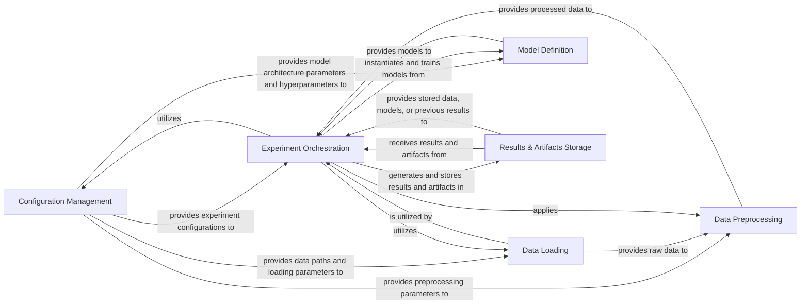

## Details

Overview of the core components for the `neuro-meeglet-paper` project, focusing on their structure, flow, and purpose, aligned with Machine Learning Research/Experimentation Project patterns.

### Configuration Management [[Expand]](./Configuration_Management.md)
This component is responsible for defining and managing all experimental parameters, hyperparameters, and data paths. It acts as the single source of truth for experiment configurations, ensuring reproducibility and easy modification of experimental setups.

**Related Classes/Methods**:

- <a href="https://github.com/Roche/neuro-meeglet-paper/blob/main/core/config.py" target="_blank" rel="noopener noreferrer">`core.config`</a>

### Data Loading
This component handles the loading of raw or preprocessed EEG data from specified sources. It provides utilities to create datasets and data loaders suitable for training machine learning models, likely integrating with libraries like MNE-Python or Braindecode.

**Related Classes/Methods**:

- <a href="https://github.com/Roche/neuro-meeglet-paper/blob/main/core/dataloaders.py" target="_blank" rel="noopener noreferrer">`core.dataloaders`</a>

### Data Preprocessing
This component contains functions and classes for cleaning, transforming, and preparing the raw EEG data for model input. This includes critical steps in EEG signal processing such as filtering, epoching, artifact rejection, and normalization.

**Related Classes/Methods**:

- <a href="https://github.com/Roche/neuro-meeglet-paper/blob/main/core/preprocessing.py" target="_blank" rel="noopener noreferrer">`core.preprocessing`</a>

### Model Definition
This component defines the machine learning models used in the experiments. Given the project's domain, these would likely be deep learning models (e.g., PyTorch models) or traditional machine learning models tailored for EEG data.

**Related Classes/Methods**:

- <a href="https://github.com/Roche/neuro-meeglet-paper/blob/main/core/models.py" target="_blank" rel="noopener noreferrer">`core.models`</a>

### Experiment Orchestration
This component orchestrates the entire experimental pipeline, from loading data and applying preprocessing to training models and evaluating their performance. It manages different experimental setups and comparisons, as exemplified by the `create_benchmark_configs` function which generates various experiment configurations.

**Related Classes/Methods**:

- <a href="https://github.com/Roche/neuro-meeglet-paper/blob/main/core/benchmark.py" target="_blank" rel="noopener noreferrer">`core.benchmark`</a>

### Results & Artifacts Storage [[Expand]](./Results_Artifacts_Storage.md)
This component is responsible for storing the outcomes of experiments, including trained model weights, performance metrics, visualizations, logs, and any intermediate data generated during the benchmarking process. The `Benchmark.load` method, while loading, implies interaction with these stored artifacts. This ensures reproducibility and traceability of experimental results.

**Related Classes/Methods**:

- <a href="https://github.com/Roche/neuro-meeglet-paper/blob/main/core/benchmark.py" target="_blank" rel="noopener noreferrer">`core.benchmark`</a>

### [FAQ](https://github.com/CodeBoarding/GeneratedOnBoardings/tree/main?tab=readme-ov-file#faq)