```mermaid
graph LR
    Configuration_Management["Configuration Management"]
    Data_Preparation["Data Preparation"]
    Data_Provisioning["Data Provisioning"]
    Model_Definition_Training["Model Definition & Training"]
    Experiment_Orchestration["Experiment Orchestration"]
    Results_Artifacts_Storage["Results & Artifacts Storage"]
    Configuration_Management -- "configures" --> Data_Preparation
    Configuration_Management -- "configures" --> Model_Definition_Training
    Data_Preparation -- "produces prepared data for" --> Data_Provisioning
    Data_Provisioning -- "supplies batched data to" --> Model_Definition_Training
    Model_Definition_Training -- "generates outputs for" --> Results_Artifacts_Storage
    Experiment_Orchestration -- "invokes" --> Data_Preparation
    Experiment_Orchestration -- "invokes" --> Model_Definition_Training
    click Configuration_Management href "https://github.com/CodeBoarding/GeneratedOnBoardings/blob/main/neuro-meeglet-paper/Configuration_Management.md" "Details"
    click Data_Provisioning href "https://github.com/CodeBoarding/GeneratedOnBoardings/blob/main/neuro-meeglet-paper/Data_Provisioning.md" "Details"
    click Model_Definition_Training href "https://github.com/CodeBoarding/GeneratedOnBoardings/blob/main/neuro-meeglet-paper/Model_Definition_Training.md" "Details"
    click Results_Artifacts_Storage href "https://github.com/CodeBoarding/GeneratedOnBoardings/blob/main/neuro-meeglet-paper/Results_Artifacts_Storage.md" "Details"
```

## Details

One paragraph explaining the functionality which is represented by this graph. What the main flow is and what is its purpose.

### Configuration Management [[Expand]](./Configuration_Management.md)
Provides a centralized system for loading, parsing, and managing all experiment configurations, including hyperparameters, data paths, and model settings. This ensures reproducibility and easy modification of experimental parameters.

**Related Classes/Methods**:

- <a href="https://github.com/Roche/neuro-meeglet-paper/blob/main/core/config.py#L1-L1" target="_blank" rel="noopener noreferrer">`core.config` (1:1)</a>
- <a href="https://github.com/Roche/neuro-meeglet-paper/blob/main/core/config.py#L1-L1" target="_blank" rel="noopener noreferrer">`config.example` (1:1)</a>

### Data Preparation
Handles the entire data pipeline from raw data ingestion and standardization into BIDS format to various signal preprocessing techniques (e.g., cleaning, filtering, artifact rejection, epoching). It transforms raw neurophysiological data into a clean, usable format for machine learning.

**Related Classes/Methods**:

- <a href="https://github.com/Roche/neuro-meeglet-paper/blob/main/core/preprocessing.py#L1-L1" target="_blank" rel="noopener noreferrer">`core.preprocessing` (1:1)</a>

### Data Provisioning [[Expand]](./Data_Provisioning.md)
Manages the efficient loading of preprocessed data and its preparation into batches suitable for training and evaluation of machine learning models. It abstracts the data access layer, providing data iterators to the model training component.

**Related Classes/Methods**:

- <a href="https://github.com/Roche/neuro-meeglet-paper/blob/main/core/dataloaders.py#L1-L1" target="_blank" rel="noopener noreferrer">`core.dataloaders` (1:1)</a>

### Model Definition & Training [[Expand]](./Model_Definition_Training.md)
Encompasses the architectural definitions of machine learning models (e.g., deep learning networks) and orchestrates their training, validation, and testing phases. It manages the execution of individual experiments, including model instantiation, training loops, and calculation of evaluation metrics.

**Related Classes/Methods**:

- <a href="https://github.com/Roche/neuro-meeglet-paper/blob/main/core/models.py#L1-L1" target="_blank" rel="noopener noreferrer">`core.models` (1:1)</a>
- <a href="https://github.com/Roche/neuro-meeglet-paper/blob/main/core/benchmark.py#L26-L95" target="_blank" rel="noopener noreferrer">`core.benchmark.Benchmark` (26:95)</a>
- <a href="https://github.com/Roche/neuro-meeglet-paper/blob/main/core/benchmark.py#L98-L108" target="_blank" rel="noopener noreferrer">`core.benchmark.RawBenchmark` (98:108)</a>
- <a href="https://github.com/Roche/neuro-meeglet-paper/blob/main/core/benchmark.py#L111-L120" target="_blank" rel="noopener noreferrer">`core.benchmark.CovBenchmark` (111:120)</a>

### Experiment Orchestration
Jupyter notebooks that serve as interactive scripts to tie together and orchestrate the entire experimental pipeline. They define the sequence of operations, from data preparation to running benchmarks, by invoking functionalities from other core components.

**Related Classes/Methods**:

- `scripts.00_bidsify_tuab` (1:1)
- `scripts.01_process_tuab` (1:1)
- `scripts.02_process_tdbrain` (1:1)
- `scripts.03_run_benchmarks` (1:1)

### Results & Artifacts Storage [[Expand]](./Results_Artifacts_Storage.md)
Stores the outcomes of experiments, including trained model weights, performance metrics, visualizations, logs, and any intermediate data generated during the benchmarking process. This ensures reproducibility and traceability of experimental results.

**Related Classes/Methods**:

- <a href="https://github.com/Roche/neuro-meeglet-paper/blob/main/core/benchmark.py#L86-L95" target="_blank" rel="noopener noreferrer">`core.benchmark.Benchmark.load` (86:95)</a>
- <a href="https://github.com/Roche/neuro-meeglet-paper/blob/main/core/benchmark.py#L171-L265" target="_blank" rel="noopener noreferrer">`core.benchmark.create_benchmark_configs` (171:265)</a>

### [FAQ](https://github.com/CodeBoarding/GeneratedOnBoardings/tree/main?tab=readme-ov-file#faq)