```mermaid
graph LR
    API_Examples["API & Examples"]
    Model_Management["Model Management"]
    Simulation_Orchestration["Simulation Orchestration"]
    Physics_Solvers["Physics Solvers"]
    Collision_Contacts["Collision & Contacts"]
    Rendering["Rendering"]
    Inverse_Kinematics_IK_Solver["Inverse Kinematics (IK) Solver"]
    Core_Engine["Core Engine"]
    API_Examples -- "Uses" --> Model_Management
    API_Examples -- "Orchestrates" --> Simulation_Orchestration
    Model_Management -- "Provides to" --> Simulation_Orchestration
    Simulation_Orchestration -- "Invokes" --> Physics_Solvers
    Simulation_Orchestration -- "Uses" --> Collision_Contacts
    Physics_Solvers -- "Interacts with" --> Core_Engine
    Collision_Contacts -- "Provides data to" --> Physics_Solvers
    API_Examples -- "Uses" --> Rendering
    Rendering -- "Visualizes" --> Model_Management
    API_Examples -- "Uses" --> Inverse_Kinematics_IK_Solver
    Inverse_Kinematics_IK_Solver -- "Modifies" --> Model_Management
    Core_Engine -- "Provides services to" --> Physics_Solvers
    Core_Engine -- "Supports" --> Collision_Contacts
    click API_Examples href "https://github.com/CodeBoarding/GeneratedOnBoardings/blob/main/newton/API_Examples.md" "Details"
    click Physics_Solvers href "https://github.com/CodeBoarding/GeneratedOnBoardings/blob/main/newton/Physics_Solvers.md" "Details"
```

## Details

The `API & Examples` subsystem serves as the primary interface for users to interact with the Newton physics engine. It provides high-level abstractions and runnable examples, enabling users to configure, execute, and visualize physics simulations without needing to delve into the low-level engine details.

### API & Examples [[Expand]](./API_Examples.md)
The top-level programmatic interface and collection of runnable examples. It exposes high-level functions for model creation, simulation control, and data access, abstracting the complexity of the underlying physics engine. It also demonstrates best practices for using the API.

**Related Classes/Methods**:

- `newton.api` (1:1)
- `newton.examples` (1:1)

### Model Management
Responsible for defining, building, and representing the physical models within the simulation. This includes handling rigid bodies, joints, and other structural components.

**Related Classes/Methods**:

- <a href="https://github.com/newton-physics/newton/blob/main/newton/sim/builder.py#L87-L3930" target="_blank" rel="noopener noreferrer">`newton.sim.builder.ModelBuilder` (87:3930)</a>
- <a href="https://github.com/newton-physics/newton/blob/main/newton/sim/model.py#L28-L565" target="_blank" rel="noopener noreferrer">`newton.sim.model.Model` (28:565)</a>

### Simulation Orchestration
Manages the overall flow of the simulation, including advancing the simulation state, applying controls, and integrating with solvers. It acts as the central coordinator for a single simulation run.

**Related Classes/Methods**:

- <a href="https://github.com/newton-physics/newton/blob/main/newton/sim/state.py#L20-L108" target="_blank" rel="noopener noreferrer">`newton.sim.state.State` (20:108)</a>
- <a href="https://github.com/newton-physics/newton/blob/main/newton/sim/control.py#L20-L76" target="_blank" rel="noopener noreferrer">`newton.sim.control.Control` (20:76)</a>

### Physics Solvers [[Expand]](./Physics_Solvers.md)
Provides the core algorithms for integrating physics equations over time. This component offers a base interface for various solver implementations, allowing for different numerical methods to be plugged in.

**Related Classes/Methods**:

- <a href="https://github.com/newton-physics/newton/blob/main/newton/solvers/solver.py#L156-L294" target="_blank" rel="noopener noreferrer">`newton.solvers.solver.SolverBase` (156:294)</a>

### Collision & Contacts
Handles the detection of collisions between geometric primitives and the generation of contact information (e.g., contact points, normals, penetration depths). This is crucial for realistic physical interactions.

**Related Classes/Methods**:

- <a href="https://github.com/newton-physics/newton/blob/main/newton/sim/collide.py#L59-L268" target="_blank" rel="noopener noreferrer">`newton.sim.collide.CollisionPipeline` (59:268)</a>
- <a href="https://github.com/newton-physics/newton/blob/main/newton/sim/contacts.py#L22-L83" target="_blank" rel="noopener noreferrer">`newton.sim.contacts.Contacts` (22:83)</a>

### Rendering
Manages the visualization of the simulation environment and its dynamic state. It provides interfaces for different rendering backends, allowing users to observe the simulation in real-time or generate visual outputs.

**Related Classes/Methods**:

- `newton.utils.render.SimRenderer`
- <a href="https://github.com/newton-physics/newton/blob/main/newton/utils/render.py#L1296-L1346" target="_blank" rel="noopener noreferrer">`newton.utils.render.SimRendererOpenGL` (1296:1346)</a>
- <a href="https://github.com/newton-physics/newton/blob/main/newton/utils/render.py#L955-L1293" target="_blank" rel="noopener noreferrer">`newton.utils.render.SimRendererUsd` (955:1293)</a>

### Inverse Kinematics (IK) Solver
Provides functionality for inverse kinematics, allowing users to specify desired end-effector poses for robotic systems, and the solver computes the necessary joint configurations.

**Related Classes/Methods**:

- <a href="https://github.com/newton-physics/newton/blob/main/newton/sim/ik.py#L34-L677" target="_blank" rel="noopener noreferrer">`newton.sim.ik.IKSolver` (34:677)</a>

### Core Engine
Represents the fundamental, low-level physics computations, including geometric operations, core mathematical routines, and potentially GPU kernels. This component is the bedrock upon which the higher-level simulation logic is built.

**Related Classes/Methods**:

- `newton_core` (1:1)
- `newton_geometry` (1:1)
- `newton_solvers` (1:1)

### [FAQ](https://github.com/CodeBoarding/GeneratedOnBoardings/tree/main?tab=readme-ov-file#faq)