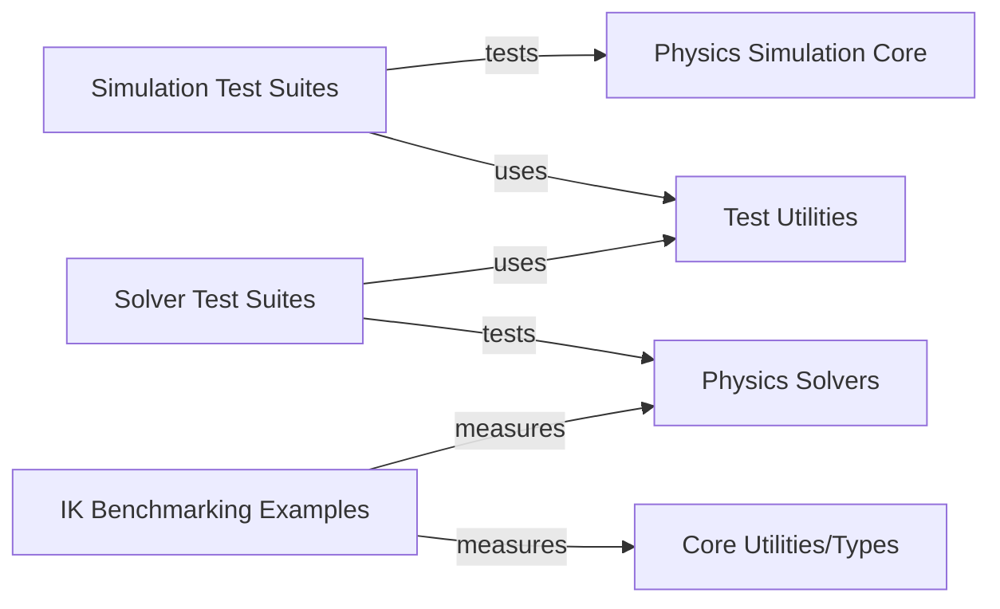

## Details

One paragraph explaining the functionality which is represented by this graph. What the main flow is and what is its purpose.

### Simulation Test Suites
This component houses test cases specifically designed to verify the correctness and stability of the overall physics simulation logic, including complex behaviors like cloth dynamics and the proper handling of various constraints. It ensures that the integrated components of the simulation behave as expected.

**Related Classes/Methods**:

- `newton.tests.test_cloth`
- `newton.tests.test_equality_constraints`

### Solver Test Suites
This component focuses on rigorously testing the various physics solvers implemented in the engine. It includes specific tests for different properties handled by solvers, such as geometric interactions, joint constraints, mass properties, and contact resolution, particularly for integrated solvers like MuJoCo.

**Related Classes/Methods**:

- `newton.tests.test_mujoco_solver`

### Test Utilities
Provides a set of reusable utility classes and functions that facilitate the writing and execution of tests across all test suites. This includes functionalities like capturing standard output/error streams, which are essential for validating console-based interactions or error reporting.

**Related Classes/Methods**:

- <a href="https://github.com/newton-physics/newton/blob/main/newton/tests/unittest_utils.py#L1-L1" target="_blank" rel="noopener noreferrer">`newton.tests.unittest_utils` (1:1)</a>

### IK Benchmarking Examples
This component contains example code and configurations specifically designed for benchmarking the performance of Inverse Kinematics (IK) solvers within the physics engine. It provides a framework for measuring and analyzing the efficiency of IK computations.

**Related Classes/Methods**:

- <a href="https://github.com/newton-physics/newton/blob/main/newton/examples/example_ik_benchmark.py#L112-L408" target="_blank" rel="noopener noreferrer">`newton.examples.example_ik_benchmark.Example` (112:408)</a>
- <a href="https://github.com/newton-physics/newton/blob/main/newton/examples/example_ik_benchmark.py#L35-L43" target="_blank" rel="noopener noreferrer">`newton.examples.example_ik_benchmark.RobotCfg` (35:43)</a>

### Physics Simulation Core
This component encapsulates the fundamental elements and functionalities required for building and managing physics simulations, including model construction, collision detection, contact handling, and state management. It provides the core infrastructure upon which various physics scenarios are built.

**Related Classes/Methods**:

- <a href="https://github.com/newton-physics/newton/blob/main/newton/sim/builder.py#L87-L3930" target="_blank" rel="noopener noreferrer">`newton.sim.builder.ModelBuilder` (87:3930)</a>
- <a href="https://github.com/newton-physics/newton/blob/main/newton/sim/collide.py#L59-L268" target="_blank" rel="noopener noreferrer">`newton.sim.collide.CollisionPipeline` (59:268)</a>
- <a href="https://github.com/newton-physics/newton/blob/main/newton/sim/contacts.py#L22-L83" target="_blank" rel="noopener noreferrer">`newton.sim.contacts.Contacts` (22:83)</a>
- <a href="https://github.com/newton-physics/newton/blob/main/newton/sim/control.py#L20-L76" target="_blank" rel="noopener noreferrer">`newton.sim.control.Control` (20:76)</a>
- <a href="https://github.com/newton-physics/newton/blob/main/newton/sim/ik.py#L34-L677" target="_blank" rel="noopener noreferrer">`newton.sim.ik.IKSolver` (34:677)</a>
- <a href="https://github.com/newton-physics/newton/blob/main/newton/sim/model.py#L28-L565" target="_blank" rel="noopener noreferrer">`newton.sim.model.Model` (28:565)</a>
- <a href="https://github.com/newton-physics/newton/blob/main/newton/sim/state.py#L20-L108" target="_blank" rel="noopener noreferrer">`newton.sim.state.State` (20:108)</a>

### Physics Solvers [[Expand]](./Physics_Solvers.md)
This component comprises various specialized algorithms and implementations for solving physics equations, handling constraints, and advancing the simulation state over time. It includes different solver types like Euler, Featherstone, Implicit MPM, MuJoCo, Style3D, VBD, and XPBD, each tailored for specific simulation needs.

**Related Classes/Methods**:

- <a href="https://github.com/newton-physics/newton/blob/main/newton/solvers/euler/solver_euler.py#L35-L145" target="_blank" rel="noopener noreferrer">`newton.solvers.euler.solver_euler.SemiImplicitSolver` (35:145)</a>
- <a href="https://github.com/newton-physics/newton/blob/main/newton/solvers/featherstone/solver_featherstone.py#L48-L666" target="_blank" rel="noopener noreferrer">`newton.solvers.featherstone.solver_featherstone.FeatherstoneSolver` (48:666)</a>
- <a href="https://github.com/newton-physics/newton/blob/main/newton/solvers/implicit_mpm/solver_implicit_mpm.py#L1040-L1914" target="_blank" rel="noopener noreferrer">`newton.solvers.implicit_mpm.solver_implicit_mpm.ImplicitMPMSolver` (1040:1914)</a>
- <a href="https://github.com/newton-physics/newton/blob/main/newton/solvers/mujoco/solver_mujoco.py#L1003-L2433" target="_blank" rel="noopener noreferrer">`newton.solvers.mujoco.solver_mujoco.MuJoCoSolver` (1003:2433)</a>
- <a href="https://github.com/newton-physics/newton/blob/main/newton/solvers/style3d/solver_style3d.py#L41-L335" target="_blank" rel="noopener noreferrer">`newton.solvers.style3d.solver_style3d.Style3DSolver` (41:335)</a>
- <a href="https://github.com/newton-physics/newton/blob/main/newton/solvers/vbd/solver_vbd.py#L2234-L3011" target="_blank" rel="noopener noreferrer">`newton.solvers.vbd.solver_vbd.VBDSolver` (2234:3011)</a>
- <a href="https://github.com/newton-physics/newton/blob/main/newton/solvers/xpbd/solver_xpbd.py#L40-L659" target="_blank" rel="noopener noreferrer">`newton.solvers.xpbd.solver_xpbd.XPBDSolver` (40:659)</a>

### Core Utilities/Types
This component provides foundational utility classes and type definitions that are broadly used across the physics engine. It includes basic data structures and enumerations essential for defining simulation parameters and interactions.

**Related Classes/Methods**:

- <a href="https://github.com/newton-physics/newton/blob/main/newton/core/types.py#L63-L120" target="_blank" rel="noopener noreferrer">`newton.core.types.Axis` (63:120)</a>

### [FAQ](https://github.com/CodeBoarding/GeneratedOnBoardings/tree/main?tab=readme-ov-file#faq)