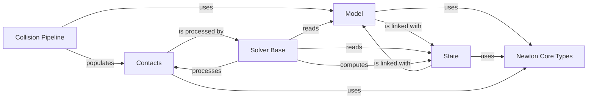

## Details

The Core Physics Engine subsystem forms the foundational layer of the physics simulation, providing essential data structures and core computational capabilities. It is designed for high performance, leveraging GPU kernels for fundamental operations.

### Newton Core Types
Establishes the fundamental data types, enumerations, and low-level constants used throughout the entire physics engine. This component is the bedrock for consistent data representation across all other components.

**Related Classes/Methods**:

- `newton.core.types`

### Model
Defines the static and kinematic structure of the simulated environment and objects, including rigid bodies, joints, and their hierarchical relationships. It is a central, fundamental data representation of the world's fixed properties.

**Related Classes/Methods**:

- <a href="https://github.com/newton-physics/newton/blob/main/newton/sim/model.py#L28-L565" target="_blank" rel="noopener noreferrer">`newton.sim.model.Model` (28:565)</a>

### State
Manages the dynamic state of the simulation, including positions, velocities, accelerations, and forces for all simulated objects. It represents the current snapshot of the simulation's evolving properties.

**Related Classes/Methods**:

- <a href="https://github.com/newton-physics/newton/blob/main/newton/sim/state.py#L20-L108" target="_blank" rel="noopener noreferrer">`newton.sim.state.State` (20:108)</a>

### Collision Pipeline
Executes efficient broad-phase and narrow-phase collision detection algorithms. This component performs fundamental geometric operations to identify potential and actual contacts between objects in the simulation.

**Related Classes/Methods**:

- <a href="https://github.com/newton-physics/newton/blob/main/newton/sim/collide.py#L59-L268" target="_blank" rel="noopener noreferrer">`newton.sim.collide.CollisionPipeline` (59:268)</a>

### Contacts
Stores and manages detailed information about detected collisions, including contact points, normals, penetration depths, and impulses. This data is crucial input for the physics solvers to resolve interactions.

**Related Classes/Methods**:

- <a href="https://github.com/newton-physics/newton/blob/main/newton/sim/contacts.py#L22-L83" target="_blank" rel="noopener noreferrer">`newton.sim.contacts.Contacts` (22:83)</a>

### Solver Base
Implements the core numerical methods and algorithms to advance the simulation state by applying physics laws, resolving constraints, and processing contact forces. This component embodies the primary "mathematical operations" and leverages "low-level GPU kernels" for high-performance computation.

**Related Classes/Methods**:

- <a href="https://github.com/newton-physics/newton/blob/main/newton/solvers/solver.py#L156-L294" target="_blank" rel="noopener noreferrer">`newton.solvers.solver.SolverBase` (156:294)</a>

### [FAQ](https://github.com/CodeBoarding/GeneratedOnBoardings/tree/main?tab=readme-ov-file#faq)