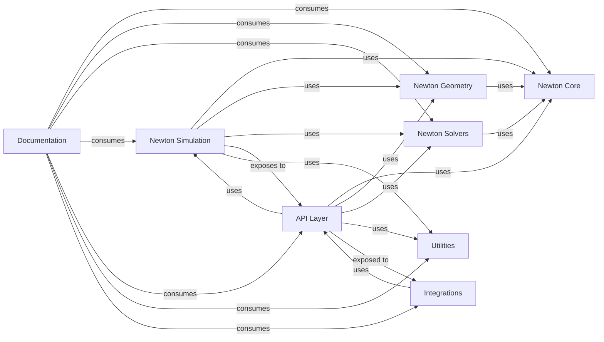

## Details

Updated analysis of the project components and their relationships.

### Newton Core
Provides the foundational mathematical operations and low-level GPU kernels essential for all physics computations. This component is optimized for performance and forms the bedrock of the entire simulation engine.

**Related Classes/Methods**:

- `newton.core` (1:1)

### Newton Geometry
Manages geometric primitives, advanced collision detection algorithms, and spatial data structures, all highly optimized for GPU processing to ensure efficient interaction analysis within simulations.

**Related Classes/Methods**:

- `newton.geometry` (1:1)

### Newton Solvers
Implements a collection of interchangeable physics solvers, allowing for flexible application of various physical rules (e.g., rigid body dynamics, soft body dynamics, fluid dynamics) to simulation scenarios.

**Related Classes/Methods**:

- `newton.solvers` (1:1)

### Newton Simulation
Acts as the central orchestrator of the physics engine. It manages the simulation loop, integrates outputs from geometry and solvers, and handles the overall state progression of the simulation.

**Related Classes/Methods**:

- `newton.sim` (1:1)

### API Layer
Offers a clean, high-level, and user-friendly Python interface, abstracting the complexities of the underlying physics engine. This layer is crucial for ease of use and integration into broader applications.

**Related Classes/Methods**:

- `newton.api` (1:1)

### Utilities
Contains general-purpose helper functions, asset loading mechanisms, rendering interfaces, and other common services that support various parts of the project.

**Related Classes/Methods**:

- `newton.utils` (1:1)

### Integrations
Manages the interfaces and connections with external frameworks and libraries, such as MuJoCo Warp or various rendering backends, allowing `newton` to operate within diverse ecosystems.

**Related Classes/Methods**:

- `newton.integrations` (1:1)

### Documentation [[Expand]](./Documentation.md)
Responsible for generating and maintaining comprehensive project documentation. This component specifically focuses on automatically documenting NVIDIA Warp functions and `newton`'s core components, leveraging tools like Sphinx to process source code and reStructuredText/Markdown files.

**Related Classes/Methods**:

- `newton.docs` (1:1)

### [FAQ](https://github.com/CodeBoarding/GeneratedOnBoardings/tree/main?tab=readme-ov-file#faq)