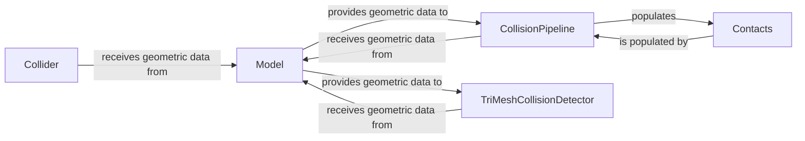

## Details

The `Geometry & Collision` subsystem is a critical part of the physics simulation engine, responsible for defining the spatial properties of objects and efficiently detecting interactions between them. It adheres to the project's emphasis on performance, modularity, and data-oriented design, leveraging GPU optimization where applicable.

### Model
Defines and stores all geometric primitives, their properties (e.g., shape, size, material), and their spatial relationships within the simulation environment. It acts as the central data representation for static and kinematic structures, providing the foundational geometric data for collision detection.

**Related Classes/Methods**:

- <a href="https://github.com/newton-physics/newton/blob/main/newton/sim/model.py#L28-L565" target="_blank" rel="noopener noreferrer">`newton.sim.model.Model` (28:565)</a>

### CollisionPipeline
Orchestrates the overall collision detection process, including broad-phase (identifying potential collision pairs) and narrow-phase (calculating precise contact information). It leverages the geometric data from the `Model` and coordinates specialized detectors.

**Related Classes/Methods**:

- <a href="https://github.com/newton-physics/newton/blob/main/newton/sim/collide.py#L59-L268" target="_blank" rel="noopener noreferrer">`newton.sim.collide.CollisionPipeline` (59:268)</a>

### Contacts
Stores and manages the output of collision detection, providing a structured representation of all detected contacts. This includes crucial information such as contact points, normals, and penetration depths, which are essential for subsequent physics response calculations.

**Related Classes/Methods**:

- <a href="https://github.com/newton-physics/newton/blob/main/newton/sim/contacts.py#L22-L83" target="_blank" rel="noopener noreferrer">`newton.sim.contacts.Contacts` (22:83)</a>

### TriMeshCollisionDetector
Performs highly optimized, specialized collision detection specifically for triangle meshes. This component is likely to leverage GPU capabilities for performance, contributing to the narrow-phase collision detection for complex geometries.

**Related Classes/Methods**:

- <a href="https://github.com/newton-physics/newton/blob/main/newton/solvers/vbd/tri_mesh_collision.py#L102-L450" target="_blank" rel="noopener noreferrer">`newton.solvers.vbd.tri_mesh_collision.TriMeshCollisionDetector` (102:450)</a>

### Collider
Handles collision detection and response within the context of specific solvers, such as the ImplicitMPMSolver. This component is tailored for particle-based or deformable body collisions, integrating collision logic directly into the solver's pipeline.

**Related Classes/Methods**:

- <a href="https://github.com/newton-physics/newton/blob/main/newton/solvers/implicit_mpm/solver_implicit_mpm.py#L62-L87" target="_blank" rel="noopener noreferrer">`newton.solvers.implicit_mpm.solver_implicit_mpm.Collider` (62:87)</a>

### [FAQ](https://github.com/CodeBoarding/GeneratedOnBoardings/tree/main?tab=readme-ov-file#faq)