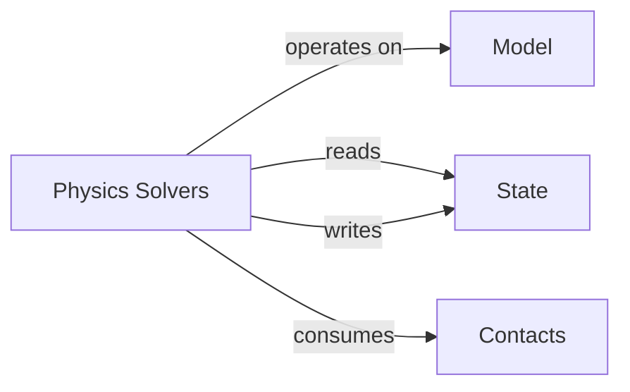

## Details

Abstract Components Overview

### Physics Solvers [[Expand]](./Physics_Solvers.md)
Implements diverse physics simulation algorithms (e.g., VBD, Featherstone, MPM, XPBD, MuJoCo) to compute forces, resolve constraints, and update object states. This component embodies the core numerical methods for evolving the physical system.

**Related Classes/Methods**:

- <a href="https://github.com/newton-physics/newton/blob/main/newton/solvers/solver.py#L156-L294" target="_blank" rel="noopener noreferrer">`newton.solvers.solver.SolverBase` (156:294)</a>
- `newton.solvers.SemiImplicitSolver` (1:1)
- `newton.solvers.FeatherstoneSolver` (1:1)
- `newton.solvers.MuJoCoSolver` (1:1)
- `newton.solvers.VBDSolver` (1:1)
- `newton.solvers.XPBDSolver` (1:1)
- `newton.solvers.ImplicitMPMSolver` (1:1)
- `newton.solvers.Style3DSolver` (1:1)

### Model
Defines the static and kinematic structure of objects within the simulation, providing the foundational geometric and physical properties that solvers operate upon.

**Related Classes/Methods**:

- <a href="https://github.com/newton-physics/newton/blob/main/newton/sim/model.py#L28-L565" target="_blank" rel="noopener noreferrer">`newton.sim.model.Model` (28:565)</a>

### State
Represents the dynamic state (positions, velocities, orientations, etc.) of simulated entities. This component is continuously read and updated by the physics solvers.

**Related Classes/Methods**:

- <a href="https://github.com/newton-physics/newton/blob/main/newton/sim/state.py#L20-L108" target="_blank" rel="noopener noreferrer">`newton.sim.state.State` (20:108)</a>

### Contacts
Provides detailed contact information resulting from collision detection, which is crucial input for the physics solvers to resolve inter-object constraints and apply contact forces.

**Related Classes/Methods**:

- <a href="https://github.com/newton-physics/newton/blob/main/newton/sim/contacts.py#L22-L83" target="_blank" rel="noopener noreferrer">`newton.sim.contacts.Contacts` (22:83)</a>

### [FAQ](https://github.com/CodeBoarding/GeneratedOnBoardings/tree/main?tab=readme-ov-file#faq)