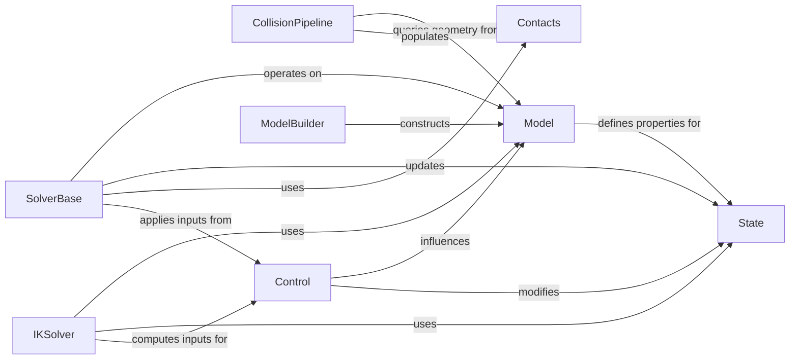

## Details

The `Simulation Framework` acts as the central orchestrator for the physics simulation engine, managing the construction of simulation models, handling the dynamic state, and coordinating the execution of various physics solvers. It integrates core data structures with the computational logic to advance the simulation over time.

### Model
Represents the static and kinematic properties of the simulation scene, including rigid bodies, joints, shapes, materials, and their hierarchical relationships. It serves as the central data structure defining the physical world.

**Related Classes/Methods**:

- <a href="https://github.com/newton-physics/newton/blob/main/newton/sim/model.py#L28-L565" target="_blank" rel="noopener noreferrer">`newton.sim.model.Model` (28:565)</a>

### State
Manages the dynamic state of the simulation at any given time, including positions, orientations, velocities, and accelerations of all bodies and joints within the Model.

**Related Classes/Methods**:

- <a href="https://github.com/newton-physics/newton/blob/main/newton/sim/state.py#L20-L108" target="_blank" rel="noopener noreferrer">`newton.sim.state.State` (20:108)</a>

### SolverBase
Advances the simulation state over time by applying physics laws, resolving forces, and integrating motion. Different concrete solvers implement various numerical methods for different simulation scenarios.

**Related Classes/Methods**:

- <a href="https://github.com/newton-physics/newton/blob/main/newton/solvers/solver.py#L156-L294" target="_blank" rel="noopener noreferrer">`newton.solvers.solver.SolverBase` (156:294)</a>

### CollisionPipeline
Performs efficient collision detection between geometric primitives defined within the Model, identifying potential contact points.

**Related Classes/Methods**:

- <a href="https://github.com/newton-physics/newton/blob/main/newton/sim/collide.py#L59-L268" target="_blank" rel="noopener noreferrer">`newton.sim.collide.CollisionPipeline` (59:268)</a>

### Contacts
Stores and manages detailed information about detected contacts, including contact points, normals, penetration depths, and impulses. This data is crucial for contact resolution by solvers.

**Related Classes/Methods**:

- <a href="https://github.com/newton-physics/newton/blob/main/newton/sim/contacts.py#L22-L83" target="_blank" rel="noopener noreferrer">`newton.sim.contacts.Contacts` (22:83)</a>

### Control
Applies external forces, torques, or desired joint positions/velocities to the Model, influencing its behavior during simulation.

**Related Classes/Methods**:

- <a href="https://github.com/newton-physics/newton/blob/main/newton/sim/control.py#L20-L76" target="_blank" rel="noopener noreferrer">`newton.sim.control.Control` (20:76)</a>

### ModelBuilder
Provides a programmatic API for constructing and configuring the Model instance, including adding bodies, joints, and shapes.

**Related Classes/Methods**:

- <a href="https://github.com/newton-physics/newton/blob/main/newton/sim/builder.py#L87-L3930" target="_blank" rel="noopener noreferrer">`newton.sim.builder.ModelBuilder` (87:3930)</a>
- <a href="https://github.com/newton-physics/newton/blob/main/newton/sim/style3d/builder_style3d.py#L40-L692" target="_blank" rel="noopener noreferrer">`newton.sim.style3d.builder_style3d.Style3DModelBuilder` (40:692)</a>

### IKSolver
Solves inverse kinematics problems, determining the joint configurations required to achieve desired end-effector poses for articulated models (e.g., robots).

**Related Classes/Methods**:

- <a href="https://github.com/newton-physics/newton/blob/main/newton/sim/ik.py#L34-L677" target="_blank" rel="noopener noreferrer">`newton.sim.ik.IKSolver` (34:677)</a>

### [FAQ](https://github.com/CodeBoarding/GeneratedOnBoardings/tree/main?tab=readme-ov-file#faq)