```mermaid
graph LR
    Core_Physics_Engine["Core Physics Engine"]
    Geometry_Collision["Geometry & Collision"]
    Physics_Solvers["Physics Solvers"]
    Simulation_Framework["Simulation Framework"]
    Utilities_Visualization["Utilities & Visualization"]
    API_Examples["API & Examples"]
    Benchmarking_Testing["Benchmarking & Testing"]
    Documentation["Documentation"]
    Core_Physics_Engine -- "Supports" --> Geometry_Collision
    Core_Physics_Engine -- "Supports" --> Physics_Solvers
    Core_Physics_Engine -- "Supports" --> Simulation_Framework
    Core_Physics_Engine -- "Supports" --> Utilities_Visualization
    Geometry_Collision -- "Leverages" --> Core_Physics_Engine
    Geometry_Collision -- "Feeds data to" --> Physics_Solvers
    Geometry_Collision -- "Used by" --> Simulation_Framework
    Physics_Solvers -- "Leverages" --> Core_Physics_Engine
    Physics_Solvers -- "Receives data from" --> Geometry_Collision
    Physics_Solvers -- "Interacts with" --> Simulation_Framework
    Simulation_Framework -- "Leverages" --> Core_Physics_Engine
    Simulation_Framework -- "Leverages" --> Geometry_Collision
    Simulation_Framework -- "Orchestrates" --> Physics_Solvers
    Simulation_Framework -- "Manages state for" --> Utilities_Visualization
    Utilities_Visualization -- "Consumes state from" --> Simulation_Framework
    Utilities_Visualization -- "Used by" --> API_Examples
    API_Examples -- "Drives" --> Simulation_Framework
    API_Examples -- "Utilizes" --> Utilities_Visualization
    Benchmarking_Testing -- "Executes" --> API_Examples
    Benchmarking_Testing -- "Validates" --> Simulation_Framework
    Documentation -- "Documents" --> Core_Physics_Engine
    Documentation -- "Documents" --> Physics_Solvers
    click Core_Physics_Engine href "https://github.com/CodeBoarding/GeneratedOnBoardings/blob/main/newton/Core_Physics_Engine.md" "Details"
    click Geometry_Collision href "https://github.com/CodeBoarding/GeneratedOnBoardings/blob/main/newton/Geometry_Collision.md" "Details"
    click Physics_Solvers href "https://github.com/CodeBoarding/GeneratedOnBoardings/blob/main/newton/Physics_Solvers.md" "Details"
    click Simulation_Framework href "https://github.com/CodeBoarding/GeneratedOnBoardings/blob/main/newton/Simulation_Framework.md" "Details"
    click API_Examples href "https://github.com/CodeBoarding/GeneratedOnBoardings/blob/main/newton/API_Examples.md" "Details"
    click Benchmarking_Testing href "https://github.com/CodeBoarding/GeneratedOnBoardings/blob/main/newton/Benchmarking_Testing.md" "Details"
    click Documentation href "https://github.com/CodeBoarding/GeneratedOnBoardings/blob/main/newton/Documentation.md" "Details"
```

## Details

One paragraph explaining the functionality which is represented by this graph. What the main flow is and what is its purpose.

### Core Physics Engine [[Expand]](./Core_Physics_Engine.md)
Provides fundamental data structures, mathematical operations, and low-level GPU kernels, forming the bedrock for the entire physics engine.

**Related Classes/Methods**: _None_

### Geometry & Collision [[Expand]](./Geometry_Collision.md)
Manages geometric primitives, spatial data structures, and performs efficient GPU-optimized collision detection, providing crucial data for physics interactions.

**Related Classes/Methods**: _None_

### Physics Solvers [[Expand]](./Physics_Solvers.md)
Implements diverse physics simulation algorithms (e.g., VBD, Featherstone, MPM, XPBD, MuJoCo) to compute forces, resolve constraints, and update object states.

**Related Classes/Methods**: _None_

### Simulation Framework [[Expand]](./Simulation_Framework.md)
The central orchestrator, handling model construction, simulation state management, and coordinating the execution of physics solvers.

**Related Classes/Methods**: _None_

### Utilities & Visualization
Offers general-purpose functionalities for rendering, data recording, and user interaction, enhancing the usability and debugging of simulations.

**Related Classes/Methods**: _None_

### API & Examples [[Expand]](./API_Examples.md)
The primary user interface, providing high-level examples and a clean API to configure, run, and interact with the physics engine.

**Related Classes/Methods**: _None_

### Benchmarking & Testing [[Expand]](./Benchmarking_Testing.md)
Ensures the performance, stability, and correctness of the physics engine through automated benchmarks and comprehensive test suites.

**Related Classes/Methods**: _None_

### Documentation [[Expand]](./Documentation.md)
Generates comprehensive project documentation, with a specific focus on automatically documenting NVIDIA Warp functions and core components.

**Related Classes/Methods**: _None_

### [FAQ](https://github.com/CodeBoarding/GeneratedOnBoardings/tree/main?tab=readme-ov-file#faq)