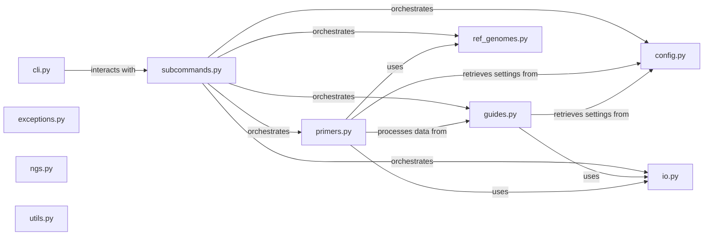

## Details

The `crispr-primer-design` subsystem, located under `images/crispr-primer-design/src/crispr/primer_design`, is responsible for the core logic of designing primers for CRISPR experiments. It handles tasks such as configuration management, guide RNA processing, primer design, and interaction with reference genomes.

### cli.py
Provides the command-line interface for the `crispr-primer-design` tool. It parses command-line arguments, sets up logging, and dispatches calls to the appropriate subcommands.

**Related Classes/Methods**:

- <a href="https://github.com/pfizer-opensource/nf-crispr-primer-design/blob/main/images/crispr-primer-design/src/crispr/primer_design/cli.py#L1-L1" target="_blank" rel="noopener noreferrer">`crispr.primer_design.cli` (1:1)</a>

### config.py
Manages the configuration settings for the primer design process. This includes loading default configurations, overriding settings with user-provided values, and validating the configuration.

**Related Classes/Methods**:

- <a href="https://github.com/pfizer-opensource/nf-crispr-primer-design/blob/main/images/crispr-primer-design/src/crispr/primer_design/config.py#L1-L1" target="_blank" rel="noopener noreferrer">`crispr.primer_design.config` (1:1)</a>

### exceptions.py
Defines custom exception classes specific to the `crispr-primer-design` subsystem.

**Related Classes/Methods**:

- <a href="https://github.com/pfizer-opensource/nf-crispr-primer-design/blob/main/images/crispr-primer-design/src/crispr/primer_design/exceptions.py#L1-L1" target="_blank" rel="noopener noreferrer">`crispr.primer_design.exceptions` (1:1)</a>

### guides.py
Handles the processing and validation of guide RNA sequences. This likely includes parsing guide input, validating their format, and potentially performing some initial filtering or annotation.

**Related Classes/Methods**:

- <a href="https://github.com/pfizer-opensource/nf-crispr-primer-design/blob/main/images/crispr-primer-design/src/crispr/primer_design/guides.py#L1-L1" target="_blank" rel="noopener noreferrer">`crispr.primer_design.guides` (1:1)</a>

### io.py
Manages file input and output operations, such as reading guide RNA files, writing primer design results, and handling different file formats.

**Related Classes/Methods**:

- <a href="https://github.com/pfizer-opensource/nf-crispr-primer-design/blob/main/images/crispr-primer-design/src/crispr/primer_design/io.py#L1-L1" target="_blank" rel="noopener noreferrer">`crispr.primer_design.io` (1:1)</a>

### ngs.py
Provides utilities related to Next-Generation Sequencing (NGS) data, which might include functions for handling FASTQ/FASTA files, sequence manipulation, or adapter trimming.

**Related Classes/Methods**:

- <a href="https://github.com/pfizer-opensource/nf-crispr-primer-design/blob/main/images/crispr-primer-design/src/crispr/primer_design/ngs.py#L1-L1" target="_blank" rel="noopener noreferrer">`crispr.primer_design.ngs` (1:1)</a>

### primers.py
Encapsulates the core algorithms and logic for designing primers based on guide RNA sequences and reference genome information. This is likely where the main primer design calculations and constraints are applied.

**Related Classes/Methods**:

- <a href="https://github.com/pfizer-opensource/nf-crispr-primer-design/blob/main/images/crispr-primer-design/src/crispr/primer_design/primers.py#L1-L1" target="_blank" rel="noopener noreferrer">`crispr.primer_design.primers` (1:1)</a>

### ref_genomes.py
Manages interactions with reference genomes, including loading genome sequences, indexing, and performing sequence lookups.

**Related Classes/Methods**:

- <a href="https://github.com/pfizer-opensource/nf-crispr-primer-design/blob/main/images/crispr-primer-design/src/crispr/primer_design/ref_genomes.py#L1-L1" target="_blank" rel="noopener noreferrer">`crispr.primer_design.ref_genomes` (1:1)</a>

### subcommands.py
Organizes and dispatches different subcommands available in the CLI. It acts as a router, directing control to specific functions based on the user's command.

**Related Classes/Methods**:

- <a href="https://github.com/pfizer-opensource/nf-crispr-primer-design/blob/main/images/crispr-primer-design/src/crispr/primer_design/subcommands.py#L1-L1" target="_blank" rel="noopener noreferrer">`crispr.primer_design.subcommands` (1:1)</a>

### utils.py
Contains various helper functions and common utilities used across different modules within the `crispr-primer-design` subsystem.

**Related Classes/Methods**:

- <a href="https://github.com/pfizer-opensource/nf-crispr-primer-design/blob/main/images/crispr-primer-design/src/crispr/primer_design/utils.py#L1-L1" target="_blank" rel="noopener noreferrer">`crispr.primer_design.utils` (1:1)</a>

### [FAQ](https://github.com/CodeBoarding/GeneratedOnBoardings/tree/main?tab=readme-ov-file#faq)