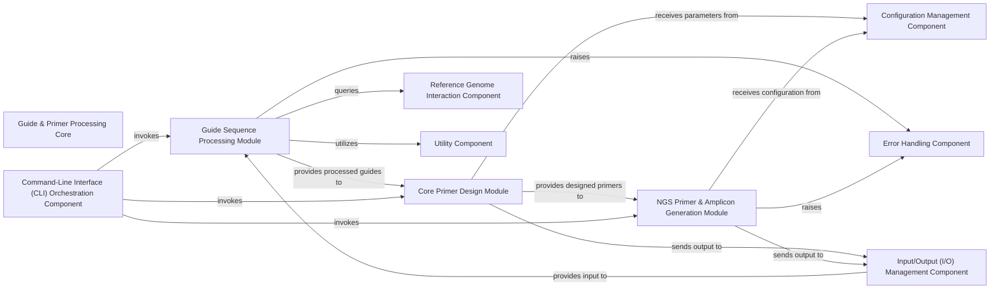

## Details

The Guide & Primer Processing Core is the computational engine of the pipeline, responsible for the intricate bioinformatics steps from raw guide sequences to optimized primer pairs, including specialized Next-Generation Sequencing (NGS) considerations.

### Guide & Primer Processing Core [[Expand]](./Guide_Primer_Processing_Core.md)
This is the computational heart of the pipeline, implementing the core bioinformatics logic. It processes raw guide sequences, determines their genomic coordinates, extracts necessary flanking genomic sequences, and designs optimal primer pairs. This component integrates and leverages external primer design software (e.g., Primer3) to perform its tasks. It also handles specialized processing for Next-Generation Sequencing (NGS) applications.

**Related Classes/Methods**:

- <a href="https://github.com/pfizer-opensource/nf-crispr-primer-design/blob/main/images/crispr-primer-design/src/crispr/primer_design/guides.py#L1-L1" target="_blank" rel="noopener noreferrer">`crispr.primer_design.guides` (1:1)</a>
- <a href="https://github.com/pfizer-opensource/nf-crispr-primer-design/blob/main/images/crispr-primer-design/src/crispr/primer_design/primers.py#L1-L1" target="_blank" rel="noopener noreferrer">`crispr.primer_design.primers` (1:1)</a>
- <a href="https://github.com/pfizer-opensource/nf-crispr-primer-design/blob/main/images/crispr-primer-design/src/crispr/primer_design/ngs.py#L1-L1" target="_blank" rel="noopener noreferrer">`crispr.primer_design.ngs` (1:1)</a>

### Guide Sequence Processing Module
This module is responsible for the initial processing and contextualization of raw guide RNA sequences. It parses input data, aligns guides to a reference genome to establish precise genomic coordinates, annotates critical features like cut sites, and extracts the essential flanking genomic sequences required for subsequent primer design.

**Related Classes/Methods**:

- <a href="https://github.com/pfizer-opensource/nf-crispr-primer-design/blob/main/images/crispr-primer-design/src/crispr/primer_design/guides.py#L12-L23" target="_blank" rel="noopener noreferrer">`crispr.primer_design.guides.prepare_guides` (12:23)</a>
- <a href="https://github.com/pfizer-opensource/nf-crispr-primer-design/blob/main/images/crispr-primer-design/src/crispr/primer_design/guides.py#L25-L68" target="_blank" rel="noopener noreferrer">`crispr.primer_design.guides.process_guide_input` (25:68)</a>
- <a href="https://github.com/pfizer-opensource/nf-crispr-primer-design/blob/main/images/crispr-primer-design/src/crispr/primer_design/guides.py#L70-L86" target="_blank" rel="noopener noreferrer">`crispr.primer_design.guides.get_guide_coordinates` (70:86)</a>
- <a href="https://github.com/pfizer-opensource/nf-crispr-primer-design/blob/main/images/crispr-primer-design/src/crispr/primer_design/guides.py#L88-L101" target="_blank" rel="noopener noreferrer">`crispr.primer_design.guides.annotate_guide_site` (88:101)</a>
- <a href="https://github.com/pfizer-opensource/nf-crispr-primer-design/blob/main/images/crispr-primer-design/src/crispr/primer_design/guides.py#L103-L124" target="_blank" rel="noopener noreferrer">`crispr.primer_design.guides.get_guide_flanking_seq` (103:124)</a>

### Core Primer Design Module
This module encapsulates the primary logic for designing PCR primer pairs. It takes the processed guide sequences and their flanking regions as input and leverages external primer design software (e.g., Primer3) to generate optimal primer candidates. It further processes the output from these tools, calculates the genomic coordinates of the designed primers, and identifies any duplicate primer sequences to ensure uniqueness and efficiency.

**Related Classes/Methods**:

- <a href="https://github.com/pfizer-opensource/nf-crispr-primer-design/blob/main/images/crispr-primer-design/src/crispr/primer_design/primers.py#L10-L53" target="_blank" rel="noopener noreferrer">`crispr.primer_design.primers.design_primers` (10:53)</a>
- <a href="https://github.com/pfizer-opensource/nf-crispr-primer-design/blob/main/images/crispr-primer-design/src/crispr/primer_design/primers.py#L55-L78" target="_blank" rel="noopener noreferrer">`crispr.primer_design.primers.process_primers` (55:78)</a>
- <a href="https://github.com/pfizer-opensource/nf-crispr-primer-design/blob/main/images/crispr-primer-design/src/crispr/primer_design/primers.py#L80-L92" target="_blank" rel="noopener noreferrer">`crispr.primer_design.primers.calc_primer_coordinates` (80:92)</a>
- <a href="https://github.com/pfizer-opensource/nf-crispr-primer-design/blob/main/images/crispr-primer-design/src/crispr/primer_design/primers.py#L94-L105" target="_blank" rel="noopener noreferrer">`crispr.primer_design.primers.flag_primer_duplicates` (94:105)</a>
- <a href="https://github.com/pfizer-opensource/nf-crispr-primer-design/blob/main/images/crispr-primer-design/src/crispr/primer_design/primers.py#L107-L142" target="_blank" rel="noopener noreferrer">`crispr.primer_design.primers.make_primers_table` (107:142)</a>
- <a href="https://github.com/pfizer-opensource/nf-crispr-primer-design/blob/main/images/crispr-primer-design/src/crispr/primer_design/primers.py#L155-L196" target="_blank" rel="noopener noreferrer">`crispr.primer_design.primers.make_primers_bed_table` (155:196)</a>

### NGS Primer & Amplicon Generation Module
This module extends the core primer design capabilities to specifically support Next-Generation Sequencing (NGS) workflows. Its responsibilities include identifying overlaps between designed amplicons and coding regions within the genome, generating structured YAML files containing amplicon information, and constructing NGS-compatible primer sequences by incorporating necessary adapter sequences.

**Related Classes/Methods**:

- <a href="https://github.com/pfizer-opensource/nf-crispr-primer-design/blob/main/images/crispr-primer-design/src/crispr/primer_design/ngs.py#L13-L36" target="_blank" rel="noopener noreferrer">`crispr.primer_design.ngs.get_amplicon_coding_coordinates` (13:36)</a>
- <a href="https://github.com/pfizer-opensource/nf-crispr-primer-design/blob/main/images/crispr-primer-design/src/crispr/primer_design/ngs.py#L44-L81" target="_blank" rel="noopener noreferrer">`crispr.primer_design.ngs.make_amplicons_yaml` (44:81)</a>
- <a href="https://github.com/pfizer-opensource/nf-crispr-primer-design/blob/main/images/crispr-primer-design/src/crispr/primer_design/ngs.py#L93-L175" target="_blank" rel="noopener noreferrer">`crispr.primer_design.ngs.make_ngs_primers_table` (93:175)</a>

### Reference Genome Interaction Component
Handles interactions with the reference genome, such as querying genomic coordinates and sequences.

**Related Classes/Methods**: _None_

### Configuration Management Component
Manages and provides configuration parameters to other components.

**Related Classes/Methods**: _None_

### Utility Component
Provides common helper functions and utilities.

**Related Classes/Methods**: _None_

### Error Handling Component
Defines and manages exceptions and error reporting mechanisms.

**Related Classes/Methods**: _None_

### Command-Line Interface (CLI) Orchestration Component
Orchestrates the overall workflow and invokes core processing modules based on command-line input.

**Related Classes/Methods**: _None_

### Input/Output (I/O) Management Component
Manages input data provision and output data persistence for the pipeline.

**Related Classes/Methods**: _None_

### [FAQ](https://github.com/CodeBoarding/GeneratedOnBoardings/tree/main?tab=readme-ov-file#faq)