```mermaid
graph LR
    Workflow_Orchestrator_CLI_["Workflow Orchestrator (CLI)"]
    Configuration_Management_Component["Configuration Management Component"]
    Input_Output_I_O_Management_Component["Input/Output (I/O) Management Component"]
    Guide_Processing_Component["Guide Processing Component"]
    Primer_Design_Core_Component["Primer Design Core Component"]
    Reference_Genome_Management_Component["Reference Genome Management Component"]
    NGS_Amplicon_Adapter_Component["NGS Amplicon & Adapter Component"]
    Exception_Handling_Component["Exception Handling Component"]
    Utility_Component["Utility Component"]
    External_Command_Execution_Component["External Command Execution Component"]
    Workflow_Orchestrator_CLI_ -- "Orchestrates" --> Guide_Processing_Component
    Workflow_Orchestrator_CLI_ -- "Orchestrates" --> Primer_Design_Core_Component
    Workflow_Orchestrator_CLI_ -- "Orchestrates" --> NGS_Amplicon_Adapter_Component
    Workflow_Orchestrator_CLI_ -- "Utilizes" --> Configuration_Management_Component
    Workflow_Orchestrator_CLI_ -- "Utilizes" --> Input_Output_I_O_Management_Component
    Workflow_Orchestrator_CLI_ -- "Utilizes" --> Reference_Genome_Management_Component
    Workflow_Orchestrator_CLI_ -- "Utilizes" --> Utility_Component
    Workflow_Orchestrator_CLI_ -- "Handles" --> Exception_Handling_Component
    Configuration_Management_Component -- "Provides Config To" --> Workflow_Orchestrator_CLI_
    Configuration_Management_Component -- "Provides Config To" --> External_Command_Execution_Component
    Input_Output_I_O_Management_Component -- "Reads Input For" --> Guide_Processing_Component
    Input_Output_I_O_Management_Component -- "Writes Output From" --> Primer_Design_Core_Component
    Input_Output_I_O_Management_Component -- "Writes Output From" --> NGS_Amplicon_Adapter_Component
    Guide_Processing_Component -- "Receives Raw Guides From" --> Input_Output_I_O_Management_Component
    Guide_Processing_Component -- "Utilizes" --> External_Command_Execution_Component
    Guide_Processing_Component -- "Queries" --> Reference_Genome_Management_Component
    Guide_Processing_Component -- "Provides Processed Guides To" --> Primer_Design_Core_Component
    Primer_Design_Core_Component -- "Receives Processed Guides From" --> Guide_Processing_Component
    Primer_Design_Core_Component -- "Queries" --> Reference_Genome_Management_Component
    Primer_Design_Core_Component -- "Provides Primers To" --> Input_Output_I_O_Management_Component
    Primer_Design_Core_Component -- "Provides Primers To" --> NGS_Amplicon_Adapter_Component
    Reference_Genome_Management_Component -- "Provides Reference Data To" --> Workflow_Orchestrator_CLI_
    Reference_Genome_Management_Component -- "Provides Reference Data To" --> Guide_Processing_Component
    Reference_Genome_Management_Component -- "Provides Reference Data To" --> Primer_Design_Core_Component
    Reference_Genome_Management_Component -- "Provides Reference Data To" --> NGS_Amplicon_Adapter_Component
    Reference_Genome_Management_Component -- "Provides Reference Data To" --> External_Command_Execution_Component
    NGS_Amplicon_Adapter_Component -- "Receives Primers From" --> Primer_Design_Core_Component
    NGS_Amplicon_Adapter_Component -- "Queries" --> Reference_Genome_Management_Component
    NGS_Amplicon_Adapter_Component -- "Provides Amplicons/NGS Primers To" --> Input_Output_I_O_Management_Component
    Exception_Handling_Component -- "Provides Exception Types To" --> Workflow_Orchestrator_CLI_
    Utility_Component -- "Utilized by" --> Workflow_Orchestrator_CLI_
    Utility_Component -- "Utilized by" --> Configuration_Management_Component
    Utility_Component -- "Utilized by" --> Input_Output_I_O_Management_Component
    Utility_Component -- "Utilized by" --> Guide_Processing_Component
    Utility_Component -- "Utilized by" --> Primer_Design_Core_Component
    Utility_Component -- "Utilized by" --> Reference_Genome_Management_Component
    Utility_Component -- "Utilized by" --> NGS_Amplicon_Adapter_Component
    Utility_Component -- "Utilized by" --> External_Command_Execution_Component
    External_Command_Execution_Component -- "Receives Configuration From" --> Configuration_Management_Component
    External_Command_Execution_Component -- "Receives Reference Data From" --> Reference_Genome_Management_Component
    External_Command_Execution_Component -- "Executes External Tools For" --> Guide_Processing_Component
    External_Command_Execution_Component -- "Provides Command Execution Abstraction To" --> Guide_Processing_Component
    click Workflow_Orchestrator_CLI_ href "https://github.com/CodeBoarding/GeneratedOnBoardings/blob/main/nf-crispr-primer-design/Workflow_Orchestrator_CLI_.md" "Details"
```

## Details

Abstract Components Overview and Relationships for a CRISPR Primer Design Pipeline

### Workflow Orchestrator (CLI) [[Expand]](./Workflow_Orchestrator_CLI_.md)
This component (`crispr.primer_design.cli`) serves as the user-facing interface and the central coordinator of the primer design pipeline. It is responsible for parsing command-line arguments, loading configuration settings, and orchestrating the high-level execution flow of the entire primer design process.

**Related Classes/Methods**:

- <a href="https://github.com/pfizer-opensource/nf-crispr-primer-design/blob/main/images/crispr-primer-design/src/crispr/primer_design/cli.py#L1-L1" target="_blank" rel="noopener noreferrer">`crispr.primer_design.cli` (1:1)</a>

### Configuration Management Component
This component (`crispr.primer_design.config`) is dedicated to loading, parsing, and managing all configuration settings required by the pipeline. It establishes default values, allows for overrides via command-line arguments or YAML files, and ensures consistent access to parameters across all workflow components.

**Related Classes/Methods**:

- <a href="https://github.com/pfizer-opensource/nf-crispr-primer-design/blob/main/images/crispr-primer-design/src/crispr/primer_design/config.py#L1-L1" target="_blank" rel="noopener noreferrer">`crispr.primer_design.config` (1:1)</a>

### Input/Output (I/O) Management Component
This component (`crispr.primer_design.io`) manages all data ingress and egress for the pipeline. It handles reading guide sequences from specified input files (or STDIN) and is responsible for writing various output files, including the final primer design table and optional amplicon files, in appropriate formats.

**Related Classes/Methods**:

- <a href="https://github.com/pfizer-opensource/nf-crispr-primer-design/blob/main/images/crispr-primer-design/src/crispr/primer_design/io.py#L1-L1" target="_blank" rel="noopener noreferrer">`crispr.primer_design.io` (1:1)</a>

### Guide Processing Component
This component (`crispr.primer_design.guides`) focuses on the initial processing and preparation of guide RNA sequences. Its tasks include validating guide formats, extracting relevant information, and performing genomic mapping or other initial transformations necessary before primer design.

**Related Classes/Methods**:

- <a href="https://github.com/pfizer-opensource/nf-crispr-primer-design/blob/main/images/crispr-primer-design/src/crispr/primer_design/guides.py#L1-L1" target="_blank" rel="noopener noreferrer">`crispr.primer_design.guides` (1:1)</a>

### Primer Design Core Component
This is the core computational engine (`crispr.primer_design.primers`) responsible for executing the primer design algorithms. It takes processed guide sequences and genomic context, applies specified design parameters (e.g., size ranges, melting temperatures), and generates optimal primer pairs.

**Related Classes/Methods**:

- <a href="https://github.com/pfizer-opensource/nf-crispr-primer-design/blob/main/images/crispr-primer-design/src/crispr/primer_design/primers.py#L1-L1" target="_blank" rel="noopener noreferrer">`crispr.primer_design.primers` (1:1)</a>

### Reference Genome Management Component
This component (`crispr.primer_design.ref_genomes`) manages access to and information about reference genomes and associated coding exon definitions. It provides functionalities to list available references and retrieve genomic sequences necessary for guide processing and primer design.

**Related Classes/Methods**:

- <a href="https://github.com/pfizer-opensource/nf-crispr-primer-design/blob/main/images/crispr-primer-design/src/crispr/primer_design/ref_genomes.py#L1-L1" target="_blank" rel="noopener noreferrer">`crispr.primer_design.ref_genomes` (1:1)</a>

### NGS Amplicon & Adapter Component
This component (`crispr.primer_design.ngs`) specializes in functionalities related to Next-Generation Sequencing (NGS) primer design. It handles the generation of amplicon YAML files and the integration of NGS adapters into primer sequences, ensuring compatibility with sequencing platforms.

**Related Classes/Methods**:

- <a href="https://github.com/pfizer-opensource/nf-crispr-primer-design/blob/main/images/crispr-primer-design/src/crispr/primer_design/ngs.py#L1-L1" target="_blank" rel="noopener noreferrer">`crispr.primer_design.ngs` (1:1)</a>

### Exception Handling Component
This component (`crispr.primer_design.exceptions`) defines custom exception classes specific to the primer design pipeline. It centralizes error types, allowing for more robust and specific error handling throughout the workflow.

**Related Classes/Methods**:

- <a href="https://github.com/pfizer-opensource/nf-crispr-primer-design/blob/main/images/crispr-primer-design/src/crispr/primer_design/exceptions.py#L1-L1" target="_blank" rel="noopener noreferrer">`crispr.primer_design.exceptions` (1:1)</a>

### Utility Component
This component (`crispr.primer_design.utils`) provides a collection of general-purpose utility functions that are reused across various parts of the `primer_design` package. These functions typically perform common, non-domain-specific tasks that support the main logic of other components.

**Related Classes/Methods**:

- <a href="https://github.com/pfizer-opensource/nf-crispr-primer-design/blob/main/images/crispr-primer-design/src/crispr/primer_design/utils.py#L1-L1" target="_blank" rel="noopener noreferrer">`crispr.primer_design.utils` (1:1)</a>

### External Command Execution Component
This component (`crispr.primer_design.subcommands`) is responsible for abstracting and executing external command-line tools (e.g., `bowtie2`, `samtools`, `bedtools`). It manages the invocation of these tools, handles their input/output streams via stdin/stdout, and integrates with module loading systems (LMOD) to ensure the correct environment for tool execution.

**Related Classes/Methods**:

- <a href="https://github.com/pfizer-opensource/nf-crispr-primer-design/blob/main/images/crispr-primer-design/src/crispr/primer_design/subcommands.py#L10-L78" target="_blank" rel="noopener noreferrer">`crispr.primer_design.subcommands.Subcommand` (10:78)</a>
- <a href="https://github.com/pfizer-opensource/nf-crispr-primer-design/blob/main/images/crispr-primer-design/src/crispr/primer_design/subcommands.py#L81-L91" target="_blank" rel="noopener noreferrer">`crispr.primer_design.subcommands.load_modules` (81:91)</a>
- <a href="https://github.com/pfizer-opensource/nf-crispr-primer-design/blob/main/images/crispr-primer-design/src/crispr/primer_design/subcommands.py#L93-L110" target="_blank" rel="noopener noreferrer">`crispr.primer_design.subcommands.guide_bed_cmd` (93:110)</a>
- <a href="https://github.com/pfizer-opensource/nf-crispr-primer-design/blob/main/images/crispr-primer-design/src/crispr/primer_design/subcommands.py#L112-L132" target="_blank" rel="noopener noreferrer">`crispr.primer_design.subcommands.guide_flank_cmd` (112:132)</a>
- <a href="https://github.com/pfizer-opensource/nf-crispr-primer-design/blob/main/images/crispr-primer-design/src/crispr/primer_design/subcommands.py#L134-L146" target="_blank" rel="noopener noreferrer">`crispr.primer_design.subcommands.bed_intersect_cmd` (134:146)</a>

### [FAQ](https://github.com/CodeBoarding/GeneratedOnBoardings/tree/main?tab=readme-ov-file#faq)