```mermaid
graph LR
    Workflow_Orchestrator_CLI_["Workflow Orchestrator (CLI)"]
    Configuration_Manager["Configuration Manager"]
    Data_Reference_Provider["Data & Reference Provider"]
    Guide_Primer_Processing_Core["Guide & Primer Processing Core"]
    NGS_Output_Formatter["NGS Output Formatter"]
    Workflow_Orchestrator_CLI_ -- "Uses" --> Configuration_Manager
    Workflow_Orchestrator_CLI_ -- "Orchestrates" --> Guide_Primer_Processing_Core
    Workflow_Orchestrator_CLI_ -- "Orchestrates" --> NGS_Output_Formatter
    Workflow_Orchestrator_CLI_ -- "Interacts with" --> Data_Reference_Provider
    Configuration_Manager -- "Provides config to" --> Workflow_Orchestrator_CLI_
    Configuration_Manager -- "Provides config to" --> Guide_Primer_Processing_Core
    Configuration_Manager -- "Provides config to" --> NGS_Output_Formatter
    Data_Reference_Provider -- "Provides data to" --> Guide_Primer_Processing_Core
    Data_Reference_Provider -- "Provides data to" --> NGS_Output_Formatter
    Data_Reference_Provider -- "Receives output from" --> NGS_Output_Formatter
    Guide_Primer_Processing_Core -- "Uses" --> Configuration_Manager
    Guide_Primer_Processing_Core -- "Uses" --> Data_Reference_Provider
    Guide_Primer_Processing_Core -- "Provides processed data to" --> NGS_Output_Formatter
    NGS_Output_Formatter -- "Uses" --> Configuration_Manager
    NGS_Output_Formatter -- "Uses" --> Data_Reference_Provider
    NGS_Output_Formatter -- "Receives processed data from" --> Guide_Primer_Processing_Core
    click Workflow_Orchestrator_CLI_ href "https://github.com/CodeBoarding/GeneratedOnBoardings/blob/main/nf-crispr-primer-design/Workflow_Orchestrator_CLI_.md" "Details"
    click Configuration_Manager href "https://github.com/CodeBoarding/GeneratedOnBoardings/blob/main/nf-crispr-primer-design/Configuration_Manager.md" "Details"
    click Data_Reference_Provider href "https://github.com/CodeBoarding/GeneratedOnBoardings/blob/main/nf-crispr-primer-design/Data_Reference_Provider.md" "Details"
    click Guide_Primer_Processing_Core href "https://github.com/CodeBoarding/GeneratedOnBoardings/blob/main/nf-crispr-primer-design/Guide_Primer_Processing_Core.md" "Details"
    click NGS_Output_Formatter href "https://github.com/CodeBoarding/GeneratedOnBoardings/blob/main/nf-crispr-primer-design/NGS_Output_Formatter.md" "Details"
```

## Details

The `nf-crispr-primer-design` project is structured as a modular bioinformatics workflow, emphasizing clear separation of concerns for robust and reproducible genomic analysis. The architecture is centered around a core processing pipeline, supported by dedicated components for configuration, data handling, and output generation. This architecture promotes modularity, allowing each component to focus on a specific responsibility, enhancing maintainability and reusability within the Nextflow pipeline ecosystem.

### Workflow Orchestrator (CLI) [[Expand]](./Workflow_Orchestrator_CLI_.md)
This is the primary entry point and control unit of the pipeline. It parses command-line arguments, initializes the workflow by loading the necessary configuration, and orchestrates the sequential execution of all subsequent processing stages, from guide preparation to primer design and final output generation.

**Related Classes/Methods**:

- <a href="https://github.com/pfizer-opensource/nf-crispr-primer-design/blob/main/images/crispr-primer-design/src/crispr/primer_design/cli.py#L1-L1" target="_blank" rel="noopener noreferrer">`crispr.primer_design.cli` (1:1)</a>

### Configuration Manager [[Expand]](./Configuration_Manager.md)
Responsible for handling the loading, merging, and validation of all pipeline parameters and settings. It aggregates configuration from built-in defaults, environment variables, and user-provided YAML files, ensuring consistent and flexible parameterization across the entire workflow.

**Related Classes/Methods**:

- <a href="https://github.com/pfizer-opensource/nf-crispr-primer-design/blob/main/images/crispr-primer-design/src/crispr/primer_design/config.py#L1-L1" target="_blank" rel="noopener noreferrer">`crispr.primer_design.config` (1:1)</a>

### Data & Reference Provider [[Expand]](./Data_Reference_Provider.md)
This component manages both input/output operations and access to essential genomic reference data. It facilitates reading diverse input data formats (e.g., guide sequences) and writing structured output files (e.g., primer tables, BED files). Concurrently, it provides and validates access to critical genomic reference files such as FASTA sequences, chromosome size files, and coding exon definitions, which are crucial for downstream sequence processing.

**Related Classes/Methods**:

- <a href="https://github.com/pfizer-opensource/nf-crispr-primer-design/blob/main/images/crispr-primer-design/src/crispr/primer_design/io.py#L1-L1" target="_blank" rel="noopener noreferrer">`crispr.primer_design.io` (1:1)</a>
- <a href="https://github.com/pfizer-opensource/nf-crispr-primer-design/blob/main/images/crispr-primer-design/src/crispr/primer_design/ref_genomes.py#L1-L1" target="_blank" rel="noopener noreferrer">`crispr.primer_design.ref_genomes` (1:1)</a>

### Guide & Primer Processing Core [[Expand]](./Guide_Primer_Processing_Core.md)
This is the computational heart of the pipeline, implementing the core bioinformatics logic. It processes raw guide sequences, determines their genomic coordinates, extracts necessary flanking genomic sequences, and designs optimal primer pairs. This component integrates and leverages external primer design software (e.g., Primer3) to perform its tasks.

**Related Classes/Methods**:

- <a href="https://github.com/pfizer-opensource/nf-crispr-primer-design/blob/main/images/crispr-primer-design/src/crispr/primer_design/guides.py#L1-L1" target="_blank" rel="noopener noreferrer">`crispr.primer_design.guides` (1:1)</a>
- <a href="https://github.com/pfizer-opensource/nf-crispr-primer-design/blob/main/images/crispr-primer-design/src/crispr/primer_design/primers.py#L1-L1" target="_blank" rel="noopener noreferrer">`crispr.primer_design.primers` (1:1)</a>

### NGS Output Formatter [[Expand]](./NGS_Output_Formatter.md)
Specializes in generating and formatting output files specifically tailored for Next-Generation Sequencing (NGS) applications. This includes creating YAML files that describe amplicons and producing detailed tables of NGS primers, incorporating adapter information and coding region coordinates. It ensures that the final data is in a format suitable for downstream NGS analysis.

**Related Classes/Methods**:

- <a href="https://github.com/pfizer-opensource/nf-crispr-primer-design/blob/main/images/crispr-primer-design/src/crispr/primer_design/ngs.py#L1-L1" target="_blank" rel="noopener noreferrer">`crispr.primer_design.ngs` (1:1)</a>

### [FAQ](https://github.com/CodeBoarding/GeneratedOnBoardings/tree/main?tab=readme-ov-file#faq)