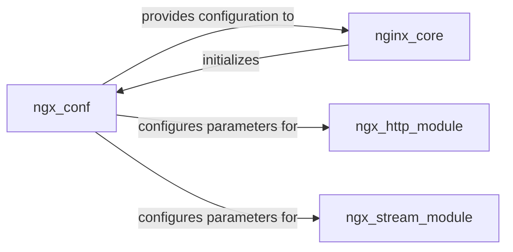

## Details

One paragraph explaining the functionality which is represented by this graph. What the main flow is and what is its purpose.

### ngx_conf
This component is solely responsible for parsing, validating, and loading the NGINX configuration file (nginx.conf). It translates human-readable directives into internal data structures that other NGINX modules can consume. It ensures the integrity and correctness of the configuration before it's applied.

**Related Classes/Methods**: _None_

### nginx_core
The foundational module of NGINX, responsible for managing the master-worker process model, event loop, and the overall server lifecycle. It initiates the configuration loading process by interacting with the Configuration Manager and consumes the parsed configuration to establish global parameters and orchestrate other modules.

**Related Classes/Methods**: _None_

### ngx_http_module
This module handles all HTTP-specific functionalities, including request processing, response generation, and various HTTP-related directives (e.g., virtual hosts, caching, load balancing). It relies on the Configuration Manager to receive its specific configuration parameters, which dictate how it processes incoming HTTP traffic.

**Related Classes/Methods**: _None_

### ngx_stream_module
Manages TCP/UDP proxying and load balancing functionalities, enabling NGINX to handle raw stream data. Similar to the HTTP module, it receives its operational parameters and rules from the Configuration Manager, allowing it to process non-HTTP network traffic according to defined policies.

**Related Classes/Methods**: _None_

### [FAQ](https://github.com/CodeBoarding/GeneratedOnBoardings/tree/main?tab=readme-ov-file#faq)