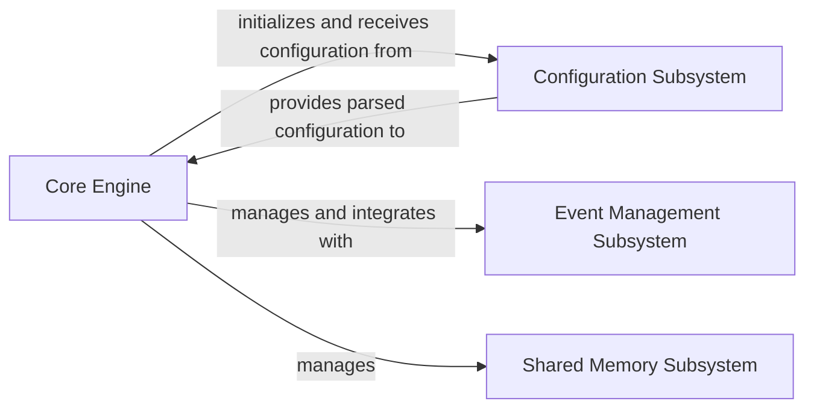

## Details

Analysis of NGINX server components and their relationships. Source code references are not provided as NGINX is primarily implemented in C, and the available tools are Python-specific.

### Core Engine [[Expand]](./Core_Engine.md)
The Core Engine is the central orchestrator of the NGINX process, embodying the core functionality of an Infrastructure Software/Server Software. It is responsible for the overall lifecycle management, including the implementation of the master-worker process model, handling system signals, and managing the main event loop. It initializes and oversees other critical core components, acting as the primary control plane for the server's operation.

**Related Classes/Methods**: _None_

### Configuration Subsystem
The Configuration Subsystem, represented by ngx_conf, is responsible for parsing, validating, and providing the server's configuration. It translates the declarative configuration files into an internal representation that the Core Engine and other modules can utilize.

**Related Classes/Methods**: _None_

### Event Management Subsystem
The Event Management Subsystem, represented by ngx_event, is responsible for handling asynchronous I/O events. It provides the underlying mechanism for NGINX's event-driven architecture, managing connections, timers, and other I/O operations efficiently.

**Related Classes/Methods**: _None_

### Shared Memory Subsystem
The Shared Memory Subsystem, represented by ngx_shm, manages shared memory zones used for inter-process communication and data sharing among worker processes. This is critical for components like caching, session management, and rate limiting.

**Related Classes/Methods**: _None_

### [FAQ](https://github.com/CodeBoarding/GeneratedOnBoardings/tree/main?tab=readme-ov-file#faq)