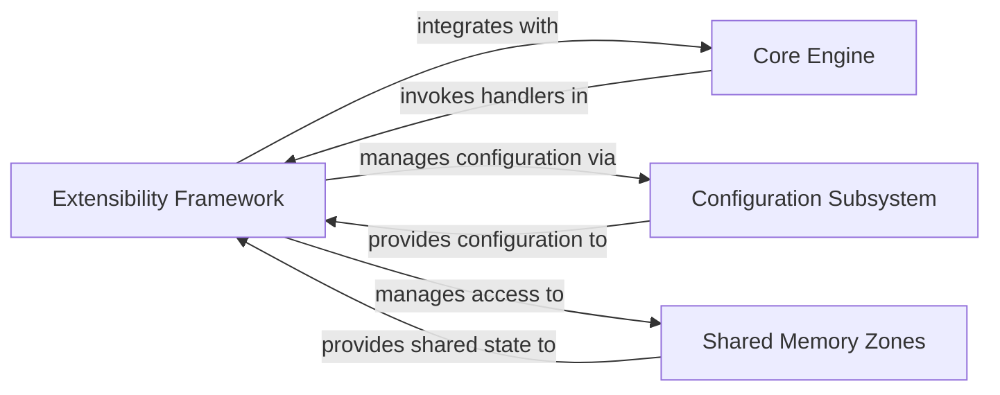

## Details

The Extensibility Framework is a cornerstone of NGINX's modular architecture, enabling dynamic and static modules to seamlessly integrate and extend the server's functionality without modifying its core. It provides the essential interfaces, lifecycle management, and a robust system of hooks and callbacks that allow modules to inject custom logic across various processing phases, from HTTP request handling to stream and mail proxying. This framework is fundamental to NGINX's ability to support diverse features like content generation, filtering, load balancing, and protocol handling through its rich ecosystem of modules.

### Extensibility Framework [[Expand]](./Extensibility_Framework.md)
Defines the core interfaces, mechanisms, and lifecycle management for integrating and executing dynamic or static modules within NGINX. It provides a robust system of hooks and callbacks that allow modules to extend NGINX's functionality across various processing phases (e.g., HTTP request processing, stream handling, mail proxying) without modifying the core engine. This framework is fundamental to NGINX's modular architecture, enabling custom logic for features like content generation, filtering, load balancing, and protocol handling.

**Related Classes/Methods**:

- `src/core/ngx_module.h`
- `src/core/ngx_module.c`
- `src/http/ngx_http_core_module.c`
- `src/http/modules/ngx_http_proxy_module.c`
- `src/event/ngx_event_module.c`

### Core Engine [[Expand]](./Core_Engine.md)
The central orchestrator of NGINX, responsible for managing the main event loop, the master-worker process model, and invoking module handlers at appropriate processing phases. It provides the fundamental APIs and services that modules interact with to perform their functions.

**Related Classes/Methods**:

- `ngx_core.h`
- `ngx_cycle.c`
- `ngx_event.c`

### Configuration Subsystem
Handles the parsing, validation, and application of NGINX's declarative configuration files. It translates human-readable directives into internal data structures that guide the behavior of the Core Engine and various modules, including module-specific settings.

**Related Classes/Methods**:

- `ngx_conf_file.h`
- `ngx_conf_file.c`

### Shared Memory Zones
Provides mechanisms for inter-process communication and shared state management among NGINX worker processes. These zones are allocated and managed by the NGINX core and are utilized by modules to store and access shared data, such as session states, cache metadata, or rate limiting counters.

**Related Classes/Methods**:

- `ngx_shmem.h`
- `ngx_shmem.c`

### [FAQ](https://github.com/CodeBoarding/GeneratedOnBoardings/tree/main?tab=readme-ov-file#faq)