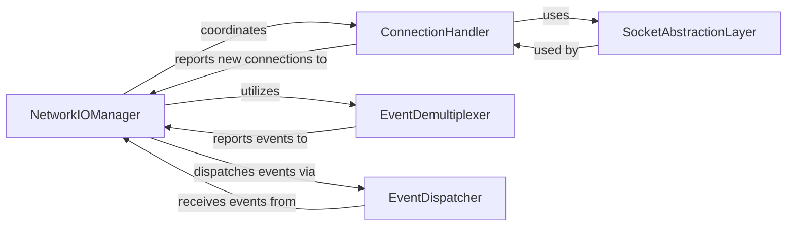

## Details

One paragraph explaining the functionality which is represented by this graph. What the main flow is and what is its purpose.

### NetworkIOManager
The central orchestrator of NGINX's event-driven network operations. It coordinates connection acceptance, manages non-blocking I/O events, and dispatches them to higher-level handlers. This component is fundamental for NGINX's high-performance, event-driven model.

**Related Classes/Methods**: _None_

### ConnectionHandler
Manages the lifecycle of individual network connections. This includes accepting new client connections, associating them with I/O events, and handling their state transitions (e.g., active, closing). It relies on the SocketAbstractionLayer for raw socket operations. This component ensures robust connection management.

**Related Classes/Methods**: _None_

### EventDemultiplexer
Provides the core non-blocking I/O multiplexing functionality, abstracting platform-specific mechanisms like `epoll`, `kqueue`, or `select`. It efficiently monitors multiple file descriptors for I/O readiness events and reports them to the NetworkIOManager. This is crucial for NGINX's scalability and ability to handle many concurrent connections.

**Related Classes/Methods**: _None_

### EventDispatcher
Responsible for routing processed network events (e.g., read readiness, write completion, connection closure) from the NetworkIOManager to the appropriate higher-level application components. This component ensures that events are delivered to the correct handlers for further processing.

**Related Classes/Methods**: _None_

### SocketAbstractionLayer
Offers a platform-independent interface for fundamental socket operations (e.g., `socket()`, `bind()`, `listen()`, `accept()`, `connect()`, `read()`, `write()`, `close()`). It encapsulates OS-specific socket API calls, contributing to NGINX's portability across different operating systems.

**Related Classes/Methods**: _None_

### [FAQ](https://github.com/CodeBoarding/GeneratedOnBoardings/tree/main?tab=readme-ov-file#faq)