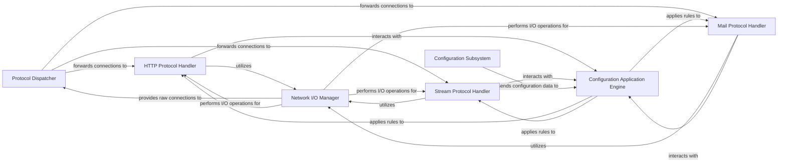

## Details

The feedback highlights two main issues: undefined components in the relationship mapping and missing source code references for several components. LogAndErrorHandling will be removed. Configuration Subsystem will be defined. Source code references for NGINX C-based components cannot be retrieved using Python-specific tools.

### Protocol Dispatcher
The initial entry point for new connections within the subsystem. It identifies the incoming protocol type (e.g., HTTP, Stream, Mail) based on initial handshake or port, and then dispatches the connection to the appropriate protocol-specific handler for further processing. This component ensures that traffic is routed to the correct processing pipeline.

**Related Classes/Methods**: _None_

### HTTP Protocol Handler
Dedicated to processing HTTP/HTTPS traffic. This component handles the parsing of HTTP request lines and headers (ngx_http_parse_request_line), manages HTTP session state, and orchestrates the application of HTTP-specific filters and routing directives (ngx_http_find_location).

**Related Classes/Methods**: _None_

### Stream Protocol Handler
Manages generic TCP/UDP stream connections. It handles raw byte streams, applies stream-level filters (e.g., access control, rate limiting), and manages the lifecycle of non-HTTP connections, providing a transparent proxying capability.

**Related Classes/Methods**: _None_

### Mail Protocol Handler
Specializes in proxying and processing mail-related protocols such as SMTP, POP3, and IMAP. It handles protocol-specific command parsing, manages mail session states, and applies mail-specific filters (e.g., spam filtering, authentication).

**Related Classes/Methods**: _None_

### Configuration Application Engine
This component is responsible for dynamically applying various processing filters, directives, and policies (e.g., routing rules, access controls, content transformations) that are defined in the system's configuration. It acts as an intermediary, translating configuration settings into executable actions during protocol processing.

**Related Classes/Methods**: _None_

### Network I/O Manager
A foundational system-level component that provides the core network communication services. It manages the establishment, maintenance, and termination of network connections, and handles asynchronous reading and writing of data to and from sockets. All protocol handlers within this subsystem rely on this component for raw network access.

**Related Classes/Methods**: _None_

### Configuration Subsystem
This external subsystem is responsible for storing, managing, and providing the configuration data to the Configuration Application Engine. It handles parsing configuration files, validating settings, and making them available for runtime application.

**Related Classes/Methods**: _None_

### [FAQ](https://github.com/CodeBoarding/GeneratedOnBoardings/tree/main?tab=readme-ov-file#faq)