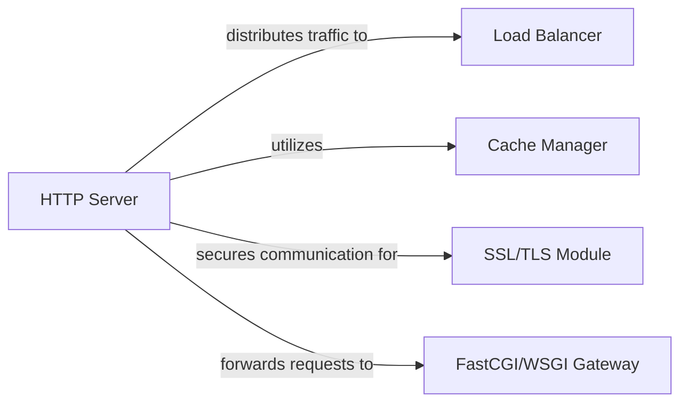

## Details

NGINX is a high-performance web server, reverse proxy, and load balancer. It is known for its stability, rich feature set, simple configuration, and low resource consumption. This analysis outlines its core components and their interactions.

### HTTP Server
Handles HTTP requests and serves static content.

**Related Classes/Methods**: _None_

### Load Balancer
Distributes incoming network traffic across multiple backend servers.

**Related Classes/Methods**: _None_

### Cache Manager
Manages caching of frequently accessed content to improve performance.

**Related Classes/Methods**: _None_

### SSL/TLS Module
Handles secure communication using SSL/TLS protocols.

**Related Classes/Methods**: _None_

### FastCGI/WSGI Gateway
Processes and executes scripts for dynamic content generation.

**Related Classes/Methods**: _None_

### [FAQ](https://github.com/CodeBoarding/GeneratedOnBoardings/tree/main?tab=readme-ov-file#faq)