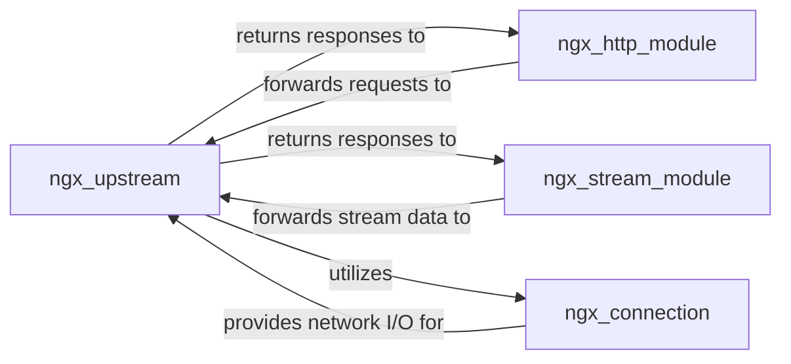

## Details

Abstract architectural components of Nginx.

### ngx_upstream
The core component responsible for managing communication with backend servers (upstreams). It handles load balancing algorithms, performs health checks on upstream servers, and manages connection pooling to optimize resource usage. It acts as the central orchestrator for routing requests to appropriate backend services.

**Related Classes/Methods**: _None_

### ngx_http_module
Handles HTTP-specific proxying logic. It receives incoming HTTP requests, processes them, and forwards them to ngx_upstream for routing to backend HTTP servers. It also receives responses from ngx_upstream and sends them back to the client.

**Related Classes/Methods**: _None_

### ngx_stream_module
Manages TCP/UDP stream proxying. Similar to the HTTP module, it handles raw stream data, passing it to ngx_upstream for routing to backend TCP/UDP services and receiving responses.

**Related Classes/Methods**: _None_

### ngx_connection
A foundational component responsible for managing individual network connections. It provides the low-level interface for reading from and writing to sockets, which ngx_upstream utilizes to establish and maintain connections with backend servers.

**Related Classes/Methods**: _None_

### [FAQ](https://github.com/CodeBoarding/GeneratedOnBoardings/tree/main?tab=readme-ov-file#faq)