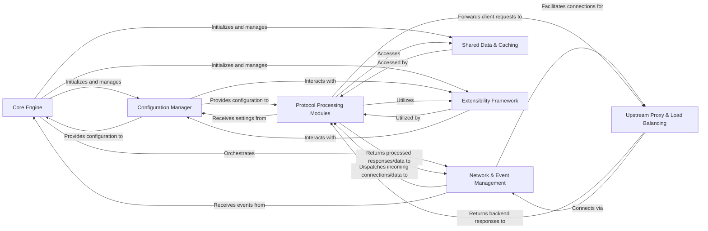

## Details

Abstract overview of NGINX components and their relationships.

### Core Engine [[Expand]](./Core_Engine.md)
The central orchestrator responsible for NGINX's lifecycle, including process management (master-worker model), signal handling, and managing the main event loop. It initializes and oversees other core components.

**Related Classes/Methods**: _None_

### Configuration Manager [[Expand]](./Configuration_Manager.md)
Handles the parsing, validation, and loading of the NGINX configuration file (nginx.conf). It translates directives into internal data structures and provides configuration data to other modules.

**Related Classes/Methods**: _None_

### Network & Event Management [[Expand]](./Network_Event_Management.md)
Manages low-level network operations, including accepting new connections, handling non-blocking I/O (e.g., epoll, kqueue), and dispatching network events to appropriate handlers.

**Related Classes/Methods**: _None_

### Protocol Processing Modules [[Expand]](./Protocol_Processing_Modules.md)
A collection of modules (e.g., HTTP, Stream, Mail) responsible for handling specific network protocols. They manage connection lifecycles, parse requests/responses, and apply various processing filters and directives.

**Related Classes/Methods**: _None_

### Upstream Proxy & Load Balancing [[Expand]](./Upstream_Proxy_Load_Balancing.md)
Manages communication with backend servers (upstreams). This component handles load balancing, health checks, and connection pooling for various proxy protocols.

**Related Classes/Methods**: _None_

### Shared Data & Caching [[Expand]](./Shared_Data_Caching.md)
Provides mechanisms for inter-process communication and shared data storage, primarily used by worker processes for caching, session state, and rate limiting.

**Related Classes/Methods**: _None_

### Extensibility Framework [[Expand]](./Extensibility_Framework.md)
Defines the interfaces and mechanisms that allow NGINX's functionality to be extended through dynamic or static modules, providing hooks for various processing phases.

**Related Classes/Methods**: _None_

### [FAQ](https://github.com/CodeBoarding/GeneratedOnBoardings/tree/main?tab=readme-ov-file#faq)