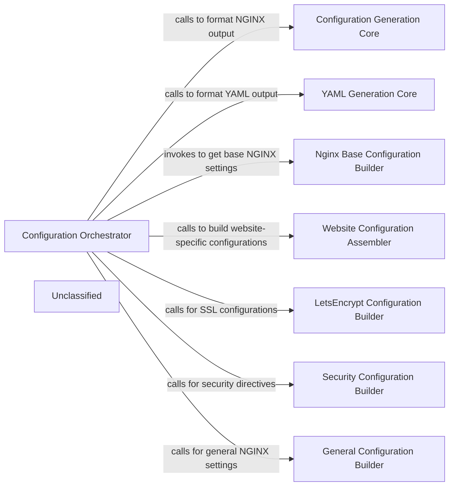

## Details

The Configuration Orchestrator subsystem encompasses the central logic for processing user inputs, orchestrating the generation of NGINX and YAML configurations, and preparing structured data for various output formats. Its boundaries are defined by its role in coordinating specialized configuration builders and formatters to produce the final server configurations. The Configuration Orchestrator acts as the central orchestrator, maintaining a "has-a" relationship with the various "Builder" components and "Generation Core" components. It directs the flow of data and calls upon these specialized components to perform their specific tasks in a coordinated manner. The "Builder" components are modular units that encapsulate the logic for generating distinct sections of the NGINX configuration, promoting a clear separation of concerns. The "Generation Core" components are responsible for the final serialization of the structured configuration data into the desired output format (NGINX or YAML). This structure allows for flexible and extensible configuration generation.

### Configuration Orchestrator [[Expand]](./Configuration_Orchestrator.md)
The central logic component that processes user inputs (domains and global settings), orchestrates the generation of the complete NGINX configuration by coordinating with specific section builders, and prepares structured data for formatting into various output files. It also determines the output format (NGINX or YAML).

**Related Classes/Methods**:

- <a href="https://github.com/digitalocean/nginxconfig.io/blob/master/src/nginxconfig/generators/index.js" target="_blank" rel="noopener noreferrer">`Configuration Orchestrator`</a>

### Configuration Generation Core
Transforms structured configuration data into a valid NGINX configuration string, handling recursive traversal, key length optimization, and NGINX block identification.

**Related Classes/Methods**:

- <a href="https://github.com/digitalocean/nginxconfig.io/blob/master/src/nginxconfig/generators/to_conf.js" target="_blank" rel="noopener noreferrer">`Configuration Generation Core`</a>

### YAML Generation Core
Transforms structured data into a YAML formatted string, used for generating Docker-related configuration files.

**Related Classes/Methods**:

- <a href="https://github.com/digitalocean/nginxconfig.io/blob/master/src/nginxconfig/generators/to_yaml.js" target="_blank" rel="noopener noreferrer">`YAML Generation Core`</a>

### Nginx Base Configuration Builder
Constructs the foundational `nginx.conf` file based on global settings, including worker processes, error logging, and PID file directives.

**Related Classes/Methods**:

- <a href="https://github.com/digitalocean/nginxconfig.io/blob/master/src/nginxconfig/generators/conf/nginx.conf.js" target="_blank" rel="noopener noreferrer">`Nginx Base Configuration Builder`</a>

### Website Configuration Assembler
Builds domain-specific NGINX configuration directives, including HTTP redirect rules, listen configurations, and server block definitions for individual websites.

**Related Classes/Methods**:

- <a href="https://github.com/digitalocean/nginxconfig.io/blob/master/src/nginxconfig/generators/conf/website.conf.js" target="_blank" rel="noopener noreferrer">`Website Configuration Assembler`</a>

### LetsEncrypt Configuration Builder
Generates NGINX configuration for Let's Encrypt SSL certificates, including certificate paths and renewal settings.

**Related Classes/Methods**:

- <a href="https://github.com/digitalocean/nginxconfig.io/blob/master/src/nginxconfig/generators/conf/letsencrypt.conf.js" target="_blank" rel="noopener noreferrer">`LetsEncrypt Configuration Builder`</a>

### Security Configuration Builder
Generates NGINX configuration for security-related settings, such as HTTP Strict Transport Security (HSTS), X-Frame-Options, and other hardening directives.

**Related Classes/Methods**:

- <a href="https://github.com/digitalocean/nginxconfig.io/blob/master/src/nginxconfig/generators/conf/security.conf.js" target="_blank" rel="noopener noreferrer">`Security Configuration Builder`</a>

### General Configuration Builder
Generates general NGINX configuration directives that apply broadly across the server or specific contexts, such as gzip compression settings or default index files.

**Related Classes/Methods**:

- <a href="https://github.com/digitalocean/nginxconfig.io/blob/master/src/nginxconfig/generators/conf/general.conf.js" target="_blank" rel="noopener noreferrer">`General Configuration Builder`</a>

### Unclassified
Component for all unclassified files and utility functions (Utility functions/External Libraries/Dependencies)

**Related Classes/Methods**: _None_

### [FAQ](https://github.com/CodeBoarding/GeneratedOnBoardings/tree/main?tab=readme-ov-file#faq)