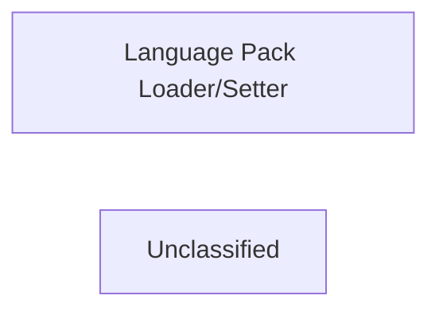

## Details

The internationalization subsystem of nginxconfig.io is primarily managed by the Language Pack Loader/Setter component. This component is central to handling the dynamic loading and activation of different language packs. It is responsible for fetching the appropriate language data, performing essential integrity checks during the loading process, and then making the selected language available throughout the application's user interface. This design ensures that language-specific content is correctly presented based on user or system preferences, with built-in mechanisms to prevent common translation-related issues.

### Language Pack Loader/Setter
This component is responsible for the lifecycle management of language translations. It handles the retrieval of language data from various sources, its subsequent integration into the application's user interface, and ensures the correct language pack is loaded and activated based on user preferences or system defaults. It also performs initial validation checks on the loaded language data to ensure its basic integrity before activation.

**Related Classes/Methods**:

- <a href="https://github.com/digitalocean/nginxconfig.io/blob/master/src/nginxconfig/i18n/setup.js#L65-L80" target="_blank" rel="noopener noreferrer">`loadLanguagePack`:65-80</a>
- <a href="https://github.com/digitalocean/nginxconfig.io/blob/master/src/nginxconfig/i18n/setup.js#L82-L89" target="_blank" rel="noopener noreferrer">`setLanguagePack`:82-89</a>

### Unclassified
Component for all unclassified files and utility functions (Utility functions/External Libraries/Dependencies)

**Related Classes/Methods**: _None_

### [FAQ](https://github.com/CodeBoarding/GeneratedOnBoardings/tree/main?tab=readme-ov-file#faq)