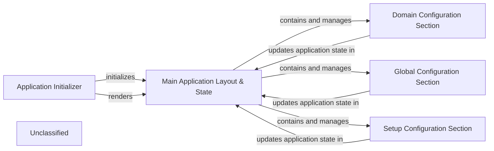

## Details

The User Interface & State Management subsystem encompasses the core client-side application components responsible for user interaction, configuration input, and application state management. This subsystem is central to a Web-based Configuration Tool, handling application initialization, overall layout, state management, and modular configuration input.

### Application Initializer
This component is the entry point for the Vue.js application. It is responsible for initializing the Vue instance and mounting the root application component to the Document Object Model (DOM), effectively starting the user interface.

**Related Classes/Methods**:

- <a href="https://github.com/digitalocean/nginxconfig.io/blob/master/src/nginxconfig/mount.js" target="_blank" rel="noopener noreferrer">`src/nginxconfig/mount.js`</a>

### Main Application Layout & State
This is the primary container component for the entire application. It defines the overall layout, manages the global application state (potentially through reactive data or a state management pattern), and orchestrates the rendering of various child configuration sections. It also displays the final generated NGINX configuration.

**Related Classes/Methods**:

- <a href="https://github.com/digitalocean/nginxconfig.io/blob/master/src/nginxconfig/templates/app.vue" target="_blank" rel="noopener noreferrer">`src/nginxconfig/templates/app.vue`</a>

### Domain Configuration Section
A specialized Vue component dedicated to capturing user inputs and displaying settings related to domain-specific NGINX configurations. It interacts with the main application state to reflect and update configuration parameters.

**Related Classes/Methods**:

- <a href="https://github.com/digitalocean/nginxconfig.io/blob/master/src/nginxconfig/templates/domain.vue" target="_blank" rel="noopener noreferrer">`src/nginxconfig/templates/domain.vue`</a>

### Global Configuration Section
A specialized Vue component focused on managing user inputs and displaying settings for global NGINX configurations. It contributes to and reacts to changes in the overall application state.

**Related Classes/Methods**:

- <a href="https://github.com/digitalocean/nginxconfig.io/blob/master/src/nginxconfig/templates/global.vue" target="_blank" rel="noopener noreferrer">`src/nginxconfig/templates/global.vue`</a>

### Setup Configuration Section
A specialized Vue component responsible for handling user inputs and displaying settings pertinent to the initial setup or foundational aspects of the NGINX configuration. It updates and reflects the application's state for its specific section.

**Related Classes/Methods**:

- <a href="https://github.com/digitalocean/nginxconfig.io/blob/master/src/nginxconfig/templates/setup.vue" target="_blank" rel="noopener noreferrer">`src/nginxconfig/templates/setup.vue`</a>

### Unclassified
Component for all unclassified files and utility functions (Utility functions/External Libraries/Dependencies)

**Related Classes/Methods**: _None_

### [FAQ](https://github.com/CodeBoarding/GeneratedOnBoardings/tree/main?tab=readme-ov-file#faq)