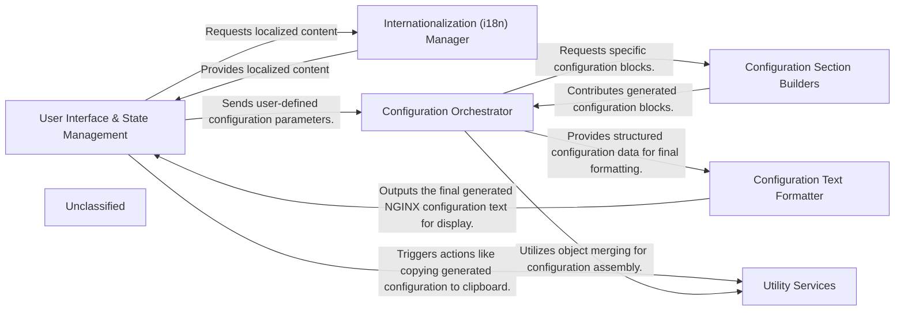

## Details

The `nginxconfig.io` project is structured around a clear separation of concerns, facilitating both user interaction and robust NGINX configuration generation. The `User Interface & State Management` component serves as the primary interaction point, capturing user inputs and displaying the final configuration. It relies on the `Internationalization (i18n) Manager` for multi-language support. User-defined parameters are then passed to the `Configuration Orchestrator`, which acts as the central processing unit. The orchestrator delegates the creation of specific NGINX configuration blocks to various `Configuration Section Builders`. Once all sections are generated, the `Configuration Text Formatter` assembles and formats the complete NGINX configuration. Throughout this process, `Utility Services` provide common functionalities like object merging and clipboard interactions. This architecture ensures a modular and maintainable system, where each component has a well-defined role in the overall data flow from user input to generated NGINX configuration.

### User Interface & State Management [[Expand]](./User_Interface_State_Management.md)
The primary interface for user interaction, capturing configuration parameters, managing application state, and displaying the generated NGINX configuration.

**Related Classes/Methods**:

- <a href="https://github.com/digitalocean/nginxconfig.io/blob/master/src/nginxconfig/mount.js" target="_blank" rel="noopener noreferrer">`src/nginxconfig/mount.js`</a>
- <a href="https://github.com/digitalocean/nginxconfig.io/blob/master/src/nginxconfig/templates/app.vue" target="_blank" rel="noopener noreferrer">`src/nginxconfig/templates/app.vue`</a>
- <a href="https://github.com/digitalocean/nginxconfig.io/blob/master/src/nginxconfig/templates/domain.vue" target="_blank" rel="noopener noreferrer">`src/nginxconfig/templates/domain.vue`</a>
- <a href="https://github.com/digitalocean/nginxconfig.io/blob/master/src/nginxconfig/templates/global.vue" target="_blank" rel="noopener noreferrer">`src/nginxconfig/templates/global.vue`</a>
- <a href="https://github.com/digitalocean/nginxconfig.io/blob/master/src/nginxconfig/templates/setup.vue" target="_blank" rel="noopener noreferrer">`src/nginxconfig/templates/setup.vue`</a>

### Internationalization (i18n) Manager [[Expand]](./Internationalization_i18n_Manager.md)
Responsible for loading, setting, and verifying language packs to provide multi-language support across the application's user interface.

**Related Classes/Methods**:

- <a href="https://github.com/digitalocean/nginxconfig.io/blob/master/src/nginxconfig/i18n/setup.js" target="_blank" rel="noopener noreferrer">`src/nginxconfig/i18n/setup.js`</a>
- <a href="https://github.com/digitalocean/nginxconfig.io/blob/master/src/nginxconfig/i18n/verify.js" target="_blank" rel="noopener noreferrer">`src/nginxconfig/i18n/verify.js`</a>

### Configuration Orchestrator [[Expand]](./Configuration_Orchestrator.md)
The central logic component that processes user inputs, orchestrates the generation of the complete NGINX configuration by coordinating with specific section builders, and prepares structured data for formatting.

**Related Classes/Methods**:

- <a href="https://github.com/digitalocean/nginxconfig.io/blob/master/src/nginxconfig/generators/index.js" target="_blank" rel="noopener noreferrer">`src/nginxconfig/generators/index.js`</a>

### Configuration Section Builders
A collection of specialized modules, each encapsulating the logic for generating specific sections or features of the NGINX configuration (e.g., website, PHP, security, Let's Encrypt).

**Related Classes/Methods**:

- <a href="https://github.com/digitalocean/nginxconfig.io/blob/master/src/nginxconfig/generators/conf/website.conf.js" target="_blank" rel="noopener noreferrer">`src/nginxconfig/generators/conf/website.conf.js`</a>
- <a href="https://github.com/digitalocean/nginxconfig.io/blob/master/src/nginxconfig/generators/conf/php_fastcgi.conf.js" target="_blank" rel="noopener noreferrer">`src/nginxconfig/generators/conf/php_fastcgi.conf.js`</a>
- <a href="https://github.com/digitalocean/nginxconfig.io/blob/master/src/nginxconfig/generators/conf/security.conf.js" target="_blank" rel="noopener noreferrer">`src/nginxconfig/generators/conf/security.conf.js`</a>
- <a href="https://github.com/digitalocean/nginxconfig.io/blob/master/src/nginxconfig/generators/conf/letsencrypt.conf.js" target="_blank" rel="noopener noreferrer">`src/nginxconfig/generators/conf/letsencrypt.conf.js`</a>

### Configuration Text Formatter
Transforms the structured configuration data into a human-readable and correctly formatted NGINX configuration text, handling indentation and block structures for the final output.

**Related Classes/Methods**:

- <a href="https://github.com/digitalocean/nginxconfig.io/blob/master/src/nginxconfig/generators/to_conf.js" target="_blank" rel="noopener noreferrer">`src/nginxconfig/generators/to_conf.js`</a>

### Utility Services
Provides general-purpose helper functions used across the application, such as deep merging objects for configuration assembly and clipboard interactions for user convenience.

**Related Classes/Methods**:

- <a href="https://github.com/digitalocean/nginxconfig.io/blob/master/src/nginxconfig/util/deep_merge.js" target="_blank" rel="noopener noreferrer">`src/nginxconfig/util/deep_merge.js`</a>
- <a href="https://github.com/digitalocean/nginxconfig.io/blob/master/src/nginxconfig/util/prism_bundle.js" target="_blank" rel="noopener noreferrer">`src/nginxconfig/util/prism_bundle.js`</a>

### Unclassified
Component for all unclassified files and utility functions (Utility functions/External Libraries/Dependencies)

**Related Classes/Methods**: _None_

### [FAQ](https://github.com/CodeBoarding/GeneratedOnBoardings/tree/main?tab=readme-ov-file#faq)