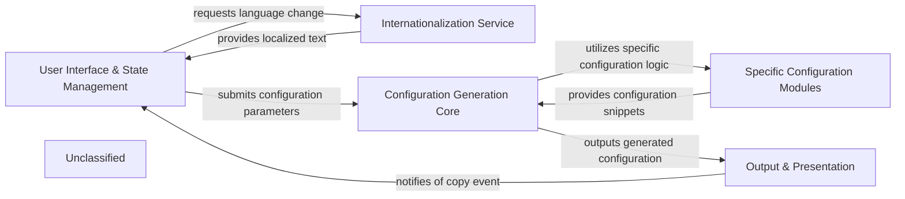

## Details

The `nginxconfig.io` project is structured around a clear separation of concerns, facilitating the generation of NGINX and Docker Compose configurations through a user-friendly web interface. The core data flow begins with user interactions on the `User Interface & State Management` component, which captures configuration preferences. These preferences are then processed by the `Internationalization Service` for localized content and passed to the `Configuration Generation Core`. This central component orchestrates the generation process by leveraging `Specific Configuration Modules` to produce the final NGINX or Docker Compose output. Finally, the `Output & Presentation` component handles the display and interaction with the generated configuration, including syntax highlighting and clipboard functionality.

### User Interface & State Management
The primary client-side component responsible for rendering the application's visual elements, capturing user input through interactive forms, and managing the overall configuration state based on user selections. It acts as the central orchestrator for user interactions.

**Related Classes/Methods**:

- <a href="https://github.com/digitalocean/nginxconfig.io/blob/mastersrc/nginxconfig/mount.js" target="_blank" rel="noopener noreferrer">`src/nginxconfig/mount.js`</a>

### Internationalization Service
Manages the application's multi-language capabilities. It handles the loading, setting, and verification of language packs to provide a localized user experience across the UI.

**Related Classes/Methods**:

- <a href="https://github.com/digitalocean/nginxconfig.io/blob/mastersrc/nginxconfig/i18n/setup.js" target="_blank" rel="noopener noreferrer">`src/nginxconfig/i18n/setup.js`</a>
- <a href="https://github.com/digitalocean/nginxconfig.io/blob/mastersrc/nginxconfig/i18n/verify.js" target="_blank" rel="noopener noreferrer">`src/nginxconfig/i18n/verify.js`</a>

### Configuration Generation Core
The central business logic component responsible for orchestrating the transformation of structured configuration parameters (from the UI) into valid NGINX or YAML configuration syntax. It delegates to specific configuration modules for detailed generation.

**Related Classes/Methods**:

- <a href="https://github.com/digitalocean/nginxconfig.io/blob/mastersrc/nginxconfig/generators/index.js" target="_blank" rel="noopener noreferrer">`src/nginxconfig/generators/index.js`</a>
- <a href="https://github.com/digitalocean/nginxconfig.io/blob/mastersrc/nginxconfig/generators/to_conf.js" target="_blank" rel="noopener noreferrer">`src/nginxconfig/generators/to_conf.js`</a>
- <a href="https://github.com/digitalocean/nginxconfig.io/blob/mastersrc/nginxconfig/generators/to_yaml.js" target="_blank" rel="noopener noreferrer">`src/nginxconfig/generators/to_yaml.js`</a>

### Specific Configuration Modules
A collection of specialized modules that provide specific NGINX configuration snippets and logic for various features (e.g., website settings, general NGINX directives, PHP-FPM, security, SSL/LetsEncrypt) and Docker Compose YAML structures. These modules are consumed by the `Configuration Generation Core`.

**Related Classes/Methods**:

- <a href="https://github.com/digitalocean/nginxconfig.io/blob/mastersrc/nginxconfig/generators/conf/website.conf.js" target="_blank" rel="noopener noreferrer">`src/nginxconfig/generators/conf/website.conf.js`</a>
- <a href="https://github.com/digitalocean/nginxconfig.io/blob/mastersrc/nginxconfig/generators/conf/general.conf.js" target="_blank" rel="noopener noreferrer">`src/nginxconfig/generators/conf/general.conf.js`</a>
- <a href="https://github.com/digitalocean/nginxconfig.io/blob/mastersrc/nginxconfig/generators/conf/php_fastcgi.conf.js" target="_blank" rel="noopener noreferrer">`src/nginxconfig/generators/conf/php_fastcgi.conf.js`</a>
- <a href="https://github.com/digitalocean/nginxconfig.io/blob/mastersrc/nginxconfig/generators/conf/security.conf.js" target="_blank" rel="noopener noreferrer">`src/nginxconfig/generators/conf/security.conf.js`</a>
- <a href="https://github.com/digitalocean/nginxconfig.io/blob/mastersrc/nginxconfig/generators/yaml/dockerCompose.yaml.js" target="_blank" rel="noopener noreferrer">`src/nginxconfig/generators/yaml/dockerCompose.yaml.js`</a>

### Output & Presentation
This component is responsible for the final presentation of the generated NGINX or YAML configuration. It integrates syntax highlighting (via Prism.js) and provides functionalities like copying the configuration to the user's clipboard.

**Related Classes/Methods**:

- <a href="https://github.com/digitalocean/nginxconfig.io/blob/mastersrc/nginxconfig/util/prism_bundle.js" target="_blank" rel="noopener noreferrer">`src/nginxconfig/util/prism_bundle.js`</a>

### Unclassified
Component for all unclassified files and utility functions (Utility functions/External Libraries/Dependencies)

**Related Classes/Methods**: _None_

### [FAQ](https://github.com/CodeBoarding/GeneratedOnBoardings/tree/main?tab=readme-ov-file#faq)