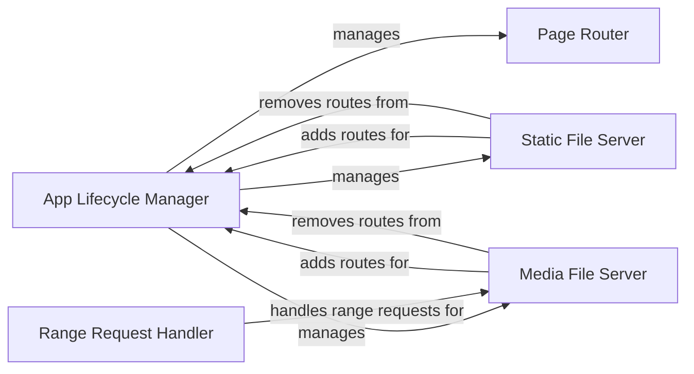

## Component Details

The App and Page Management subsystem in NiceGUI is responsible for handling the application's lifecycle, routing, and serving static and media files. The `App` class manages the application's startup and shutdown, while the `page` decorator associates routes with UI content. Static and media files are served through dedicated components, with range requests handled efficiently to optimize bandwidth usage. This system ensures that the application can handle various types of content and requests, providing a flexible and efficient user experience.

### App Lifecycle Manager
The App Lifecycle Manager is responsible for the overall lifecycle of the NiceGUI application. It handles the application's startup, including setting up routes and background tasks, and manages the shutdown process, ensuring proper cleanup and termination of resources. It interacts with the Static File Server and Media File Server to initialize routes for static and media files.

**Related Classes/Methods**:

- <a href="https://github.com/zauberzeug/nicegui/blob/master/nicegui/app/app.py#L69-L76" target="_blank" rel="noopener noreferrer">`nicegui.app.app.App.start` (69:76)</a>
- <a href="https://github.com/zauberzeug/nicegui/blob/master/nicegui/app/app.py#L114-L119" target="_blank" rel="noopener noreferrer">`nicegui.app.app.App.on_shutdown` (114:119)</a>

### Page Router
The Page Router component is responsible for handling incoming requests and routing them to the appropriate page. It uses the `page` decorator to associate routes with UI content and ensures that the necessary setup and rendering are performed when a page is accessed. It interacts with the UI elements to render the page content and manage the page's lifecycle.

**Related Classes/Methods**:

- <a href="https://github.com/zauberzeug/nicegui/blob/master/nicegui/page.py#L100-L158" target="_blank" rel="noopener noreferrer">`nicegui.page.page.__call__` (100:158)</a>
- `nicegui.page.page.__call__.decorated.wait_for_result` (44:47)

### Static File Server
The Static File Server component is responsible for serving static files, such as CSS, JavaScript, and images, to the client. It adds routes for these files and removes them when necessary, ensuring that the files are accessible to the client. It interacts with the App Lifecycle Manager to add and remove routes during the application's lifecycle.

**Related Classes/Methods**:

- <a href="https://github.com/zauberzeug/nicegui/blob/master/nicegui/app/app.py#L180-L218" target="_blank" rel="noopener noreferrer">`nicegui.app.app.App.add_static_file` (180:218)</a>
- <a href="https://github.com/zauberzeug/nicegui/blob/master/nicegui/app/app.py#L276-L278" target="_blank" rel="noopener noreferrer">`nicegui.app.app.App.remove_route` (276:278)</a>

### Media File Server
The Media File Server component is responsible for serving media files, such as videos and audio, to the client. It adds routes for these files and removes them when necessary, ensuring that the files are accessible to the client. It interacts with the App Lifecycle Manager to add and remove routes during the application's lifecycle and with the Range Request Handler to serve media content efficiently.

**Related Classes/Methods**:

- <a href="https://github.com/zauberzeug/nicegui/blob/master/nicegui/app/app.py#L241-L274" target="_blank" rel="noopener noreferrer">`nicegui.app.app.App.add_media_file` (241:274)</a>
- <a href="https://github.com/zauberzeug/nicegui/blob/master/nicegui/app/app.py#L276-L278" target="_blank" rel="noopener noreferrer">`nicegui.app.app.App.remove_route` (276:278)</a>

### Range Request Handler
The Range Request Handler component handles range requests for media files, allowing clients to request specific portions of a file. It reads the content of the file in chunks and returns the requested range, optimizing bandwidth usage. It interacts with the Media File Server to serve media content efficiently and with the file system to read the media files.

**Related Classes/Methods**:

- <a href="https://github.com/zauberzeug/nicegui/blob/master/nicegui/app/range_response.py#L13-L58" target="_blank" rel="noopener noreferrer">`nicegui.app.range_response.get_range_response` (13:58)</a>
- <a href="https://github.com/zauberzeug/nicegui/blob/master/nicegui/app/range_response.py#L43-L52" target="_blank" rel="noopener noreferrer">`nicegui.app.range_response.get_range_response.content_reader` (43:52)</a>