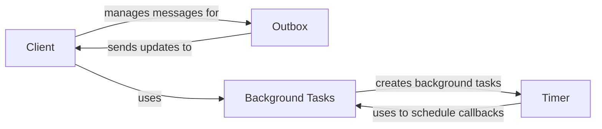

## Component Details

The Client Communication and Task Management subsystem is responsible for managing the communication between the server and the client, as well as handling background tasks. It uses WebSockets for real-time updates and asyncio for asynchronous operations. The core components include the Client, which manages the WebSocket connection and user interface interactions; the Outbox, which queues messages for efficient delivery to the client; the Timer, which schedules periodic function calls; and the Background Tasks module, which provides utilities for running tasks asynchronously.

### Client
The Client class manages the WebSocket connection between the server and a specific user interface. It handles incoming messages, invokes callbacks, manages UI elements, and ensures proper cleanup when the client disconnects. It interacts with the Outbox to send updates to the client and uses background tasks for asynchronous operations. It also manages session storage and lifecycle.

**Related Classes/Methods**:

- <a href="https://github.com/zauberzeug/nicegui/blob/master/nicegui/client.py#L35-L385" target="_blank" rel="noopener noreferrer">`nicegui.client.Client` (35:385)</a>
- <a href="https://github.com/zauberzeug/nicegui/blob/master/nicegui/client.py#L127-L174" target="_blank" rel="noopener noreferrer">`nicegui.client.Client:build_response` (127:174)</a>
- <a href="https://github.com/zauberzeug/nicegui/blob/master/nicegui/client.py#L191-L198" target="_blank" rel="noopener noreferrer">`nicegui.client.Client:disconnected` (191:198)</a>
- <a href="https://github.com/zauberzeug/nicegui/blob/master/nicegui/client.py#L246-L257" target="_blank" rel="noopener noreferrer">`nicegui.client.Client:handle_handshake` (246:257)</a>
- <a href="https://github.com/zauberzeug/nicegui/blob/master/nicegui/client.py#L259-L284" target="_blank" rel="noopener noreferrer">`nicegui.client.Client:handle_disconnect` (259:284)</a>
- <a href="https://github.com/zauberzeug/nicegui/blob/master/nicegui/client.py#L304-L322" target="_blank" rel="noopener noreferrer">`nicegui.client.Client:safe_invoke` (304:322)</a>
- <a href="https://github.com/zauberzeug/nicegui/blob/master/nicegui/client.py#L334-L336" target="_blank" rel="noopener noreferrer">`nicegui.client.Client:remove_all_elements` (334:336)</a>
- <a href="https://github.com/zauberzeug/nicegui/blob/master/nicegui/client.py#L338-L347" target="_blank" rel="noopener noreferrer">`nicegui.client.Client:delete` (338:347)</a>

### Outbox
The Outbox class manages a queue of messages that need to be sent to the client. It ensures that messages are sent in the correct order and handles potential rewinding of the queue if necessary. It interacts with the Client to send the actual messages and uses an event to signal when new messages are available.

**Related Classes/Methods**:

- <a href="https://github.com/zauberzeug/nicegui/blob/master/nicegui/outbox.py#L26-L154" target="_blank" rel="noopener noreferrer">`nicegui.outbox.Outbox` (26:154)</a>
- <a href="https://github.com/zauberzeug/nicegui/blob/master/nicegui/outbox.py#L28-L41" target="_blank" rel="noopener noreferrer">`nicegui.outbox.Outbox:__init__` (28:41)</a>
- <a href="https://github.com/zauberzeug/nicegui/blob/master/nicegui/outbox.py#L48-L52" target="_blank" rel="noopener noreferrer">`nicegui.outbox.Outbox:enqueue_update` (48:52)</a>
- <a href="https://github.com/zauberzeug/nicegui/blob/master/nicegui/outbox.py#L54-L58" target="_blank" rel="noopener noreferrer">`nicegui.outbox.Outbox:enqueue_delete` (54:58)</a>
- <a href="https://github.com/zauberzeug/nicegui/blob/master/nicegui/outbox.py#L60-L64" target="_blank" rel="noopener noreferrer">`nicegui.outbox.Outbox:enqueue_message` (60:64)</a>
- <a href="https://github.com/zauberzeug/nicegui/blob/master/nicegui/outbox.py#L66-L108" target="_blank" rel="noopener noreferrer">`nicegui.outbox.Outbox:loop` (66:108)</a>
- <a href="https://github.com/zauberzeug/nicegui/blob/master/nicegui/outbox.py#L128-L145" target="_blank" rel="noopener noreferrer">`nicegui.outbox.Outbox:try_rewind` (128:145)</a>

### Timer
The Timer class provides a mechanism to execute a callback function periodically. It manages the execution of the callback in a separate task and handles starting, stopping, and cleanup of the timer. It interacts with the event loop to schedule the callback execution.

**Related Classes/Methods**:

- <a href="https://github.com/zauberzeug/nicegui/blob/master/nicegui/timer.py#L11-L116" target="_blank" rel="noopener noreferrer">`nicegui.timer.Timer` (11:116)</a>
- <a href="https://github.com/zauberzeug/nicegui/blob/master/nicegui/timer.py#L15-L45" target="_blank" rel="noopener noreferrer">`nicegui.timer.Timer:__init__` (15:45)</a>
- <a href="https://github.com/zauberzeug/nicegui/blob/master/nicegui/timer.py#L63-L72" target="_blank" rel="noopener noreferrer">`nicegui.timer.Timer:_run_once` (63:72)</a>
- <a href="https://github.com/zauberzeug/nicegui/blob/master/nicegui/timer.py#L74-L94" target="_blank" rel="noopener noreferrer">`nicegui.timer.Timer:_run_in_loop` (74:94)</a>

### Background Tasks
The Background Tasks module provides utilities for running tasks in the background. It includes functions for creating and managing background tasks, ensuring that they are properly awaited on shutdown. It interacts with the asyncio event loop to schedule and manage the tasks.

**Related Classes/Methods**:

- <a href="https://github.com/zauberzeug/nicegui/blob/master/nicegui/background_tasks.py#L17-L30" target="_blank" rel="noopener noreferrer">`nicegui.background_tasks.create` (17:30)</a>
- <a href="https://github.com/zauberzeug/nicegui/blob/master/nicegui/background_tasks.py#L33-L50" target="_blank" rel="noopener noreferrer">`nicegui.background_tasks.create_lazy` (33:50)</a>
- <a href="https://github.com/zauberzeug/nicegui/blob/master/nicegui/background_tasks.py#L65-L72" target="_blank" rel="noopener noreferrer">`nicegui.background_tasks._ensure_coroutine` (65:72)</a>
- <a href="https://github.com/zauberzeug/nicegui/blob/master/nicegui/background_tasks.py#L84-L102" target="_blank" rel="noopener noreferrer">`nicegui.background_tasks.teardown` (84:102)</a>