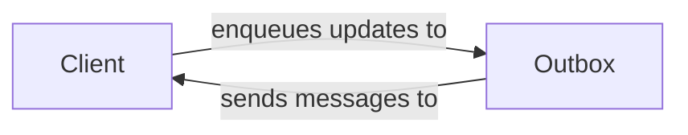

## Component Details

The Client-Server Communication component in NiceGUI facilitates real-time interaction between the server and the client (browser). It establishes and manages WebSocket connections, enabling the server to push updates to the client and ensuring the UI reflects the application's current state. The component utilizes an Outbox to efficiently queue and deliver messages, optimizing communication and maintaining responsiveness.

### Client
The Client class represents a single browser connection to the NiceGUI server. It's responsible for handling incoming messages from the client, invoking the appropriate callbacks, and managing the lifecycle of UI elements within that client's view. It also handles connection and disconnection events, ensuring proper cleanup and resource management.

**Related Classes/Methods**:

- <a href="https://github.com/zauberzeug/nicegui/blob/master/nicegui/client.py#L35-L385" target="_blank" rel="noopener noreferrer">`nicegui.client.Client` (35:385)</a>
- <a href="https://github.com/zauberzeug/nicegui/blob/master/nicegui/client.py#L127-L174" target="_blank" rel="noopener noreferrer">`nicegui.client.Client:build_response` (127:174)</a>
- <a href="https://github.com/zauberzeug/nicegui/blob/master/nicegui/client.py#L191-L198" target="_blank" rel="noopener noreferrer">`nicegui.client.Client:disconnected` (191:198)</a>
- <a href="https://github.com/zauberzeug/nicegui/blob/master/nicegui/client.py#L246-L257" target="_blank" rel="noopener noreferrer">`nicegui.client.Client:handle_handshake` (246:257)</a>
- <a href="https://github.com/zauberzeug/nicegui/blob/master/nicegui/client.py#L259-L284" target="_blank" rel="noopener noreferrer">`nicegui.client.Client:handle_disconnect` (259:284)</a>
- <a href="https://github.com/zauberzeug/nicegui/blob/master/nicegui/client.py#L304-L322" target="_blank" rel="noopener noreferrer">`nicegui.client.Client:safe_invoke` (304:322)</a>
- <a href="https://github.com/zauberzeug/nicegui/blob/master/nicegui/client.py#L334-L336" target="_blank" rel="noopener noreferrer">`nicegui.client.Client:remove_all_elements` (334:336)</a>
- <a href="https://github.com/zauberzeug/nicegui/blob/master/nicegui/client.py#L338-L347" target="_blank" rel="noopener noreferrer">`nicegui.client.Client:delete` (338:347)</a>
- <a href="https://github.com/zauberzeug/nicegui/blob/master/nicegui/client.py#L176-L178" target="_blank" rel="noopener noreferrer">`nicegui.client.Client.resolve_title` (176:178)</a>
- <a href="https://github.com/zauberzeug/nicegui/blob/master/nicegui/client.py#L286-L288" target="_blank" rel="noopener noreferrer">`nicegui.client.Client._cancel_delete_task` (286:288)</a>
- <a href="https://github.com/zauberzeug/nicegui/blob/master/nicegui/client.py#L180-L189" target="_blank" rel="noopener noreferrer">`nicegui.client.Client.connected` (180:189)</a>
- `nicegui.client.Client.safe_invoke.func_with_client` (full file reference)
- `nicegui.client.Client.safe_invoke.result_with_client` (full file reference)
- <a href="https://github.com/zauberzeug/nicegui/blob/master/nicegui/client.py#L324-L332" target="_blank" rel="noopener noreferrer">`nicegui.client.Client.remove_elements` (324:332)</a>
- `nicegui.client.Client.handle_disconnect.delete_content` (full file reference)

### Outbox
The Outbox class is responsible for managing the queue of messages that need to be sent to a specific client. It provides methods for enqueueing updates, deletions, and general messages. It also includes a background loop that periodically sends these messages to the client, ensuring efficient and timely delivery of updates.

**Related Classes/Methods**:

- <a href="https://github.com/zauberzeug/nicegui/blob/master/nicegui/outbox.py#L26-L154" target="_blank" rel="noopener noreferrer">`nicegui.outbox.Outbox` (26:154)</a>
- <a href="https://github.com/zauberzeug/nicegui/blob/master/nicegui/outbox.py#L28-L41" target="_blank" rel="noopener noreferrer">`nicegui.outbox.Outbox:__init__` (28:41)</a>
- <a href="https://github.com/zauberzeug/nicegui/blob/master/nicegui/outbox.py#L48-L52" target="_blank" rel="noopener noreferrer">`nicegui.outbox.Outbox:enqueue_update` (48:52)</a>
- <a href="https://github.com/zauberzeug/nicegui/blob/master/nicegui/outbox.py#L54-L58" target="_blank" rel="noopener noreferrer">`nicegui.outbox.Outbox:enqueue_delete` (54:58)</a>
- <a href="https://github.com/zauberzeug/nicegui/blob/master/nicegui/outbox.py#L60-L64" target="_blank" rel="noopener noreferrer">`nicegui.outbox.Outbox:enqueue_message` (60:64)</a>
- <a href="https://github.com/zauberzeug/nicegui/blob/master/nicegui/outbox.py#L66-L108" target="_blank" rel="noopener noreferrer">`nicegui.outbox.Outbox:loop` (66:108)</a>
- <a href="https://github.com/zauberzeug/nicegui/blob/master/nicegui/outbox.py#L128-L145" target="_blank" rel="noopener noreferrer">`nicegui.outbox.Outbox:try_rewind` (128:145)</a>
- <a href="https://github.com/zauberzeug/nicegui/blob/master/nicegui/outbox.py#L43-L46" target="_blank" rel="noopener noreferrer">`nicegui.outbox.Outbox._set_enqueue_event` (43:46)</a>
- <a href="https://github.com/zauberzeug/nicegui/blob/master/nicegui/outbox.py#L110-L126" target="_blank" rel="noopener noreferrer">`nicegui.outbox.Outbox._emit` (110:126)</a>