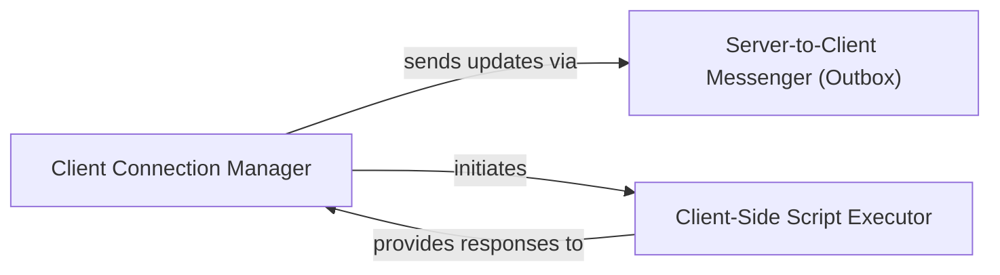

## Component Details

This component overview describes the core elements involved in managing real-time client-server communication within the NiceGUI framework. The main flow involves a `Client Connection Manager` handling the lifecycle of individual client connections, including their establishment, disconnection, and processing of client-side events. It leverages a `Server-to-Client Messenger (Outbox)` to efficiently queue and send UI updates and messages from the server to connected clients. Additionally, a `Client-Side Script Executor` enables the server to execute JavaScript code on the client and asynchronously receive results, facilitating dynamic UI interactions and data exchange.

### Client Connection Manager
Manages the lifecycle of individual client connections, including connection establishment, disconnection, and handling client-side events. It orchestrates UI updates and JavaScript execution on the client.

**Related Classes/Methods**:

- <a href="https://github.com/zauberzeug/nicegui/blob/master/nicegui/client.py#L35-L385" target="_blank" rel="noopener noreferrer">`nicegui.client.Client` (35:385)</a>
- <a href="https://github.com/zauberzeug/nicegui/blob/master/nicegui/client.py#L51-L89" target="_blank" rel="noopener noreferrer">`nicegui.client.Client:__init__` (51:89)</a>
- <a href="https://github.com/zauberzeug/nicegui/blob/master/nicegui/client.py#L127-L174" target="_blank" rel="noopener noreferrer">`nicegui.client.Client:build_response` (127:174)</a>
- <a href="https://github.com/zauberzeug/nicegui/blob/master/nicegui/client.py#L180-L189" target="_blank" rel="noopener noreferrer">`nicegui.client.Client:connected` (180:189)</a>
- <a href="https://github.com/zauberzeug/nicegui/blob/master/nicegui/client.py#L191-L198" target="_blank" rel="noopener noreferrer">`nicegui.client.Client:disconnected` (191:198)</a>
- <a href="https://github.com/zauberzeug/nicegui/blob/master/nicegui/client.py#L200-L227" target="_blank" rel="noopener noreferrer">`nicegui.client.Client:run_javascript` (200:227)</a>
- <a href="https://github.com/zauberzeug/nicegui/blob/master/nicegui/client.py#L229-L232" target="_blank" rel="noopener noreferrer">`nicegui.client.Client:open` (229:232)</a>
- <a href="https://github.com/zauberzeug/nicegui/blob/master/nicegui/client.py#L234-L236" target="_blank" rel="noopener noreferrer">`nicegui.client.Client:download` (234:236)</a>
- <a href="https://github.com/zauberzeug/nicegui/blob/master/nicegui/client.py#L246-L257" target="_blank" rel="noopener noreferrer">`nicegui.client.Client:handle_handshake` (246:257)</a>
- <a href="https://github.com/zauberzeug/nicegui/blob/master/nicegui/client.py#L259-L284" target="_blank" rel="noopener noreferrer">`nicegui.client.Client:handle_disconnect` (259:284)</a>
- <a href="https://github.com/zauberzeug/nicegui/blob/master/nicegui/client.py#L290-L298" target="_blank" rel="noopener noreferrer">`nicegui.client.Client:handle_event` (290:298)</a>
- <a href="https://github.com/zauberzeug/nicegui/blob/master/nicegui/client.py#L300-L302" target="_blank" rel="noopener noreferrer">`nicegui.client.Client:handle_javascript_response` (300:302)</a>
- <a href="https://github.com/zauberzeug/nicegui/blob/master/nicegui/client.py#L304-L322" target="_blank" rel="noopener noreferrer">`nicegui.client.Client:safe_invoke` (304:322)</a>
- <a href="https://github.com/zauberzeug/nicegui/blob/master/nicegui/client.py#L324-L332" target="_blank" rel="noopener noreferrer">`nicegui.client.Client:remove_elements` (324:332)</a>
- <a href="https://github.com/zauberzeug/nicegui/blob/master/nicegui/client.py#L334-L336" target="_blank" rel="noopener noreferrer">`nicegui.client.Client:remove_all_elements` (334:336)</a>
- <a href="https://github.com/zauberzeug/nicegui/blob/master/nicegui/client.py#L338-L347" target="_blank" rel="noopener noreferrer">`nicegui.client.Client:delete` (338:347)</a>
- <a href="https://github.com/zauberzeug/nicegui/blob/master/nicegui/client.py#L349-L355" target="_blank" rel="noopener noreferrer">`nicegui.client.Client:check_existence` (349:355)</a>

### Server-to-Client Messenger (Outbox)
Responsible for queuing and efficiently sending messages and UI updates from the server to connected browser clients. It maintains a message history for client reconnections.

**Related Classes/Methods**:

- <a href="https://github.com/zauberzeug/nicegui/blob/master/nicegui/outbox.py#L26-L154" target="_blank" rel="noopener noreferrer">`nicegui.outbox.Outbox` (26:154)</a>
- <a href="https://github.com/zauberzeug/nicegui/blob/master/nicegui/outbox.py#L28-L41" target="_blank" rel="noopener noreferrer">`nicegui.outbox.Outbox:__init__` (28:41)</a>
- <a href="https://github.com/zauberzeug/nicegui/blob/master/nicegui/outbox.py#L48-L52" target="_blank" rel="noopener noreferrer">`nicegui.outbox.Outbox:enqueue_update` (48:52)</a>
- <a href="https://github.com/zauberzeug/nicegui/blob/master/nicegui/outbox.py#L54-L58" target="_blank" rel="noopener noreferrer">`nicegui.outbox.Outbox:enqueue_delete` (54:58)</a>
- <a href="https://github.com/zauberzeug/nicegui/blob/master/nicegui/outbox.py#L60-L64" target="_blank" rel="noopener noreferrer">`nicegui.outbox.Outbox:enqueue_message` (60:64)</a>
- <a href="https://github.com/zauberzeug/nicegui/blob/master/nicegui/outbox.py#L66-L108" target="_blank" rel="noopener noreferrer">`nicegui.outbox.Outbox:loop` (66:108)</a>
- <a href="https://github.com/zauberzeug/nicegui/blob/master/nicegui/outbox.py#L110-L126" target="_blank" rel="noopener noreferrer">`nicegui.outbox.Outbox:_emit` (110:126)</a>
- <a href="https://github.com/zauberzeug/nicegui/blob/master/nicegui/outbox.py#L128-L145" target="_blank" rel="noopener noreferrer">`nicegui.outbox.Outbox:try_rewind` (128:145)</a>

### Client-Side Script Executor
Facilitates the execution of arbitrary JavaScript code on the client and provides a mechanism to asynchronously await and handle the results of these executions.

**Related Classes/Methods**:

- <a href="https://github.com/zauberzeug/nicegui/blob/master/nicegui/javascript_request.py#L7-L34" target="_blank" rel="noopener noreferrer">`nicegui.javascript_request.JavaScriptRequest` (7:34)</a>
- <a href="https://github.com/zauberzeug/nicegui/blob/master/nicegui/javascript_request.py#L18-L24" target="_blank" rel="noopener noreferrer">`nicegui.javascript_request.JavaScriptRequest:resolve` (18:24)</a>
- <a href="https://github.com/zauberzeug/nicegui/blob/master/nicegui/awaitable_response.py#L8-L35" target="_blank" rel="noopener noreferrer">`nicegui.awaitable_response.AwaitableResponse` (8:35)</a>
- <a href="https://github.com/zauberzeug/nicegui/blob/master/nicegui/awaitable_response.py#L10-L23" target="_blank" rel="noopener noreferrer">`nicegui.awaitable_response.AwaitableResponse:__init__` (10:23)</a>
- <a href="https://github.com/zauberzeug/nicegui/blob/master/nicegui/awaitable_response.py#L38-L48" target="_blank" rel="noopener noreferrer">`nicegui.awaitable_response.NullResponse` (38:48)</a>

### [FAQ](https://github.com/CodeBoarding/GeneratedOnBoardings/tree/main?tab=readme-ov-file#faq)